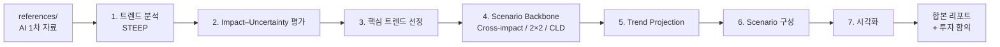

# Scenario Invest — 시나리오 플래닝 기반 AI 산업 투자 연구

> **한 줄 소개**  
> 시나리오 플래닝 방법론을 활용하여 **GenAI를 포함한 AI 산업의 변화**를 다층적으로 해석하고, 그 결과를 **중장기 투자 의사결정**에 연결하기 위한 연구·실험 저장소.

---

## 1. 핵심 질문 (Research Question)

> **“변화 속도와 성장 가능성이 모두 높은 AI 산업에서, 향후 3~7년 관점의 중장기 투자 기회는 어떤 시나리오에서, 어떤 영역(밸류체인·수혜군·리스크)에서 발생하는가?”**

이 질문에 답하기 위해 본 연구는 다음을 수행한다.

- AI 산업과 그 거시 환경(STEEP)에서 **핵심 트렌드**를 도출  
- 트렌드의 **임팩트·불확실성**을 평가하여 **분기 변수**를 선정  
- 복수의 **미래 시나리오**를 구성하고, 각 시나리오에서 **유리해지는 영역과 위협받는 영역**을 식별  
- 결과를 **개인 및 기업 투자자**의 의사결정 프레임으로 번역

---

## 2. 배경과 동기

- AI 산업은 기술·정책·자본·인프라·사회 수용성 등 **여러 축이 동시에 빠르게 움직이는** 영역으로, 단일 예측보다 **시나리오 기반 접근**이 적합하다.  
- 본 저장소의 `references/`는 모두 **AI 산업 관련 1차 자료**(글로벌 투자·정책·기술 동향 보고서)로 구성되어 있다.  
- 따라서 시나리오 플래닝의 **방법론적 형식**을 따르되, 결과의 활용은 **AI 산업 투자 인사이트 도출**에 초점을 둔다.

---

## 3. 대상 사용자 (Personas)

| 구분 | 설명 | 본 자료를 읽는 관점 |
|------|------|----------------------|
| **개인 투자자** | 중장기(3~7년) 자산배분·테마 투자에 관심 있는 일반 투자자 | 시나리오별 **유망 섹터·종목군·현금 비중** 가이드로 사용 |
| **기업 투자 의사결정자** | 지주회사 전략실, CVC, 신사업·R&D 투자 담당 | 시나리오별 **신사업·M&A·파트너십 후보군**과 **리스크** 점검에 사용 |

두 페르소나는 **같은 산출물**을 보지만, **읽는 단위(개별 종목 vs 사업·조직 단위)가 다르다.**

---

## 4. 산출물 (Deliverables)

본 연구는 다음 7개 산출물 + 부록으로 구성된다.

| # | 산출물 | 목적 | 결과 파일 (예) |
|---|--------|------|----------------|
| 1 | 주요 트렌드 분석 (STEEP 기반) | AI 산업과 거시 환경의 트렌드를 구조화 | `out/01-trends.md` |
| 2 | Impact–Uncertainty 평가 및 매트릭스 | 트렌드의 **영향도·불확실성** 정량 평가 | `out/02-impact-uncertainty.md` |
| 3 | 선정된 핵심 트렌드 리스트 | 시나리오 분기 변수 후보 도출 | `out/03-core-trends.md` |
| 4 | Scenario Backbone (Cross-impact, 2×2, CLD) | 시나리오 골격·인과 구조 설계 | `out/04-backbone.md` |
| 5 | Trend Projection | 핵심 트렌드별 미래 전개 패턴 정리 | `out/05-projection.md` |
| 6 | Scenario | 시나리오별 내러티브·사건·전략 함의 | `out/06-scenarios.md` |
| 7 | Scenario 시각화 자료 | 이미지·다이어그램·동영상 | `assets/` + `out/07-visuals.md` |
| 부록 | 단계별 프롬프트 모음 | 재현·재실행을 위한 프롬프트 보관 | `prompts/` |

진행 현황은 별도 파일에서 관리한다 → `poc-진행체크리스트-시나리오플래닝-구성참조.md`

---

## 5. 활용 방안 (How to Use the Output)

### 5.1 개인 투자자 관점

- 시나리오별 **유리한 자산군·섹터·테마 ETF/종목군**을 정리한다.  
- 시나리오 진입 신호(또는 반증 신호)를 **모니터링 체크리스트**로 옮긴다.  
- 정기적(분기·반기) 재실행으로 **시나리오 가중치**를 갱신한다.

### 5.2 기업 투자 의사결정자 관점

- 시나리오별 **수혜·피해 사업 영역**을 매핑하여 신사업 후보와 비교한다.  
- **M&A·CVC 투자 후보군**의 정합성을 시나리오 단위로 점검한다.  
- 핵심 사건(Critical Events)을 **리스크 등록부**로 운영한다.

### 5.3 공통 활용

- 본 산출물은 **연구·학습·내부 의사결정 보조**를 위한 자료이며, **투자 권유가 아니다.**  
- 모든 결론은 `references/`의 1차 자료 및 시나리오 가정에 기반한다.

---

## 6. 워크플로 개요



각 단계의 입력·출력·프롬프트는 동일한 파일명 규칙을 따른다.

---

## 7. 저장소 구조

```
.
├── README.md                                 # 본 문서
├── poc-flow-refer.md   # 진행 표 / 장별 체크리스트
├── references/                               # AI 산업 관련 1차 자료(PDF 등)
├── prompts/                                  # 단계별 프롬프트 (버전 관리)
├── out/                                      # 결과 MD (장별)
│   ├── 01-trends.md
│   ├── 02-impact-uncertainty.md
│   ├── 03-core-trends.md
│   ├── 04-backbone.md
│   ├── 05-projection.md
│   ├── 06-scenarios.md
│   └── 07-visuals.md
├── assets/                                   # 이미지·동영상
└── report.md                                 # (선택) 최종 합본
```

> 디렉터리는 단계 진행에 따라 점진적으로 추가된다.

---

## 8. 사용 방법

### 8.1 결과만 읽고 싶을 때
- `out/` 하위 장별 MD를 순서대로 본다.  
- 합본이 필요한 경우 `report.md`를 본다.

### 8.2 다시 돌리고 싶을 때
- `prompts/`에 있는 동일한 프롬프트 파일을 모델에 입력한다.  
- 결과 MD 상단의 `source_prompts` 메타에서 어떤 프롬프트가 어떤 결과를 만들었는지 확인 가능하도록 유지한다.

### 8.3 근거를 확인하고 싶을 때
- 각 결과 MD에서 인용된 문장은 가능하면 `references/` 하위 파일명·페이지를 함께 표기한다.  
- AI 모델 출력은 환각(hallucination) 가능성이 있으므로, **수치·인용은 1차 자료로 검증**하는 것을 원칙으로 한다.

### 8.4 권장 사용 조합
- **탐색·아이디어 단계**: 빠른 모델 / 자유 채팅  
- **확정본 작성 단계**: 상위 추론 모델로 고정하여 같은 프롬프트를 일관 실행

---

## 9. 방법론 요약

| 기법 | 본 연구에서의 역할 |
|------|--------------------|
| STEEP | 다도메인 트렌드 구조화 (Social, Technological, Economic, Environmental, Political) |
| Influence Diagram (DAG) | Cross-impact 임계치 이상의 단방향 영향만 시각화 (피드백 없음) |
| Impact–Uncertainty Matrix | 분기 변수 후보 선정 |
| Cross-impact Analysis | 트렌드 간 인과 강도 정량화 |
| 2×2 Scenario Backbone | 핵심 축 기반 시나리오 공간 정의 |
| Causal Loop Diagram (CLD) | 강화·균형 루프와 레버리지 포인트 식별 |
| Scenario Narrative | 시나리오별 사건·대응·함의 서술 |

---

## 10. 한계와 주의사항

- **AI 산업에 한정**된 시나리오이며, 거시 전체를 대표하지 않는다.  
- `references/`의 자료 범위·시점에 따라 결과가 편향될 수 있다.  
- GenAI 도구를 분석에 활용하므로, **출처 표기와 1차 자료 검증**을 반드시 병행한다.  
- 본 결과물은 **투자 자문이 아니며**, 의사결정의 책임은 사용자 본인에게 있다.

---

## 11. 향후 확장 (Roadmap)

현재 단계는 **수기·반자동 분석**이지만, 동일한 산출물 구조를 유지하면서 다음 단계로 확장할 수 있도록 설계되어 있다.

1. **데이터 자동 수집**: 뉴스·공시·VC 투자·논문·특허·정책 RSS/API  
2. **규칙 기반 태깅·스코어링**: 트렌드·섹터·기업 단위로 자동 분류  
3. **시나리오 ↔ 포지션 연결**: 시나리오 가중치 변화에 따른 포트폴리오 시뮬레이션  
4. **모니터링 / 알림**: Critical Events·반증 신호 발생 시 알림  
5. **대시보드화**: 시나리오 가중치, 모니터링 지표, 포지션 현황의 통합 뷰

---

## 12. 참고 자료

- `references/` 폴더 내 AI 산업 관련 1차 자료 (글로벌 투자·정책·기술 동향 보고서)  
- 시나리오 플래닝 일반 방법론 (STEEP, Cross-impact, Influence Diagram, CLD 등)
