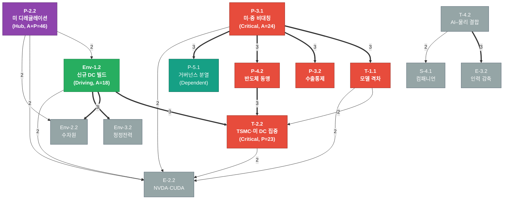
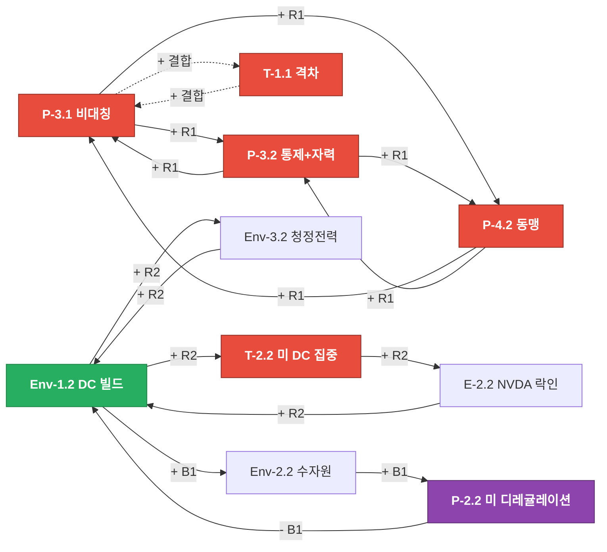

# 제4장 — Scenario Backbone

> 14개 핵심 트렌드의 **인과 강도**를 0~3 척도로 정량화(Cross-Impact)하고, **2×2 축**·**DAG**·**CLD** 로 시나리오의 골격을 만든다. 제3장의 가설(`B × D`)이 cross-impact로 검증되는지 먼저 점검한 뒤 축의 의미를 재정의한다.

## 한눈에 보기

| 항목 | 값 | 비고 |
|------|----|------|
| 평가 단위 | 14×14 cross-impact (대각선 제외 182셀) | 척도 0~3, P1·P2·P3 암묵 평균 |
| 4구역 분포 | **Driving 1 / Critical 6 / Dependent 1 / Inert 6** | med(A) = 17, med(P) = 16.5 |
| 유일한 순수 Driving | **Env-1.2 신규 DC 100MW+** (A=18, P=16) | DC 빌드가 환경·NVDA·DC 집중을 모두 끎 |
| 가장 큰 Critical (피드백 중심) | **P-2.2 미 디레귤레이션+주 규제** (A=23, P=23, A+P=46) | **레버리지 포인트 #1** |
| 가장 큰 Driving-leaning Critical | **P-3.1 미·중 산업 비대칭** (A=24, P=18, A−P=+6) | **레버리지 포인트 #2** |
| 가장 큰 Dependent | **T-2.2 TSMC·미 DC 집중** (P=23) | DC 집중은 결과 변수 — 분면별로 다르게 나타남 |
| **B × D 가설 검증** | **부분 확정** (B 5/5 Critical, D는 Env-1.2만 Driving) | D 축의 의미를 **“DC 빌드 진폭(Env-1.2 중심)”** 으로 재정의 |
| 2×2 최종 축 | **B축 = 글로벌 협력 ↔ 블록화** (대표: P-3.1) × **D축 = DC 빌드 진폭(자유 ↔ 제약)** (대표: Env-1.2) | Env-2.2·Env-3.2는 시나리오 결과 변수로 강등 |
| 4 시나리오 (Q1~Q4) | Q1 **Pax Silica** (B+/D−) · Q2 **Bunkered AI** (B+/D+) · Q3 **Green Concord** (B−/D+) · Q4 **Open Boom** (B−/D−) | 모든 분면 전개. §4.4 |
| 사전 확률 견적 (4장) | Q1 35% · Q2 25% · Q3 15% · Q4 25% | 6장에서 정식 확정. §4.7 |
| 핵심 R/B 루프 | R1 블록화 트리오 / R2 DC 자기강화 / B1 환경 백래시 | §4.6 |

> **§4.1**의 cross-impact 매트릭스 원자료(14×14)는 본문에 표 + 히트맵으로 동시 제시한다.

---

## 4.1 Cross-Impact Analysis

### 4.1.1 척도 정의 (0~3)

| 점수 | 의미 |
|------|------|
| **0** | 영향 없음 — 이 트렌드의 변동이 다른 트렌드의 진폭에 사실상 무관 |
| **1** | 약 — 간접·장기적 영향. 변동이 시간차로 흡수됨 |
| **2** | 중 — 직접 영향이 있으나 한정적 (특정 채널·지역·시점에 한정) |
| **3** | 강 — 즉각·결정적 영향. 한 변수가 다른 변수의 방향을 사실상 결정 |

> **v1(0~5) → v2(0~3) 변경 사유**: 14×14 = 196셀을 사람이 일관되게 평가하려면 척도를 좁혀야 한다. 0~5는 “3과 4의 차이”를 페르소나 간 일관되게 잡기 어렵다. POC 단계에서는 정밀도보다 일관성을 우선한다.

### 4.1.2 14×14 매트릭스 (행 = from, 열 = to)

| from \ to | S-4.1 | T-1.1 | T-2.2 | T-4.2 | E-3.2 | P-2.2 | P-3.1 | P-3.2 | P-4.2 | Env-2.2 | P-5.1 | Env-1.2 | Env-3.2 | E-2.2 |
|-----------|:-----:|:-----:|:-----:|:-----:|:-----:|:-----:|:-----:|:-----:|:-----:|:-------:|:-----:|:-------:|:-------:|:-----:|
| **S-4.1**     | — | 0 | 1 | 0 | 0 | 2 | 0 | 0 | 0 | 1 | 1 | 1 | 0 | 1 |
| **T-1.1**     | 1 | — | 2 | 2 | 1 | 2 | 3 | 3 | 2 | 1 | 2 | 1 | 1 | 2 |
| **T-2.2**     | 0 | 1 | — | 2 | 0 | 1 | 2 | 2 | 3 | 2 | 0 | 2 | 2 | 2 |
| **T-4.2**     | 2 | 1 | 1 | — | 3 | 2 | 1 | 1 | 1 | 0 | 0 | 0 | 0 | 1 |
| **E-3.2**     | 1 | 0 | 0 | 1 | — | 2 | 0 | 0 | 0 | 0 | 1 | 0 | 0 | 0 |
| **P-2.2**     | 2 | 2 | 2 | 2 | 2 | — | 1 | 1 | 1 | 2 | 2 | 2 | 2 | 2 |
| **P-3.1**     | 1 | 3 | 2 | 2 | 1 | 2 | — | 3 | 3 | 0 | 3 | 1 | 1 | 2 |
| **P-3.2**     | 0 | 3 | 2 | 2 | 0 | 1 | 3 | — | 3 | 0 | 2 | 1 | 0 | 2 |
| **P-4.2**     | 0 | 2 | 3 | 1 | 0 | 1 | 3 | 3 | — | 1 | 2 | 2 | 1 | 1 |
| **Env-2.2**   | 0 | 0 | 2 | 0 | 0 | 2 | 0 | 0 | 1 | — | 1 | 2 | 1 | 1 |
| **P-5.1**     | 1 | 2 | 1 | 1 | 0 | 2 | 2 | 2 | 2 | 0 | — | 0 | 1 | 0 |
| **Env-1.2**   | 0 | 1 | 3 | 1 | 0 | 2 | 1 | 0 | 1 | 3 | 1 | — | 3 | 2 |
| **Env-3.2**   | 0 | 0 | 2 | 0 | 0 | 2 | 0 | 0 | 0 | 1 | 1 | 2 | — | 0 |
| **E-2.2**     | 1 | 2 | 2 | 1 | 0 | 2 | 2 | 2 | 1 | 0 | 1 | 2 | 0 | — |

> 매트릭스 원본·재현용 데이터는 [`scripts/04_cross_impact.py`](../scripts/04_cross_impact.py) 에 인라인 보관. 값 변경 시 본 표와 스크립트를 함께 갱신할 것.

### 4.1.3 Active / Passive Sum + 4구역 분류

| ID | 도메인 | A (행 합) | P (열 합) | A−P | A+P | **분류** |
|----|--------|----------:|----------:|----:|----:|---------|
| **P-3.1** 미·중 비대칭          | Pol  | **24** | 18 | **+6** | 42 | Critical (Driving-leaning) |
| **T-1.1** 미·중 모델 격차        | Tech | **23** | 17 | **+6** | 40 | Critical |
| **P-2.2** 미 디레귤레이션+주    | Pol  | **23** | **23** | 0  | **46** | **Critical (피드백 중심)** |
| **P-4.2** 반도체 동맹            | Pol  | 20 | 18 | +2 | 38 | Critical |
| **P-3.2** 수출통제+자력갱생      | Pol  | 19 | 17 | +2 | 36 | Critical |
| **T-2.2** TSMC·미 DC 집중        | Tech | 19 | **23** | −4 | 42 | Critical (Passive-leaning) |
| **Env-1.2** 신규 DC 100MW+       | Env  | 18 | 16 | +2 | 34 | **Driving** |
| E-2.2 NVDA·CUDA 락인             | Econ | 16 | 16 | 0  | 32 | Inert (boundary) |
| P-5.1 G7/UN vs Paris 분열         | Pol  | 14 | 17 | −3 | 31 | **Dependent** |
| T-4.2 AI–물리 결합               | Tech | 13 | 15 | −2 | 28 | Inert |
| Env-2.2 추론 수자원              | Env  | 10 | 11 | −1 | 21 | Inert |
| Env-3.2 청정전력·SMR             | Env  | 8  | 12 | −4 | 20 | Inert |
| S-4.1 AI 컴패니언                 | Social | 7 | 9  | −2 | 16 | Inert |
| E-3.2 1/3 기업 인력 감축          | Econ | 5  | 7  | −2 | 12 | Inert |

**임계값**: median(A) = 17.0, median(P) = 16.5  
**분포**: Driving 1 / Critical 6 / Dependent 1 / Inert 6

### 4.1.4 Top 인사이트 5

1. **Critical 구역에 정치 변수 4개·기술 변수 2개가 몰림** — 본 시나리오의 dynamics는 거의 전적으로 “미·중 블록화 + 미국 정책 진폭”에 의해 추진된다. 환경·노동·사회 변수는 결과(Inert/Dependent)로 나타난다.
2. **유일한 순수 Driving = Env-1.2 (DC 빌드)** — 의외의 결과. 환경 변수 3개 중 Env-1.2만 Active>Passive로 다른 변수를 끄는 위치다. **Env-2.2(수자원)·Env-3.2(청정전력)는 Inert**로 떨어져 결과 변수에 가깝다 → D 축의 의미를 “환경 일반”이 아니라 **“DC 빌드 진폭”** 으로 재정의해야 함을 시사.
3. **P-2.2 (미 디레귤레이션) = A+P 46 = 시스템 피드백의 정중앙** — 정책 방향이 바뀌면 거의 모든 트렌드가 반응. **레버리지 포인트 1순위**.
4. **T-2.2 (TSMC·미 DC 집중)은 Passive-leaning Critical** — 결과 변수에 가깝다. 시나리오마다 “어디에 어떻게 집중되는가”가 달라지는 변수.
5. **E-2.2 (NVDA·CUDA 락인)은 Inert(경계)** — 14개 안에서만 보면 boundary지만, 실제 자본 시장에서는 더 큰 영향력. 14에 포함되지 않은 외부 변수(컴퓨트 비용, 모델 가격, 빅테크 자본 흐름)와의 결합이 본 매트릭스에 포착되지 않은 한계.

---

## 4.2 B × D 가설 검증

### 4.2.1 검증 절차

제3장 §3.4의 후보 `B × D`가 cross-impact 4구역 결과에서 살아남는지 점검:
- 조건 1: **B 축 대표 노드는 Driving 또는 Critical**
- 조건 2: **D 축 대표 노드는 Driving 또는 Critical** (B와 다른 클러스터)

### 4.2.2 결과 — 부분 확정 (D 축 의미 재정의)

| 클러스터 | 소속 노드 | 4구역 결과 | 결론 |
|---------|----------|-----------|------|
| **B (블록화)** | T-1.1, T-2.2, P-3.1, P-3.2, P-4.2 | **5/5 Critical** | ✅ B 축은 통째로 Critical 풀 — 가장 강한 시나리오 동력. 대표는 **P-3.1 (A=24, A−P=+6)** |
| **D (환경)** | Env-1.2, Env-2.2, Env-3.2 | **1 Driving + 2 Inert** | ⚠️ Env-1.2만 Driving. Env-2.2·Env-3.2는 Inert → 결과 변수. 대표는 **Env-1.2 (유일한 순수 Driving)** |

→ **결론**: `B × D` 가설은 살아남는다. 단 **D 축의 의미를 재정의**한다.
- (제3장 정의) D 축 = “에너지·환경 제약 (느슨 ↔ 강함)”
- (4장 재정의) **D 축 = “DC 빌드 진폭 (자유 빌드 ↔ 제한된 빌드)”**, Env-1.2 중심
- Env-2.2 (수자원), Env-3.2 (청정전력 PPA)는 **시나리오 결과 변수**로 재배치 — 분면별 결과로 나타남(§4.4).

### 4.2.3 검토한 대안 축 (모두 기각)

| 대안 | 이유 |
|------|------|
| B × A (블록화 × 자율성) | A 클러스터(T-4.2, S-4.1)는 둘 다 Inert. 축으로 쓰면 시나리오 dynamics가 약함 |
| B × C (블록화 × 정책 진폭) | P-2.2가 Critical이지만 P-2.2는 “피드백 중심” — 축이 아니라 레버리지로 다룸 |
| B × E (블록화 × 자본 구조) | E-2.2가 Inert(경계). 단독으로 축이 되기엔 Active 부족 |
| **D 단독 → D 의미 “환경 일반”** | Env-2.2, Env-3.2가 Inert → 환경 “일반”은 결과 변수에 가깝고 축으로 쓸 강도 부족. 따라서 D 축은 “DC 빌드 진폭”으로 좁힘 |

> **메모**: P-2.2는 축이 아니라 **레버리지 포인트**다. A=23, P=23으로 사방에서 받고 사방으로 미는 “시스템 허브”. 축으로 쓰면 다른 모든 축과 상관관계가 강해 4분면 색이 흐려진다.

---

## 4.3 2×2 축 양 끝 라벨링

### 4.3.1 B축 — 글로벌 협력 ↔ 블록화

| 끝 | 라벨 | 정의 한 줄 | 트리거 신호 (2~3개) |
|-----|------|------------|---------------------|
| **B−** | 글로벌 협력 | 미·중·EU가 공통 표준에 수렴, 수출통제 완화, 동맹 경계 흐림 | (i) UN/G7 공통 안전 표준 채택, (ii) 미국 수출통제 일부 해제, (iii) 미·중 모델 표준 호환 |
| **B+** | 블록화 | 디커플링 가속, 동맹 결성 강화, 표준·공급망 분기 | (i) 추가 수출통제 + 자력갱생 가속, (ii) Pax Silica/Chip4 등 동맹 명시화, (iii) G7 vs Paris·BRICS 표준 분열 |

**B축 대표 = P-3.1 (미·중 산업 비대칭)**. P-3.1의 변동이 T-1.1, P-3.2, P-4.2를 동조시켜 B+ 또는 B−로 끌고 다닌다.

### 4.3.2 D축 — DC 빌드 진폭 (자유 빌드 ↔ 제약된 빌드)

| 끝 | 라벨 | 정의 한 줄 | 트리거 신호 (2~3개) |
|-----|------|------------|---------------------|
| **D−** | 자유 빌드 | 메가 DC가 환경·전력·물 규제를 무리없이 흡수, 청정전력 PPA 시장 자율 | (i) 신규 DC 입지 환경평가 24개월 내 통과 비율 ≥70%, (ii) PPA 단가 안정 (≤ +15% YoY), (iii) 주별 모라토리엄 전무 |
| **D+** | 제약된 빌드 | 환경·물·탄소 규제 강화, DC 빌드 비용 폭증, 분산·소형화 압력 | (i) 신규 100MW+ DC 환경평가 통과율 <40%, (ii) PPA·전력 단가 +30% YoY, (iii) 주별 물·전력 모라토리엄 3개주 이상 |

**D축 대표 = Env-1.2 (신규 DC 100MW+)**. Env-1.2의 빌드 속도가 Env-2.2(수자원)·Env-3.2(청정전력 PPA)를 직접 끈다 (cross-impact 3, 3).

> **재배치된 변수**: Env-2.2 (수자원), Env-3.2 (청정전력 PPA)는 **D축의 결과 변수**로 §4.4 분면별 표에 “결과” 행으로 나타냄.

---

## 4.4 4분면 시나리오 Backbone

> Q1~Q4 모두 전개. 각 분면에 (a) 가칭 시나리오명, (b) 1줄 요지, (c) 시작 트리거, (d) 우세 루프, (e) 14개 트렌드 매핑, (f) 투자 함의를 작성.

### Q1 — **Pax Silica** (B+ × D−) — 블록화 강함, 빌드 자유

- **요지**: 미·중 디커플링은 가속되지만 미국·동맹 측의 환경·입지 규제는 느슨. 메가 DC가 자유롭게 빌드되고 미국이 압도적 컴퓨트 우위를 굳힌다.
- **시작 트리거**: 트럼프 디레귤레이션 + 추가 수출통제 + 동맹 명시화 + 주별 환경평가 빠른 통과.
- **우세 루프**: R1 (블록화 트리오 강화) × R2 (DC 자기강화) — 두 reinforcing loop가 동시에 우상향.

| ID | 트렌드 | 이 분면에서의 모습 (한 줄) |
|----|-------|--------------------------|
| P-3.1 | 미·중 비대칭 | **극대화** — 미국 우위 굳힘, 비대칭 지수 사상 최고 |
| T-1.1 | 모델 격차 | 격차 유지 (중국이 일부 따라잡지만 동맹 외에서만) |
| P-3.2 | 수출통제 | 추가 라운드, EUV·HBM·소프트웨어 모두 포함 |
| P-4.2 | 반도체 동맹 | Pax Silica 명시화 (Chip4 + 인도·EU 일부) |
| T-2.2 | TSMC·미 DC 집중 | **극대화** — TSMC AZ 풀가동, 미 DC 50%+ 점유 |
| P-2.2 | 미 디레귤레이션 | **활성** — 연방 완화, 주는 환경·고용 일부만 강화 |
| Env-1.2 | DC 빌드 (D−) | **자유 빌드** — 신규 100MW+ DC 폭증 |
| Env-2.2 | 수자원 (결과) | 약 압박 — 일부 텍사스·애리조나 갈등, 전국적 충돌은 없음 |
| Env-3.2 | 청정전력 PPA (결과) | 시장 자율 — PPA 가격 +10~15% 안정 |
| E-2.2 | NVDA 락인 | **강화** — $5T+, CUDA·NVLink 단극 |
| P-5.1 | 거버넌스 분열 | 분열 명시화 — G7+동맹 vs 비동맹 트랙 분리 |
| T-4.2 | 물리 AI | 미국 주도 — 휴머노이드·산업 AI 미국·동맹 우위 |
| S-4.1 | AI 컴패니언 | 미국 시장 한정 확산 — 청소년 보호 일부 주만 입법 |
| E-3.2 | 인력 감축 | 진폭 큼 — 미국 화이트칼라 대량 재배치, 정치 화제 |

**투자 함의**
- **개인**: 미국 빅테크 + NVDA + TSMC ADR + 동맹 반도체 (ASML, BE Semi) 비중 확대. SMR/청정전력은 보조.
- **기업·CVC**: Pax Silica 동맹 공급망 직접 투자 (TSMC 미 협력사, 동맹국 OSAT, 동맹 EDA·EUV 부품). 미국 DC REIT(Equinix, DLR)도 주요 자산.

---

### Q2 — **Bunkered AI** (B+ × D+) — 블록화 강함, 빌드 제약 강함

- **요지**: 디커플링 가속 + 환경 규제까지 강함. 미국조차 메가 DC 빌드 비용 폭증, 효율·소형화·온디바이스가 핵심. 중국은 자력갱생+자체 청정 인프라.
- **시작 트리거**: 디레귤레이션이 일부만 작동, 주별 환경평가 강화 + 물·전력 모라토리엄 3개주 이상 + 청정 PPA 단가 +30%+.
- **우세 루프**: R1 (블록화 트리오) + B1 (환경 백래시) — R1은 강하게 돌고, B1이 R2를 억제.

| ID | 트렌드 | 이 분면에서의 모습 (한 줄) |
|----|-------|--------------------------|
| P-3.1 | 미·중 비대칭 | 강하게 유지, 단 비용 부담으로 진폭 둔화 |
| T-1.1 | 모델 격차 | 미국이 우위지만 효율 모델·온디바이스에서 중국 따라잡음 |
| P-3.2 | 수출통제 | 강화, 단 미국 자체 제조 비용 압박 |
| P-4.2 | 반도체 동맹 | 결성되나 비용 분담 갈등 |
| T-2.2 | TSMC·미 DC 집중 | **둔화** — 환경·물 규제로 일부 프로젝트 지연 |
| P-2.2 | 미 디레귤레이션 | 부분 작동 — 주별 환경 규제가 연방 완화 무력화 |
| Env-1.2 | DC 빌드 (D+) | **제약** — 신규 100MW+ DC 환경평가 통과율 <40% |
| Env-2.2 | 수자원 (결과) | **강 충돌** — 텍사스·애리조나·UAE 등 입지 모라토리엄 |
| Env-3.2 | 청정전력 PPA (결과) | **단가 폭증** — PPA +30%+ YoY, SMR 수혜 |
| E-2.2 | NVDA 락인 | **약화** — 효율 모델·소형 칩·맞춤 ASIC 부상 |
| P-5.1 | 거버넌스 분열 | 환경 표준에서는 일부 수렴 (탄소·물) |
| T-4.2 | 물리 AI | 둔화 — 컴퓨트 비용 부담 |
| S-4.1 | AI 컴패니언 | 보수적 확산, 주별 보호 입법 다수 |
| E-3.2 | 인력 감축 | 점진적 — 효율 중심 개선, 대량해고 둔화 |

**투자 함의**
- **개인**: 효율 칩·소형 모델·온디바이스 (Apple, ARM, 일부 IDM) + SMR (NuScale, BWXT) + 청정전력 utilities (NextEra) 비중 확대. NVDA는 보유 축소.
- **기업·CVC**: 효율·맞춤형 추론 인프라 (Cerebras, Groq, Tenstorrent) + 산업 SMR 사업자 + 환경 컨설팅·인허가 자산. 미·동맹 메가 DC는 비중 축소.

---

### Q3 — **Green Concord** (B− × D+) — 협력 우세, 빌드 제약 강함

- **요지**: EU AI Act 모델이 글로벌 표준, 청정전력·탄소 규제 글로벌 적용. DC는 청정전력 가용 지역(북유럽, 캐나다, 라틴아메리카, 인도)에 분산. 미·중 협력 모드.
- **시작 트리거**: 미국 행정부 교체 또는 정책 선회 + UN/G7 공통 안전·환경 표준 합의 + EU AI Act 글로벌 채택.
- **우세 루프**: B1 (환경 백래시) 강하게 작동, R1 약화. R2 분산 모드.

| ID | 트렌드 | 이 분면에서의 모습 (한 줄) |
|----|-------|--------------------------|
| P-3.1 | 미·중 비대칭 | **완화** — 다극 공급망 회복 |
| T-1.1 | 모델 격차 | 격차 사실상 소멸 — 표준 호환 |
| P-3.2 | 수출통제 | 일부 해제, 이중용도만 유지 |
| P-4.2 | 반도체 동맹 | 느슨 — 동맹보다 글로벌 표준 우선 |
| T-2.2 | TSMC·미 DC 집중 | **글로벌 분산** — 북유럽·캐나다·인도 신규 DC 우세 |
| P-2.2 | 미 디레귤레이션 | 약화 — 미국이 EU 모델로 부분 수렴 |
| Env-1.2 | DC 빌드 (D+) | 글로벌 분산 + 강한 환경 인증 (탄소 중립 의무) |
| Env-2.2 | 수자원 (결과) | 글로벌 표준 적용, 입지 신중 |
| Env-3.2 | 청정전력 PPA (결과) | **글로벌 시장** — 단가 일정, SMR·재생 분산 |
| E-2.2 | NVDA 락인 | **약화** — 반독점 + 오픈소스 + 다양한 칩 경쟁 |
| P-5.1 | 거버넌스 분열 | **수렴** — UN AI 협약 발효 |
| T-4.2 | 물리 AI | 글로벌 분산 발전, 안전 표준 통합 |
| S-4.1 | AI 컴패니언 | 글로벌 표준 보호 입법, 다국 동시 발효 |
| E-3.2 | 인력 감축 | 점진적 + 글로벌 재교육 자금 |

**투자 함의**
- **개인**: 청정전력 (NextEra, Iberdrola), 글로벌 분산 DC REIT (Equinix EU·Asia), 다양한 칩 (AMD, Intel, ARM, RISC-V 생태계). NVDA는 비중 축소.
- **기업·CVC**: 다국적 DC 사업자 + 글로벌 청정전력 자산 + ESG 컴플라이언스·탄소 회계 SaaS. Pax Silica 동맹 자산은 비중 축소.

---

### Q4 — **Open Boom** (B− × D−) — 협력 우세, 빌드 자유

- **요지**: 가장 낙관적. 글로벌 협력 + 환경 자유. AI 무한 확장. 컴퓨트 가격 폭락, AI 침투 모든 영역, 미·중 격차 사라지고 다극 생태계.
- **시작 트리거**: UN AI 협약 + 미·중 정책 동조 + 환경 규제 시장 자율 + 효율 개선이 환경 압력 흡수.
- **우세 루프**: R2 (DC 자기강화) 글로벌 모드. R1 약화. B1 약함.

| ID | 트렌드 | 이 분면에서의 모습 (한 줄) |
|----|-------|--------------------------|
| P-3.1 | 미·중 비대칭 | **소멸** — 다극 협력 |
| T-1.1 | 모델 격차 | 격차 무의미 — 다양한 생태계 |
| P-3.2 | 수출통제 | 대부분 해제 |
| P-4.2 | 반도체 동맹 | 명시 동맹 약화, 시장 자율 동맹 |
| T-2.2 | TSMC·미 DC 집중 | 글로벌 자유 분산 |
| P-2.2 | 미 디레귤레이션 | 강 — 시장 자율 |
| Env-1.2 | DC 빌드 (D−) | **글로벌 자유 빌드** — 신규 DC 폭증 |
| Env-2.2 | 수자원 (결과) | 약 압박, 효율 개선이 흡수 |
| Env-3.2 | 청정전력 PPA (결과) | 시장 자율, 가격 안정 |
| E-2.2 | NVDA 락인 | **약화** — 시장 경쟁으로 다양한 칩 경쟁 |
| P-5.1 | 거버넌스 분열 | 협력 모드, 글로벌 표준 수렴 |
| T-4.2 | 물리 AI | 글로벌 폭발 — 휴머노이드·산업 AI 모든 지역 |
| S-4.1 | AI 컴패니언 | 글로벌 폭증 |
| E-3.2 | 인력 감축 | 진폭 매우 큼 + 글로벌 재배치 자유 |

**투자 함의**
- **개인**: 글로벌 빅테크 + 다양한 칩·플랫폼 + 글로벌 DC REIT + 휴머노이드·물리 AI 신생 종목. NVDA 단일 종목 비중은 축소(다극화).
- **기업·CVC**: 다국적 AI 가치사슬 + 글로벌 인프라 + 신흥 시장 AI 응용 + 휴머노이드·산업 AI 스타트업. 동맹·통제 차익은 거의 없음.

---

## 4.5 Influence Diagram (DAG)

> Cross-impact ≥ 3 엣지를 우선 채택, 양방향 페어는 **conceptually-master 노드 (P-3.1)** 에서 출발하는 방향만 유지하여 무순환으로 정리.  
> 보강용으로 ≥ 2 엣지 일부 추가 (순환 만들지 않는 한). **P-2.2 (Critical 피드백 중심)** 는 DAG에서 일방 출발 노드로만 표시 (양방향 결합은 §4.6 CLD에서 다룸).

**Top 3 Drivers (Active 기준)**: P-3.1 (24), T-1.1 (23), P-2.2 (23)  
**Top 3 Most Affected (Passive 기준)**: T-2.2 (23), P-2.2 (23), P-3.1 (18)  
**메모**: P-2.2가 Top Drivers와 Top Most Affected에 동시에 등장 = 시스템 피드백 허브. DAG에서는 일방 흐름만 표시했지만 실제로는 강한 양방향 → **CLD에서 본격 분석**.

---

## 4.6 CLD (Causal Loop Diagram) + 레버리지 포인트

> DAG에서 잘라낸 양방향·순환 엣지를 재조립. 4구역 결과를 보면 **Critical 6개 + Driving 1개**가 거의 모든 피드백을 형성한다.  
> CLD는 Mermaid `flowchart`로 표기 (전용 CLD 도구가 아니므로 `+`/`−` 표기를 엣지 라벨에 명시).

### 4.6.1 핵심 루프 3개

#### **R1 — 블록화 가속 트리오 (Reinforcing)**
- **노드 시퀀스**: P-3.1 ↔ P-3.2 ↔ P-4.2 (+ T-1.1 결합)
- **메커니즘**:
  - 미·중 비대칭(P-3.1)이 커지면 → 미국이 추가 수출통제·중국이 자력갱생 가속(P-3.2) → 통제와 자력갱생이 비대칭 다시 강화 (양방향 3↔3)
  - 동시에 P-3.1 → 동맹 결성 강화(P-4.2) → 동맹이 비대칭 강화 (양방향 3↔3)
  - T-1.1 (격차)가 줄어들면 P-3.2(통제 강화)로 다시 격차 유지 시도 — 약 균형도 있으나 근본적으로 reinforcing
- **시스템적 함의**: 한 번 시동이 걸리면 자체 가속하는 루프. **이 루프가 우세한 분면이 Q1 Pax Silica·Q2 Bunkered AI**.

#### **R2 — DC 자기강화 (Reinforcing)**
- **노드 시퀀스**: Env-1.2 → T-2.2 → E-2.2 → Env-1.2 (+ Env-3.2 결합)
- **메커니즘**:
  - 신규 DC 빌드(Env-1.2 → T-2.2: 3) → DC 집중이 NVDA 수요 견인(T-2.2 → E-2.2: 2) → NVDA·하이퍼스케일러 자본이 다시 DC 빌드(E-2.2 → Env-1.2: 2)
  - 청정전력 PPA(Env-3.2)가 DC 빌드 가능성을 다시 끌어올림 (Env-3.2 → Env-1.2: 2, Env-1.2 → Env-3.2: 3, 양방향)
- **시스템적 함의**: 인프라 자본의 자기강화. **Q1 Pax Silica·Q4 Open Boom에서 우세**.

#### **B1 — 환경 백래시 (Balancing)**
- **노드 시퀀스**: Env-1.2 → Env-2.2 → P-2.2 → Env-1.2(−)
- **메커니즘**:
  - DC 빌드 가속(Env-1.2 → Env-2.2: 3, 수자원 압력 ↑)
  - → 주별 환경·물 규제 활성화(Env-2.2 → P-2.2: 2)
  - → 주별 규제가 신규 DC 빌드를 제약(P-2.2 → Env-1.2: 2, 부호는 −)
- **시스템적 함의**: R2를 억제하는 균형 루프. **Q2 Bunkered AI·Q3 Green Concord에서 우세**. 이 루프가 강하게 돌면 D+ 끝(빌드 제약)으로 이동.

### 4.6.2 CLD Mermaid

> Mermaid는 표기 한계상 R/B 라벨을 엣지 텍스트로 적었다. PDF/PNG로 변환할 때는 화살표 색을 R(파랑)/B(빨강)로 분리하면 더 명확.

### 4.6.3 레버리지 포인트

| 우선순위 | 노드 | A+P | 개입 시 효과 |
|---------|------|-----|------------|
| **#1** | **P-2.2 미국 디레귤레이션 + 주 규제** | **46** | 시스템 허브. 정책 방향 1단계 변경이 R2(DC), B1(환경 백래시), R1(블록화) 모두에 동시 영향. 정책 모니터링 1순위. |
| **#2** | **P-3.1 미·중 산업 비대칭** | 42 | R1 트리오의 마스터. 비대칭이 줄면 R1 약화 → Q3/Q4로 이동, 강해지면 R1 가속 → Q1/Q2로 이동. |
| #3 | **Env-1.2 신규 DC 빌드** | 34 | R2와 B1의 공통 노드. DC 빌드 속도 조절이 환경·NVDA·DC 집중 모두에 영향 (단, P-2.2와 P-3.1보다는 후행). |

### 4.6.4 DAG vs CLD 차이 한 줄

> **DAG**는 “누가 누구를 미는가”의 일방 흐름을 보여주고, **CLD**는 “시스템이 자기 자신을 어떻게 가속·억제하는가”의 피드백 구조를 보여준다. DAG에서 잘라냈던 R1·R2·B1이 본 시나리오의 dynamics를 결정한다.

---

## 4.7 시나리오 확률 사전 견적

> 6장에서 정식 확률·서사·신뢰도를 확정한다. 본 절은 4장 backbone 단계의 사전 견적이다.

| 분면 | 시나리오 | 사전 확률 | 사유 |
|------|---------|---------:|------|
| Q1 (B+ × D−) | **Pax Silica** | **35%** | 현재 모멘텀이 가장 강함 — 트럼프 디레귤레이션 + 추가 수출통제 + 동맹 명시화. 환경 규제는 미국에서 약함 |
| Q2 (B+ × D+) | **Bunkered AI** | **25%** | 환경·물 규제가 주별로 강해질 가능성 (텍사스·애리조나 모라토리엄 등). 동시에 디커플링은 유지 |
| Q3 (B− × D+) | **Green Concord** | **15%** | 미·중 협력 모드로의 선회는 단기 가능성 낮음. EU 모델 채택은 미국 정권 교체 의존 |
| Q4 (B− × D−) | **Open Boom** | **25%** | 협력 + 자유 빌드의 “최선의 세계”. 효율 개선이 환경 압력을 흡수하는 시나리오 |
| **합** | | **100%** | |

> **6장 정식 평가 시 변동 가능성**: Q1 ↔ Q2 사이가 가장 유동 (환경 규제 강도). Q3 ↔ Q4 사이도 정권·정책 1회 변동에 민감.

---

## 4.8 다음 단계로의 인계

### 5장 (Trend Projection) 입력
- 본 파일 §4.1.3 — Active/Passive 4구역 분류 (Driving 1, Critical 6, Dependent 1, Inert 6)
- 본 파일 §4.4 — 4분면별 14개 트렌드 매핑 (분면별로 각 트렌드의 진폭 한 줄)
- 5장은 Driving + Critical 7개를 우선 프로젝션 (Future direction / Growth trajectory / Uncertainty dynamics / Link drivers)

### 6장 (Scenario 본문) 입력
- 본 파일 §4.3 — 2×2 양 끝 라벨 (B축, D축)
- 본 파일 §4.4 — 4분면 시나리오 backbone (Q1~Q4)
- 본 파일 §4.6 — R1/R2/B1 핵심 루프
- 본 파일 §4.7 — 사전 확률 견적 (6장에서 정식 확정)
- **6장 본문 채택**: 4 분면 모두 (POC 단계에서는 분기 가능성을 모두 보임. 단, Q3는 “보조 시나리오”로 분량 축소 가능)

### 7장 (시각화) 입력
- 본 파일 `assets/04-active-passive-map.png` — Active/Passive 4구역 산점도
- 본 파일 `assets/04-cross-impact-heatmap.png` — 14×14 cross-impact 히트맵
- 7장에서 추가 생성: 4 시나리오 패널 이미지(시나리오별 Hero), 시나리오 확률 막대그래프, R/B 루프 컬러 다이어그램

### P4 라운드 (자본 배분자) 입력
- §4.4의 4 시나리오별 투자 함의 — P4가 투자 가설로 변환할 1차 자료
- §4.6의 레버리지 포인트 3개 — P4가 모니터링 신호로 사용
