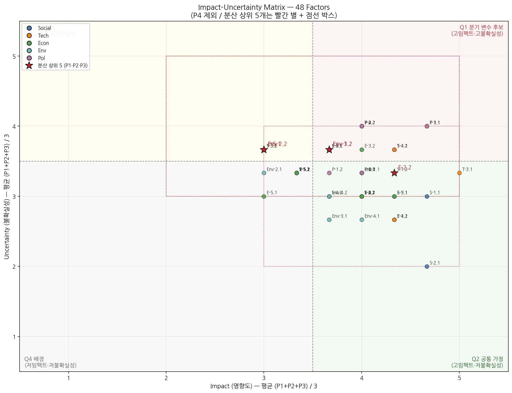
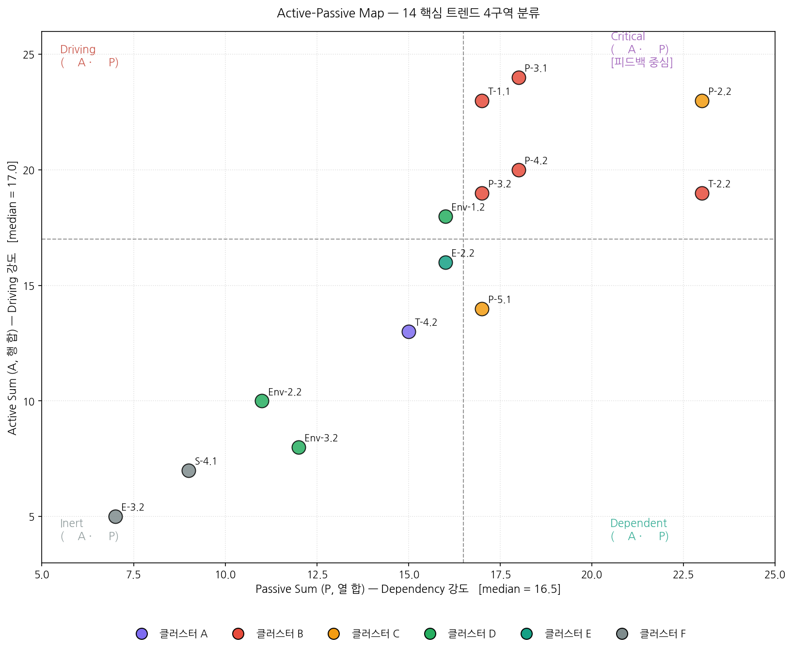
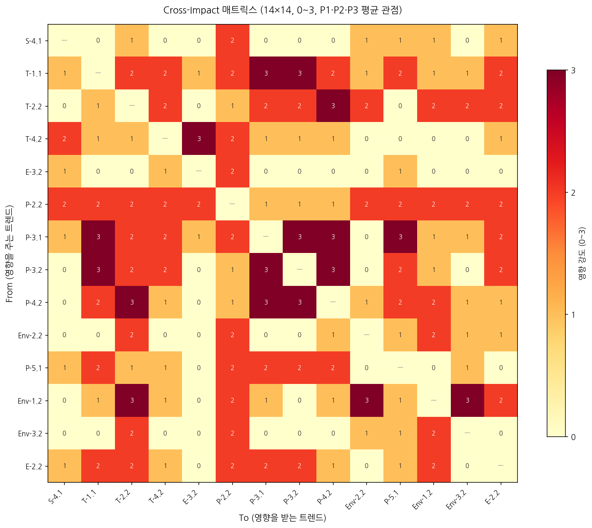
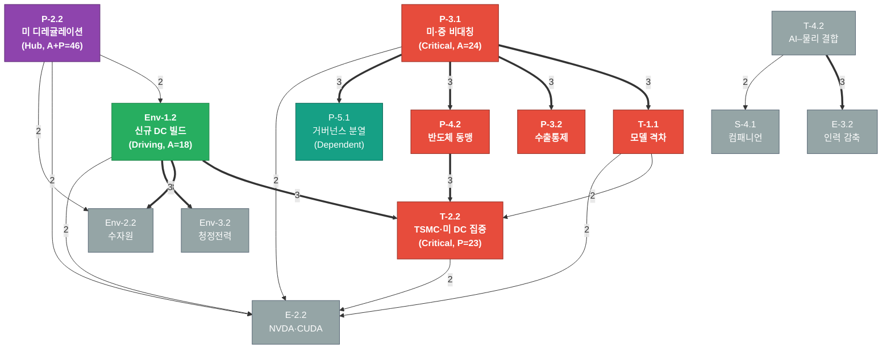
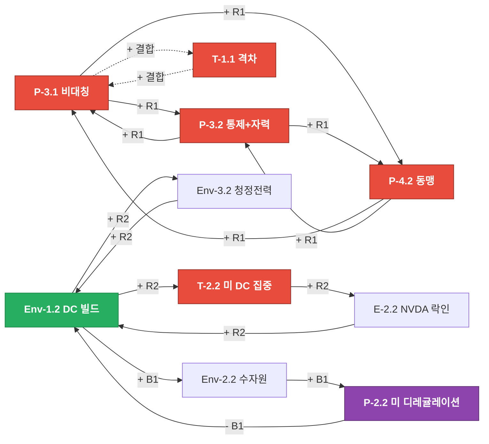
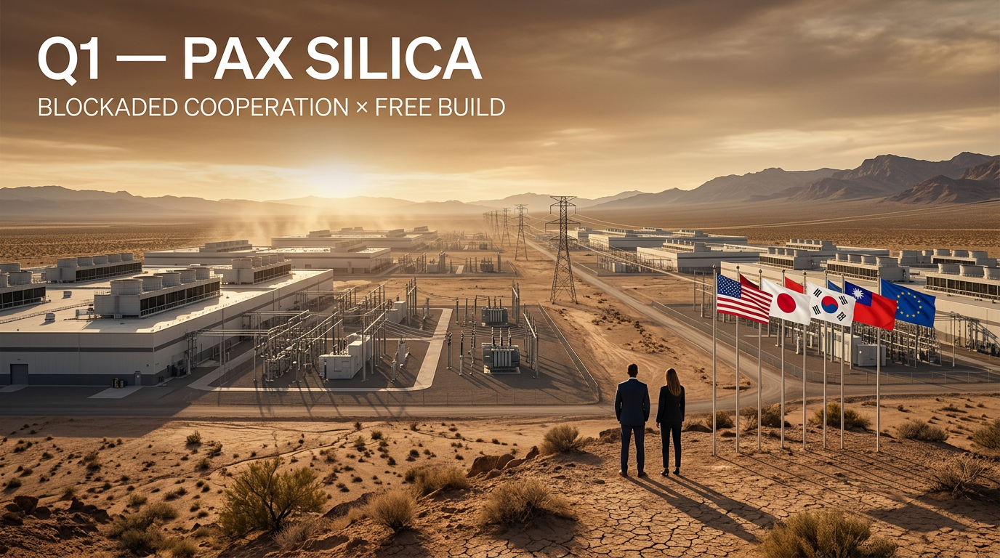
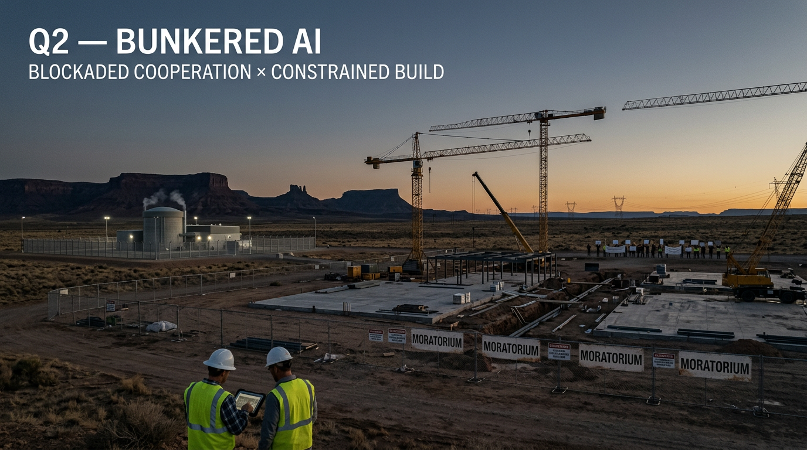
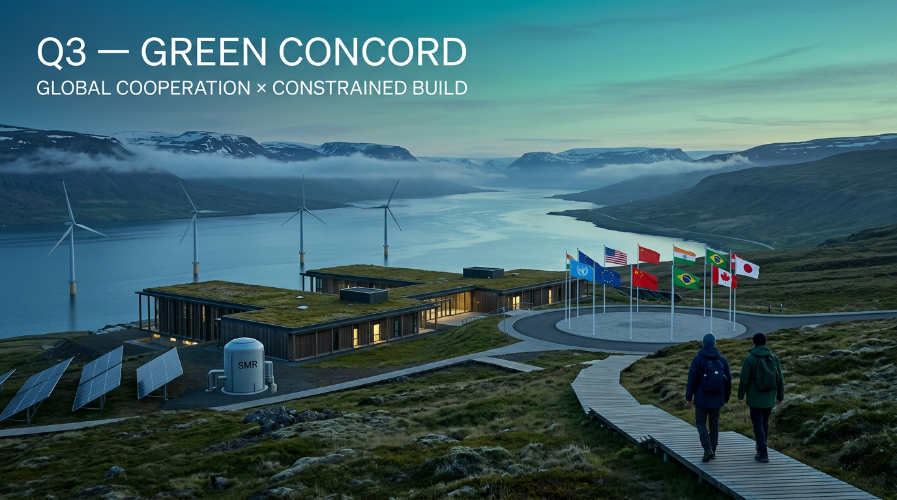
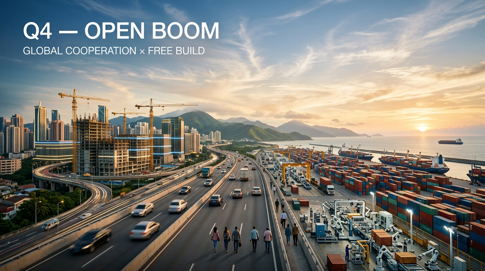

# AI 산업 중장기 투자 시나리오 플래닝 보고서 (2026~2030)

> **분석 호라이즌**: 2026 ~ 2030 (5년)  
> **분석 대상**: AI 산업 (Generative AI 포함) 과 그 거시 환경  
> **사용 대상**: 중장기 (3~7년) 투자 의사결정을 준비하는 개인 투자자 / 기업 (지주회사·CVC) / 신사업 투자자  
> **본 산출물은 연구·학습용이며 투자 권유가 아니다.**

## 보고서 개요

본 보고서는 AI 산업의 변화와 성장 가능성을 시나리오 플래닝 방법으로 정리한 단일 문서이다. 
STEEP (Social·Technological·Economic·Environmental·Political) 프레임에서 트렌드를 도출하고, 
3개 투자 페르소나(P1 기술 낙관론자 / P2 규제·리스크 전문가 / P3 시장·고객 관점)가 Impact–Uncertainty를 평가했다. 
핵심 14개 트렌드의 14×14 Cross-Impact 분석으로 시스템 골격을 파악한 뒤, 
**B축 (글로벌 협력 ↔ 블록화) × D축 (DC 빌드 진폭 자유 ↔ 제약)** 의 2×2 시나리오 4개 (Q1 Pax Silica / Q2 Bunkered AI / Q3 Green Concord / Q4 Open Boom) 를 균등 전개했다.

## 본 보고서가 답하는 질문

> **2030년까지 AI 산업의 어떤 분기 가능성에 대비해 어떤 투자 포지션을 잡을 것인가?**

- 미·중 디커플링과 동맹 명시화는 어디까지 진행되는가?
- 데이터센터 빌드는 환경·전력·물 제약을 흡수할 수 있는가?
- NVDA·CUDA 단극은 유지되는가, 다극화되는가?
- 휴머노이드·물리 AI는 언제 글로벌 폭발하는가?
- 화이트칼라 직무 재구성은 점진적 흡수인가, 급격한 충격인가?

## 사용한 원 소스 (`references/`)

본 보고서의 모든 트렌드·근거는 아래 3개 자료를 1차 출처로 사용한다. 각 Factor는 `Mirae | OECD | Stanford | general` Source Tag와 `Strong / Single / General` Triangulation 표기를 함께 갖는다 (제1장 §1.2 참조).

| 코드 | 자료 | 파일 | 성격 | 강한 영역 (STEEP) |
|------|------|------|------|--------------------|
| `Mirae`    | 미래에셋 — *AI 현황 보고서* (2025-09, 한국어)       | `references/20250910_미래에셋_AI 현황 보고서.pdf` | 증권사 리서치, 풀스택 패권·기업 분석 위주 | T (기술 패권·인프라), E (자본·기업), P (미·중·소버린), S (고용 충격) |
| `OECD`     | OECD — *AI VC Investment Report* (2026-02, ~2025 데이터, 영문) | `references/OECD AI VC Investment Report.pdf` | 정책 브리프, 정량 통계 | E (VC 자본 흐름·국가별), T/E (IT 인프라 투자), P (국가 정책 비교) |
| `Stanford` | Stanford HAI — *AI Index Report 2026* (영문)        | `references/stanford ai_index_report_2026.pdf` | 연례 인덱스, 광범위 메타 데이터 | T (성능·R&D), S (공공 인식·교육·고용), P (거버넌스·소버린), E (경제 임팩트) |

> 본 보고서에서 보강·확장이 필요한 영역은 각 장의 인계 메모(특히 제1장 §1.4 / §1.5) 에 명시되어 있다.

## 분석 방법론 한눈에 보기

| 단계 | 산출물 | 핵심 도구 |
|------|--------|-----------|
| 제1장 | 트렌드 분석 (STEEP) | 도메인별 5 Cluster × 2 Factor (총 ~50 Factor) |
| 제2장 | Impact–Uncertainty 평가 | 3 페르소나 × 1~5 척도 + I/U 매트릭스 |
| 제3장 | 핵심 트렌드 14개 정리·인계 | Q1 (정량 임계 9개) ∪ 분산 상위 5개 (중복 0) |
| 제4장 | Scenario Backbone | 14×14 Cross-Impact (0~3) → 4구역 (Driving/Critical/Dependent/Inert) → 2×2 + DAG + CLD + 사전 확률 |
| 제5장 | Trend Projection | 14 트렌드 카드 (Direction·Trajectory·Uncertainty·Link Drivers + 분면별 분기 메모) |
| 제6장 | 시나리오 4개 본문 | 옵션 A 균등 전개, 자급자족 서사, 정량 모니터링 트리거 |
| 제7장 | 시나리오 시각화 | 4 헤로 이미지 (16:9 cinematic photoreal) |

## 본 보고서의 구성

- **본문 1부 — 분석**: 제1장 ~ 제7장 (`out/` 폴더의 7 산출물 통합)
- **부록 A — 사용한 프롬프트**: 시스템 프롬프트 + 페르소나 정의 + 1~7장 프롬프트 (총 9 파일)

> 진행 상태는 `poc-flow-refer.md`, 프로젝트 개요는 `README.md` 를 참조한다.

---

# 본문 1부 — 분석

<!-- ===== 01-trends.md ===== -->

# 제1장 — 주요 트렌드 분석

> AI 산업과 거시 환경(**STEEP**)에서 **클러스터 → 팩터** 계층으로 트렌드를 구조화한다.  
> 진행 체크리스트: `poc-flow-refer.md` → 제1장

## 1.1 분석 프레임 (STEEP)

- 도메인: Social, Technological, Economic, Environmental, Political (5개)
- 권장 규모: 도메인당 5 Cluster × 2 Factor (전체 약 50 Factor)
- **자료 활용 가이드**: `prompts/01-trends_v1.md`의 **Source Map / Source Triangulation** 규칙을 따른다.
  - 각 Factor에 **Source Tag** `[Mirae | OECD | Stanford | general]` 와 **Strong / Single / General** 표기.
  - Environmental 도메인은 자료가 부족하면 클러스터 수를 줄이고 "자료 보강 권장" 메모.

## 1.2 도메인별 클러스터·팩터

### Social (5 Clusters × 2 Factors)

- **S-1. 일·고용 구조 변화 (AI 고용 충격)** — Cluster Source Tag: Mirae+Stanford — Strong
  - **S-1.1**: 화이트칼라·주니어 직무의 자동화 가속
    - Description: 코딩·고객 응대 등 **구조화된 화이트칼라 작업**부터 AI 대체가 진행 중. 원인은 GenAI/에이전트의 능력 향상과 비용 하락. 영향은 신규 채용 축소와 직급 피라미드의 하단부 압축. 시나리오적 함의는 “신규·청년 노동 기회”가 시나리오 분기를 가르는 핵심 사회 변수.
    - Source Tag: Stanford+Mirae — **Strong**
    - Source Note: Stanford AI Index 2026 *Economy* — 22~25세 SW 개발자 고용 약 -20%, 1/3 기업 인력 감축 예상 / Mirae *I. AI와 사회 변화 — 고용충격*.
  - **S-1.2**: AI 활용 노동의 생산성 격차 확대
    - Description: 분야별 생산성 향상은 14~50%까지 보고되나, 이 이득은 **AI를 능숙히 쓰는 인력**에 비대칭적으로 귀속. 영향은 동일 직군 내 임금·평가 격차 확대. 시나리오적 함의는 사회 안전망·재교육이 따라가는지에 따라 “포용적 성장” vs “양극화” 분기.
    - Source Tag: Stanford — **Single**
    - Source Note: Stanford *Economy*, productivity gains 14~26% (CS/SE), 50% (marketing).

- **S-2. 인공지능의 대중화·일상화** — Cluster Source Tag: Stanford — Strong
  - **S-2.1**: GenAI의 역사적 침투 속도 (3년 내 53%)
    - Description: GenAI는 PC·인터넷보다 빠르게 인구 침투 53%에 도달. 원인은 무료/저비용 진입과 모델 능력 급상승. 영향은 광범위한 소비자 행동·소프트웨어 인터페이스 재편. 시나리오적 함의는 **수요 측 동인**이 제도/규제 속도보다 빠를 때 발생할 수 있는 사회적 마찰의 전조.
    - Source Tag: Stanford — **Single**
    - Source Note: Stanford *Top Takeaways* #8 / *Economy* Ch.4 highlights.
  - **S-2.2**: GenAI 소비자 잉여 급증 (미국 ~$172B/년)
    - Description: 무료·저가 도구 기반 소비자 잉여가 1년 새 54% 증가. 원인은 가격 대비 효용의 비대칭. 영향은 “지표상 GDP에 잡히지 않는 가치”가 누적되며 생산성 통계와 체감의 괴리. 시나리오적 함의는 **가치 포착(value capture)** 의 주체(빅테크 vs 사용자 vs 정부)가 시나리오를 가른다.
    - Source Tag: Stanford — **Single**
    - Source Note: Stanford *Economy*, consumer surplus $172B, median per-user value tripled.

- **S-3. 신뢰·여론의 양극화** — Cluster Source Tag: Stanford — Strong
  - **S-3.1**: 전문가–일반 대중의 인식 격차
    - Description: AI의 일자리 영향에 대해 전문가 73%가 긍정적인 반면 일반 대중은 23%로, 약 50pt 격차. 원인은 정보 비대칭과 대체 우려. 영향은 정책 수용성 저하와 ‘기술 vs 사회’ 균열. 시나리오적 함의는 정치 시나리오의 진폭(규제 강화 vs 완화)을 좌우.
    - Source Tag: Stanford — **Single**
    - Source Note: Stanford *Top Takeaways* #15 / *Public Opinion* Ch.9.
  - **S-3.2**: 낙관과 불안의 동시 상승
    - Description: AI 혜택 인식(55→59%)과 동시에 “AI가 불안하다” 비율(52%)이 함께 상승. 원인은 가치와 위협이 같은 도구에서 동시에 발생. 영향은 양가적 여론이 정책 변동성을 키움. 시나리오적 함의는 **정치적 진자 운동** 가능성을 시나리오에 반영해야 함을 시사.
    - Source Tag: Stanford — **Single**
    - Source Note: Stanford *Public Opinion* Ch.9 highlights.

- **S-4. 정서·관계의 AI 의존** — Cluster Source Tag: Stanford — Single
  - **S-4.1**: AI 컴패니언/동반자 사용 확산
    - Description: 정서 교감 가능한 AI 사용이 빠르게 확산되며 입법·소송 사례 증가. 원인은 외로움·접근성 격차의 사회적 충족. 영향은 인간관계의 재정의와 광고·구독 비즈니스의 신모델. 시나리오적 함의는 “인간-기계 공생” vs “정서적 위기”의 분기.
    - Source Tag: Stanford — **Single**
    - Source Note: Stanford *Policy & Governance* Ch.8 — Utah HB 452, CA SB 243(companion bots), Aug 2025 companion lawsuits.
  - **S-4.2**: 청소년·청년의 정신건강 리스크
    - Description: 컴패니언 AI 관련 청소년 자살 사건이 입법 검토를 촉발. 원인은 안전장치 부재·중독성 설계. 영향은 강한 ‘아동·청소년 보호’ 입법 흐름. 시나리오적 함의는 사회 신뢰 시나리오의 핵심 분기점.
    - Source Tag: Stanford — **Single**
    - Source Note: Stanford *Policy* Ch.8 — “AI Companion Lawsuits Prompt Renewed Scrutiny” (Aug 2025).

- **S-5. 교육·학습 행태 변화** — Cluster Source Tag: Stanford — Single
  - **S-5.1**: 학생·교육 현장의 GenAI 표준화
    - Description: 미국 고·대학생의 80% 이상이 학업에 GenAI 사용. 원인은 도구 보편화와 학습 곡선 단축. 영향은 평가·과제 체계의 재설계 압력. 시나리오적 함의는 인적 자본의 형성 방식 변화 → 장기 산업 경쟁력의 결정적 변수.
    - Source Tag: Stanford — **Single**
    - Source Note: Stanford *Education* Ch.7 highlights.
  - **S-5.2**: AI 스킬 숙련의 신흥국 약진
    - Description: AI 엔지니어링 스킬은 UAE·칠레·남아공 등에서 가장 빠르게 성장. 원인은 정책적 의지·낮은 진입장벽·LinkedIn 등 글로벌 학습 자원. 영향은 AI 인재 분산. 시나리오적 함의는 **인재 흐름**이 미·중 외 제3블록 형성에 기여할 수 있음.
    - Source Tag: Stanford — **Single**
    - Source Note: Stanford *Top Takeaways* #13, *Education* Ch.7.

---

### Technological (5 Clusters × 2 Factors)

- **T-1. 모델 성능 프런티어와 수렴** — Cluster Source Tag: Stanford+Mirae — Strong
  - **T-1.1**: 미·중 프론티어 모델 성능 격차 축소
    - Description: 2025년 들어 미·중 최상위 모델이 여러 차례 선두를 교대(2026.03 기준 미국 모델 우위 약 2.7%p). 원인은 중국의 인재·자체 학습 인프라 강화. 영향은 단일 표준이 아닌 **이중 표준 생태계** 가능성. 시나리오적 함의는 “표준화·협력” vs “블록화” 시나리오 결정 변수.
    - Source Tag: Stanford+Mirae — **Strong**
    - Source Note: Stanford *Top Takeaways* #2 / Mirae *VII. 중국 AI*.
  - **T-1.2**: 효율화·오픈소스 모델의 약진
    - Description: 작은 모델로 큰 모델 성능을 따라잡는 사례 누적(예: OLMo 3.1, GPN-Star). 원인은 데이터 큐레이션·후처리·증류 기술의 진보. 영향은 진입장벽 하락과 멀티 벤더 경쟁. 시나리오적 함의는 **빅테크 독점**과 **분산 혁신**의 균형을 가르는 핵심 변수.
    - Source Tag: Stanford+Mirae — **Strong**
    - Source Note: Stanford *R&D* Ch.1 — open-source 5.6M projects, OLMo 3.1 / Mirae *II. 주류 연구방향* — 추론·RL 스케일링.

- **T-2. 컴퓨트·인프라 구심력 (Compute Centrality)** — Cluster Source Tag: Stanford+Mirae — Strong
  - **T-2.1**: 글로벌 AI 컴퓨트 연 3.3배 증가 (≈17.1M H100-eq)
    - Description: 2022년 이후 글로벌 학습/추론 컴퓨트가 연 3.3배 성장. NVDA 60%+ 점유, Google·Amazon이 잔여 다수, Huawei가 소수 점유. 원인은 모델 스케일링·추론 수요. 영향은 **자본·전력 의존도**의 구조적 상승. 시나리오적 함의는 자본·전력 가용성이 시나리오의 가속 페달 역할.
    - Source Tag: Stanford — **Single**
    - Source Note: Stanford *R&D* Ch.1 — Global AI compute capacity 3.3×/yr; 17.1M H100-eq.
  - **T-2.2**: 칩 공급망의 TSMC 단일 의존 + 미국 데이터센터 집중
    - Description: 사실상 모든 선도 AI 칩이 대만 TSMC 1개 파운드리에서 제조, 미국이 5,427개 DC로 글로벌 1위 보유. 원인은 첨단 노드 독점·하이퍼스케일러 집중 투자. 영향은 지정학적 리스크 + 에너지 집중. 시나리오적 함의는 **TSMC 위기/대만 해협 이슈**가 시나리오 트리거 사건으로 작동.
    - Source Tag: Stanford+Mirae — **Strong**
    - Source Note: Stanford *Top Takeaways* #3, *R&D* Ch.1 / Mirae *VIII. 엔비디아*.

- **T-3. AI 에이전트화·자율 실행** — Cluster Source Tag: Stanford+Mirae — Strong
  - **T-3.1**: 에이전트 능력의 비선형 도약 (OSWorld 12% → ~66%)
    - Description: 1년 새 컴퓨터 작업 자동화 능력이 5배 이상 도약. 원인은 도구 사용·계획 능력 결합. 영향은 BPO·운영 자동화의 본격적 침투. 시나리오적 함의는 “AI 에이전트 주도 자동화 사회” vs “감독 하 보조 도구” 시나리오의 핵심 분기 변수.
    - Source Tag: Stanford+Mirae — **Strong**
    - Source Note: Stanford *Top Takeaways* #4 / Mirae *IX. 테슬라*, *X. 팔란티어* — 에이전트·온톨로지.
  - **T-3.2**: 가정·물리 환경에서의 능력 한계 (RLBench 89.4% vs 가정 12%)
    - Description: 통제 시뮬레이션에서는 90% 가까운 성능을 보이지만 가정 등 비정형 환경 성공률은 12%. 원인은 분포 외 일반화·물리 인터랙션 난이도. 영향은 로봇 상용화 시점의 지연 가능성. 시나리오적 함의는 “물리 AI 상용화” 시점의 프로젝션이 시나리오를 가른다.
    - Source Tag: Stanford — **Single**
    - Source Note: Stanford *Top Takeaways* #5; *Technical Performance* Ch.2.

- **T-4. 풀스택 헤게모니·AI ↔ 물리 결합** — Cluster Source Tag: Mirae — Strong
  - **T-4.1**: 풀스택(반도체–전력–데이터–모델–앱) 통합 경쟁
    - Description: 단일 레이어가 아닌 **반도체+전력+데이터+모델+운영 시스템 전체**를 장악하려는 경쟁이 가속. 원인은 한 레이어의 병목이 전체 가치를 좌우하기 때문. 영향은 거대 기업·국가 단위 통합 투자 확대. 시나리오적 함의는 “수직 통합 vs 수평 분산”의 산업 구조 분기.
    - Source Tag: Mirae — **Single**
    - Source Note: Mirae *결론 — 풀 스택 패권의 시대*.
  - **T-4.2**: AI–물리 세계 결합(자율주행·휴머노이드·온톨로지)
    - Description: 로보택시·휴머노이드 로봇·기업 운영 통합(팔란티어 온톨로지) 등 AI가 **물리·운영 영역**으로 확장. 원인은 모델 능력 + 센서·액츄에이터 비용 하락. 영향은 자본·서비스 산업의 재편. 시나리오적 함의는 **물리 AI 시점**이 자산군별 수혜 순위를 결정.
    - Source Tag: Stanford+Mirae — **Strong**
    - Source Note: Stanford *Economy* — Physical Intelligence $5.6B / Mirae *IX·X. 테슬라·팔란티어*.

- **T-5. AI 안전·평가 체계의 한계** — Cluster Source Tag: Stanford — Single
  - **T-5.1**: 책임 AI(RAI) 평가가 능력 발전을 따라가지 못함
    - Description: 능력 벤치마크는 보고되지만 안전·공정성 등 RAI 보고는 산발적. AI 사고는 233 → 362건으로 급증. 원인은 평가 표준의 부재·기업 자율 보고. 영향은 규제 충돌·소송 리스크. 시나리오적 함의는 “신뢰 우선 통제” 시나리오의 진입 트리거.
    - Source Tag: Stanford — **Single**
    - Source Note: Stanford *Top Takeaways* #6, *Responsible AI* Ch.3.
  - **T-5.2**: RAI 차원 간 트레이드오프(개선 시 다른 차원 악화)
    - Description: 안전·공정성·정확성·프라이버시는 동시에 개선되지 않으며, 특정 차원을 강화하면 다른 차원이 악화. 원인은 학습·정렬 기법의 구조적 제약. 영향은 “단일 모델로 모든 책임 요건 충족 불가”라는 구조적 한계. 시나리오적 함의는 **인증·평가 산업** 자체가 신규 산업으로 부상.
    - Source Tag: Stanford — **Single**
    - Source Note: Stanford *Responsible AI* Ch.3.10 — Tradeoffs Across RAI Dimensions.

---

### Economic (5 Clusters × 2 Factors)

- **E-1. AI 자본 집중·메가딜 가속** — Cluster Source Tag: OECD+Stanford — Strong
  - **E-1.1**: AI VC 비중 61% / 메가딜이 자본의 73%
    - Description: 2025년 글로벌 VC의 61%(USD 258.7B)가 AI로 흘러가며, USD 100M 초과 메가딜이 자본의 73%, USD 1B 초과 딜이 거의 절반을 차지. 원인은 인프라 자본 집약성 + 후기 단계 베팅 집중. 영향은 초기 단계 다양성 축소. 시나리오적 함의는 **자본 분포의 양극화**가 산업 구조 시나리오를 가른다.
    - Source Tag: OECD — **Single**
    - Source Note: OECD *Key messages*, mega deals 73%, USD 100M+; deals USD 1B+ ≈ 절반.
  - **E-1.2**: 미국으로의 압도적 자본 집중 (≈75%)
    - Description: 미국 AI 기업이 전체 AI VC의 약 75%(USD 194B)를 흡수, EU27·중국·영국이 각각 5~6%. 원인은 인재·인프라·자본의 정의 효과. 영향은 **미국 의존도 심화**. 시나리오적 함의는 정치/공급망 시나리오에서 “단극” vs “복수 허브” 분기.
    - Source Tag: OECD+Stanford — **Strong**
    - Source Note: OECD *Key messages* / Stanford *Top Takeaways* #7 — US private investment $285.9B (2025).

- **E-2. 빅테크 CapEx·인프라 군비경쟁** — Cluster Source Tag: Stanford+Mirae — Strong
  - **E-2.1**: 데이터센터 빌드아웃 ($500B Stargate, Google $40B Texas 등)
    - Description: 2025년 발표된 데이터센터 투자 계획만 수천억 달러 단위. 원인은 학습/추론 컴퓨트 수요 폭증. 영향은 자본·에너지·부지의 동시 압력 + 1차 산업(전력·건설·HVAC)으로의 파급. 시나리오적 함의는 **CAPEX 사이클**이 매크로 자본·금리에 민감하게 반응.
    - Source Tag: Stanford+Mirae — **Strong**
    - Source Note: Stanford *Economy* 4.1 timeline (Stargate $500B, Anthropic $13B, OpenAI $40B / $300B Oracle) / Mirae *IV. AI 군비경쟁*.
  - **E-2.2**: NVDA 시총 $4T·인프라 단일 사슬 (CUDA·3계층 네트워크)
    - Description: NVDA가 첫 시총 $4T 기업 도달, CUDA·NVLink·Spectrum-X로 GPU↔서버↔DC 전 계층을 장악. 원인은 SW–HW 통합 락인. 영향은 AI 가치사슬의 단일 의존. 시나리오적 함의는 “경쟁사 부상”·“반독점 규제”가 시나리오 분기 트리거.
    - Source Tag: Stanford+Mirae — **Strong**
    - Source Note: Stanford *Economy* July 9, 2025 / Mirae *VIII. 엔비디아 — CUDA 생태계*.

- **E-3. 노동 시장의 세대·직군 비대칭 충격** — Cluster Source Tag: Stanford — Single
  - **E-3.1**: 22~25세 SW 개발자 고용 약 -20%
    - Description: 생산성 이득이 측정된 분야(소프트웨어 등)에서 **신규(주니어) 채용 감소**가 가장 두드러짐. 원인은 AI가 “모방 가능한 신규 작업”을 우선 대체. 영향은 진입 코호트 단절. 시나리오적 함의는 “노동력 재교육·재배치”가 따라가는지에 따른 사회·정치 시나리오 변화.
    - Source Tag: Stanford — **Single**
    - Source Note: Stanford *Economy* Ch.4 highlights / *Top Takeaways* #9.
  - **E-3.2**: 1/3 기업이 향후 1년 내 인력 감축 예상
    - Description: 서비스 운영·공급망·SW 엔지니어링 분야에서 **선행 기대치**가 가장 높음. 원인은 에이전트·자동화 도입 계획. 영향은 “기대 vs 실제” 격차의 변동성. 시나리오적 함의는 **고용 인플레이션·임금**과 결합되어 거시 변동성을 키움.
    - Source Tag: Stanford — **Single**
    - Source Note: Stanford *Economy* Ch.4 highlights #8.

- **E-4. 생산성·소비자 가치의 비대칭** — Cluster Source Tag: Stanford+Mirae — Strong
  - **E-4.1**: 분야별 생산성 14~50%, 그러나 **고판단 영역은 약함**
    - Description: 고객지원 14~15%, SW 개발 26%, 마케팅 50% 수준의 생산성 향상이 보고되나 깊은 추론 작업에서는 효과가 약하거나 부정적. 원인은 작업 구조화 가능성. 영향은 산업·직군별 ROI 격차. 시나리오적 함의는 ROI가 큰 영역(인프라·BPO)이 자산 시나리오의 1차 수혜.
    - Source Tag: Stanford — **Single**
    - Source Note: Stanford *Economy* Ch.4 highlights #9.
  - **E-4.2**: 소비자 가치 폭증과 모델 공급자 마진 압박의 공존
    - Description: 소비자 잉여는 급증(미국 ~$172B/년)하지만 모델 공급자 가격 경쟁과 추론 비용 부담으로 마진 확보가 쉽지 않음. 원인은 모델 무료/프리티어 + 컴퓨트 비용 상승의 동시 작동. 영향은 “돈을 버는 곳 vs 가치가 발생하는 곳”의 어긋남. 시나리오적 함의는 **밸류 체인 어디에 자본을 투입할지**의 핵심 의사결정 포인트.
    - Source Tag: Stanford+Mirae — **Strong**
    - Source Note: Stanford *Economy* — consumer surplus / Mirae *VIII. 엔비디아* — 인프라 마진 vs 모델사 마진 비교.

- **E-5. AI 산업·시장 구조의 양극화** — Cluster Source Tag: OECD — Strong
  - **E-5.1**: 후기 단계로의 자본 쏠림 (early avg $11.8M vs late $131M)
    - Description: 딜 수에서는 초기 단계가 75%지만 자본의 절반 이상은 후기 단계로 흐름. 원인은 “승자에게 더”의 베팅 구조. 영향은 초기 혁신 다양성 약화. 시나리오적 함의는 “분산 혁신”·“대표주 집중” 시나리오 분기 신호.
    - Source Tag: OECD — **Single**
    - Source Note: OECD report — early-stage 75% of deal count, mega deals 73% of value.
  - **E-5.2**: AI VC가 IT 인프라/호스팅으로 집중 (USD 109.3B in 2025)
    - Description: 산업별로 IT 인프라·호스팅 분야의 AI VC가 압도적 1위(누적 USD 256.1B, 2012–25). 원인은 컴퓨트 자본 집약. 영향은 **‘곡괭이 판매’ 사업모델의 우위**. 시나리오적 함의는 자본이 인프라 → 모델 → 응용 순으로 흐르는 사이클을 시나리오에 반영.
    - Source Tag: OECD — **Single**
    - Source Note: OECD report — IT infrastructure & hosting AI VC.

---

### Environmental (4 Clusters × 2 Factors)

> **자료 보강 권장**: Environmental 도메인은 자료에서 직접 근거가 풍부한 영역이 **에너지·전력 인프라**에 편중. 기후·물·자원 순환 등은 자료 1건에서만 다뤄지는 경우가 많아 **5번째 클러스터**는 무리하게 추가하지 않음.

- **Env-1. 데이터센터 전력·그리드 병목** — Cluster Source Tag: Stanford+Mirae — Strong
  - **Env-1.1**: AI 데이터센터 전력 용량 29.6 GW (NY주 피크급)
    - Description: 글로벌 AI DC 전력 용량이 한 주(state) 단위 피크 수요와 비교되는 수준으로 상승. 원인은 학습·추론 동시 수요 + 클러스터 거대화. 영향은 송배전·발전 부족과 가격 변동성. 시나리오적 함의는 **전력 가용성**이 AI 발전 속도의 강제 페이서가 됨.
    - Source Tag: Stanford+Mirae — **Strong**
    - Source Note: Stanford *Top Takeaways* #10 / Mirae *V. 에너지와 그리드 — Electric Shock*.
  - **Env-1.2**: 신규 DC 프로젝트의 거대화 (100MW 초과 48%, GW급 4%)
    - Description: 신규 DC 약 절반이 100MW 초과, 4%는 이미 GW 도달. 원인은 LLM 학습 클러스터의 인접성·고밀도 요구. 영향은 입지·수도·송전 인프라의 재설계 필요. 시나리오적 함의는 “전력·부지 가용 지역”이 AI 산업 지도를 다시 그림.
    - Source Tag: Mirae — **Single**
    - Source Note: Mirae *V. 에너지와 그리드*, SemiAnalysis 설문 인용.

- **Env-2. 탄소·수자원 발자국** — Cluster Source Tag: Stanford — Single
  - **Env-2.1**: 학습 단계 탄소 배출 누적 (Grok 4 ≈ 72,816 tCO₂e)
    - Description: 단일 모델 학습으로도 도시 단위에 비견되는 탄소 발자국. 원인은 학습 컴퓨트의 가파른 증가. 영향은 ESG 리스크와 탄소 규제 노출. 시나리오적 함의는 **탄소 가격·규제 강도**가 AI 모델 경제성을 흔들 수 있음.
    - Source Tag: Stanford — **Single**
    - Source Note: Stanford *R&D* Ch.1.4 / *Top Takeaways* #10.
  - **Env-2.2**: 추론 단계 수자원 사용 급증 (GPT-4o 추론수 ≈ 1,200만명 식수 추정)
    - Description: 학습뿐 아니라 **상시 추론**에서도 냉각수 소비가 큰 변수로 부상. 원인은 추론 트래픽 폭증 + 냉각 효율 한계. 영향은 “물 부족 지역의 DC 입지 제한”. 시나리오적 함의는 지역별 입지 경쟁이 심화.
    - Source Tag: Stanford — **Single**
    - Source Note: Stanford *R&D* Ch.1.4.

- **Env-3. 전력 인프라 재설계** — Cluster Source Tag: Mirae — Single
  - **Env-3.1**: 800V HVDC·액체냉각·온사이트 발전의 표준화 흐름
    - Description: 랙 전력 12kW → 120kW(>1MW)로 도약하면서 기존 12V AC/DC 변환·공랭 한계가 명확. 원인은 GPU 밀도와 TDP 폭증. 영향은 DC 자체가 “전원·냉각 산업 플랜트”로 재정의. 시나리오적 함의는 전력·냉각 부품 산업이 **2차 수혜군**으로 부상.
    - Source Tag: Mirae — **Single**
    - Source Note: Mirae *V. 에너지와 그리드 — Kyber 랙 / 800V HVDC*.
  - **Env-3.2**: 청정전력·SMR·신재생 PPA로의 직거래 확산
    - Description: AI 기업이 발전·저장(BESS) 자산과 직거래 PPA를 체결하는 흐름이 확산. 원인은 그리드 대기 시간·탄소 규제. 영향은 발전·유틸리티 산업과 AI 산업의 결합. 시나리오적 함의는 **AI 인접 발전·전력 인프라 자산**이 시나리오에서 별도의 투자 대상이 됨.
    - Source Tag: Mirae — **Single**
    - Source Note: Mirae *V. 에너지와 그리드 — 신재생/IPP/유틸리티 AI 언급도*.

- **Env-4. 효율성·저전력 기술 혁신** — Cluster Source Tag: Stanford+Mirae — Strong
  - **Env-4.1**: 알고리즘 효율 매년 약 3배 (동일 연산 대비 성능)
    - Description: 모델 알고리즘·학습 기법·프롬프팅·도구 사용 최적화의 누적으로 **추론 비용은 매년 약 1/10**로 감소. 원인은 RL·증류·MoE 등 후처리 기법의 발전. 영향은 일정 성능을 더 적은 자원으로 달성. 시나리오적 함의는 **에너지 제약 시나리오**에서도 일부 영역의 발전이 지속될 수 있음.
    - Source Tag: Mirae — **Single**
    - Source Note: Mirae *I. AI와 사회 변화 — 발전 속도* (Forethought 분석 인용).
  - **Env-4.2**: 모델 슬림화·소형 모델 약진(OLMo 3.1 Think 32B)
    - Description: Grok 4 대비 약 90배 적은 파라미터의 OLMo 3.1 Think 32B가 일부 벤치마크에서 동등 수준 성능. 원인은 큐레이션·디둡·프루닝의 진보. 영향은 엣지·온디바이스 AI의 확장. 시나리오적 함의는 **에너지 임계 시 분산형 추론**이 가능해지는 경로.
    - Source Tag: Stanford — **Single**
    - Source Note: Stanford *R&D* Ch.1 highlights #4.

---

### Political (5 Clusters × 2 Factors)

- **P-1. AI 주권(Sovereign AI)의 부상** — Cluster Source Tag: Stanford+Mirae — Strong
  - **P-1.1**: 국가 AI 전략 채택의 신흥국 가속
    - Description: 2024~25년 신규 AI 전략의 절반 이상이 신흥국. 원인은 “전략을 가져야 한다”는 정책 확산 효과. 영향은 정책 표준의 다양화. 시나리오적 함의는 **3극 이상 다극화** 시나리오의 정치적 토대.
    - Source Tag: Stanford — **Single**
    - Source Note: Stanford *Policy* Ch.8 highlights #1.
  - **P-1.2**: 국가 AI 슈퍼컴 인프라 격차 확대
    - Description: 유럽·중앙아시아의 국가 후원 AI 슈퍼컴 클러스터가 3 → 44개로 급증한 반면 남아시아·라틴아메리카·MENA는 한 자리 수. 원인은 재정 여력·전략 의지 격차. 영향은 모델 주권의 차등 실현. 시나리오적 함의는 AI 주권 시나리오의 **실현 가능 국가군**을 결정.
    - Source Tag: Stanford+Mirae — **Strong**
    - Source Note: Stanford *Policy* Ch.8.3 / Mirae *VI. 소버린 AI*.

- **P-2. 미국 vs EU 규제 분기** — Cluster Source Tag: Stanford+Mirae — Strong
  - **P-2.1**: EU AI Act 단계적 발효 + 회원국 자체 입법 (이탈리아 등)
    - Description: 2025년 2월 1차 금지 조항 발효, 8월 일반 목적 AI 의무 시행, 9월 이탈리아 회원국 법 통과. 원인은 위험 기반 접근의 제도화. 영향은 글로벌 규제의 사실상의 표준 효과(De facto standard). 시나리오적 함의는 “규범 기반 표준화” 시나리오의 핵심 동인.
    - Source Tag: Stanford+Mirae — **Strong**
    - Source Note: Stanford *Policy* Ch.8.1 timeline / Mirae *VI. 소버린 AI*.
  - **P-2.2**: 미국 연방 디레귤레이션 + 주(州) 규제 경쟁
    - Description: 연방은 “America’s AI Action Plan”·EO 등 규제 완화 방향, 캘리포니아 SB 53·텍사스 TRAIGA 등 주는 강화. 원인은 정치·산업 정책의 비대칭. 영향은 미국 내 **규제 패치워크**. 시나리오적 함의는 “주·연방 충돌” 자체가 단·중기 정책 변동성의 원천.
    - Source Tag: Stanford — **Single**
    - Source Note: Stanford *Policy* Ch.8.1, Ch.8.4 — state-level legislation, federal preemption attempts.

- **P-3. 미·중 기술 패권 경쟁의 구조화** — Cluster Source Tag: Stanford+Mirae — Strong
  - **P-3.1**: 모델 성능 격차 축소 + 산업 생태계 비대칭
    - Description: 모델 성능은 수렴 중이나 자본·인프라는 미국 우위, 산업 로봇·특허는 중국 우위. 원인은 양국의 정책·자원 차별화. 영향은 **상호 의존+상호 견제**의 이중 구조. 시나리오적 함의는 “기술 블록화” 시나리오의 정중앙 변수.
    - Source Tag: Stanford+Mirae — **Strong**
    - Source Note: Stanford *Top Takeaways* #2 / Mirae *VII. 중국 AI*.
  - **P-3.2**: 미국 대중국 수출통제 + 중국의 자력갱생(국가대표 모델)
    - Description: 미국 측 첨단 칩·장비 통제, 중국은 DeepSeek·Alibaba·Moonshot 등 자체 모델 개발과 대규모 국가 펀드(2025.03 USD 138B). 원인은 안보·산업 정책. 영향은 양 진영의 **이중 표준 생태계** 정착 가능성. 시나리오적 함의는 **수출통제·자원 규제**가 시나리오 트리거 사건.
    - Source Tag: Stanford+Mirae — **Strong**
    - Source Note: Stanford *Economy* 4.1 timeline (Mar 6 — China $138B fund) / Mirae *VII. 중국 AI*.

- **P-4. 데이터·공급망 주권화** — Cluster Source Tag: Stanford+Mirae — Strong
  - **P-4.1**: 데이터 현지화(Data Localization) 조치의 지역별 확산
    - Description: 동아시아·태평양 77건, 사하라이남 71건, 유럽·중앙아시아 66건 vs 북미 3건. 원인은 디지털 주권·산업 정책 의지. 영향은 글로벌 데이터 흐름의 분절. 시나리오적 함의는 “데이터 블록화”가 AI 모델 학습 비용·다양성에 직접 영향.
    - Source Tag: Stanford — **Single**
    - Source Note: Stanford *Policy* Ch.8.3 (Data Sovereignty) — highlights #3.
  - **P-4.2**: 반도체·하드웨어 동맹 (Pax Silica, TSMC-US 확장)
    - Description: 미국 주도 Pax Silica 선언(2025.12), TSMC 미국 공장 가동 시작(2025). 원인은 칩·DC 인프라 안보화. 영향은 **‘동맹 안의 분업·동맹 밖의 분리’** 구조 가속. 시나리오적 함의는 “기술 블록화” 시나리오의 강한 트리거.
    - Source Tag: Stanford+Mirae — **Strong**
    - Source Note: Stanford *Policy* Ch.8.1 (Dec 11 Pax Silica) / Mirae *VIII. 엔비디아·VI. 소버린 AI*.

- **P-5. 글로벌 거버넌스의 분열·재구성** — Cluster Source Tag: Stanford — Single
  - **P-5.1**: G7/UN의 다자 협력 시도 vs 일부 국가의 거리두기
    - Description: G7 공동성명·UN AI 거버넌스 패널 등 다자 시도와, Paris AI Action Summit에서의 미·영 미서명이 공존. 원인은 협력 인센티브와 자국 우선주의의 충돌. 영향은 표준의 **다중 트랙화**. 시나리오적 함의는 “글로벌 표준화” 진폭의 변동성.
    - Source Tag: Stanford — **Single**
    - Source Note: Stanford *Policy* Ch.8.1 — Feb 11 (Paris Summit), Jun 17 (G7), Aug 26 (UN panel).
  - **P-5.2**: 입법·규제에서의 빅테크 영향력 증가
    - Description: 미국 의회의 AI 관련 청문회 산업계 증인이 13% → 37%로 상승, 학계 비중 하락. 원인은 의제 형성에서의 자원 우위. 영향은 정책의 **산업 친화적 경향** 강화. 시나리오적 함의는 “규제 강화” 시나리오의 발생 빈도와 강도를 약화시키는 동인.
    - Source Tag: Stanford — **Single**
    - Source Note: Stanford *Policy* Ch.8 highlights #4.

---

## 1.3 출처 매핑 (대표 예시)

| Factor | Source Tag | 근거 파일 / 섹션 |
|--------|------------|-------------------|
| E-1.1 AI VC 메가딜 73% | OECD — Single | `references/OECD AI VC Investment Report.pdf`, *Key messages* |
| E-2.2 NVDA $4T 시총 | Stanford+Mirae — Strong | Stanford *Economy* 4.1 (Jul 9 2025) / Mirae *VIII. 엔비디아* |
| Env-1.2 신규 DC 100MW+ 48% | Mirae — Single | Mirae *V. 에너지와 그리드* (SemiAnalysis 인용) |
| P-2.1 EU AI Act 발효 | Stanford+Mirae — Strong | Stanford *Policy* Ch.8.1 / Mirae *VI. 소버린 AI* |
| T-1.1 미·중 모델 격차 축소 | Stanford+Mirae — Strong | Stanford *Top Takeaways* #2 / Mirae *VII. 중국 AI* |
| S-4.1 AI 컴패니언 입법 | Stanford — Single | Stanford *Policy* Ch.8.1 (Utah HB 452, CA SB 243) |

> 전체 Factor의 Source Tag/Note는 §1.2 본문에서 각 Factor 항목에 직접 표기됨.

---

## 1.4 Coverage 요약

> 자가 점검: 자료 편향과 취약 영역 가시화.

- **자료별 반영 Factor 수** (한 Factor가 복수 출처면 모두 카운트):
  - **Mirae**: 약 13개 (T-1.1/1.2, T-2.2, T-4.1/4.2, E-2.1/2.2, E-4.2, Env-1.1/1.2, Env-3.1/3.2, Env-4.1, P-1.2, P-2.1, P-3.1/3.2, P-4.2)
  - **OECD**: 약 4개 (E-1.1, E-1.2, E-5.1, E-5.2)
  - **Stanford**: 약 38개 (S 전체, T 대부분, E 대부분, Env-1/2/4 일부, P 대부분)
  - **general**: 0개 (모든 Factor는 자료 기반)
- **Single 출처 Factor 수**: 약 28개 → 제2장 평가 전 **출처 보강 우선 후보**:
  - Stanford 단독: S-1.2, S-2.1, S-2.2, S-3.1, S-3.2, S-4.1, S-4.2, S-5.1, S-5.2, T-2.1, T-3.2, T-5.1, T-5.2, E-3.1, E-3.2, E-4.1, P-1.1, P-2.2, P-4.1, P-5.1, P-5.2
  - Mirae 단독: T-4.1, Env-1.2, Env-3.1, Env-3.2, Env-4.1
  - OECD 단독: E-1.1, E-5.1, E-5.2
- **Environmental 도메인 클러스터 수**: 4개 (목표 5 미만).
  - 사유: 자료에서 직접적 근거가 **에너지·전력·효율**에 편중되어 있어, 무리하게 5번째 클러스터(예: 폐기·생물다양성)를 만들지 않음.
  - **자료 보강 권장**: ① IEA·EIA의 글로벌 전력 수요 시나리오, ② 데이터센터 물 사용 통계(예: 미국 EPA·McKinsey·Bluefield), ③ 전자폐기물·반도체 산업 자원 통계.
- **편향 점검 메모**:
  - OECD에 끌릴 위험은 자본 흐름 트렌드(E-1, E-5)에 한정, 다른 도메인에서 OECD는 거의 사용되지 않음. 추후 `references/`에 정책·산업 자료(예: G7·OECD AI Principles 2026, IEA Energy Outlook)를 추가하면 균형이 좋아짐.
  - Mirae 의존이 큰 영역은 풀스택·전력 인프라·중국 AI. 검증을 위해 Stanford R&D 그래프와 Cross-check 권장.
  - Stanford 비중이 매우 큼 — 전반적으로 “관찰자(인덱스)” 시각이라 **시장·기업 전략 시각**이 약할 수 있음. 미래에셋·OECD 외 기업 IR/리서치를 1~2건 추가하면 균형이 개선됨.

---

## 1.5 다음 단계로의 인계

- 제2장(`out/02-impact-uncertainty.md`)에서 평가할 **팩터 후보 목록**: 위 §1.2의 모든 Factor (총 약 48개).
- 제2장 평가 시 **P4 Capital Allocator 적용 후보**(투자 실행 가능성·유동성과 직접 연결):
  - T-2.2 (TSMC·DC 집중), T-4.1 (풀스택), T-4.2 (물리 AI), E-1.x (자본 집중·미국), E-2.x (CapEx), E-4.2 (가치 포착 위치), E-5.2 (인프라 집중), Env-1.x (전력·DC), Env-3.x (전력 인프라 자산), P-4.2 (반도체 동맹).
- 제2장 결과의 **분기 변수 후보**(시나리오 백본 축으로 검토):
  - **AI 자율성 수준** 축: T-3.1, T-4.2, S-4.1
  - **글로벌 협력 vs 블록화** 축: P-3.x, P-4.x, P-2.x
  - **에너지·환경 제약** 축: Env-1.x, Env-4.x
  - **자본·시장 구조 양극화** 축: E-1.x, E-5.x

---

<!-- ===== 02-impact-uncertainty.md ===== -->

# 제2장 — Impact–Uncertainty 평가 및 매트릭스

> 제1장에서 도출된 팩터에 대해 **3개 필수 페르소나(P1·P2·P3)** 가 독립적으로 Impact / Uncertainty를 평가한다.  
> **페르소나 정의 원본**: `prompts/personas_v1.md` (이 파일이 단일 출처. 본 장은 결과만 기록한다.)

## 한눈에 보기



| 항목 | 값 | 비고 |
|------|----|------|
| 평가 팩터 수 | **48개** | Social 10 / Tech 10 / Econ 10 / Env 8 / Pol 10 |
| 적용 페르소나 | **P1·P2·P3** | P4(자본 배분자) 본 실행 제외 |
| 고임팩트 (평균 I ≥ 4.0) | **28개** | — |
| 고불확실성 (평균 U ≥ 3.5) | **17개** | — |
| **Q1 분기 변수** (I ≥ 4 ∧ U ≥ 3.5) | **9개** | S-4.1, T-1.1, T-2.2, T-4.2, E-3.2, P-2.2, P-3.1, P-3.2, P-4.2 |
| **Q2 공통 가정 strong** (I ≥ 4 ∧ U ≤ 3.0) | **11개** | S-1.1, S-2.1, S-2.2, S-5.1, T-1.2, T-2.1, T-4.1, E-2.1, E-4.1, E-5.2, Env-4.1 |
| **분산 상위 5** (P1·P2·P3 std_I + std_U) | Env-2.2 / P-5.1 / Env-1.2 / Env-3.2 / E-2.2 | 환경 3 + 정책 1 + 경제 1 |
| **제3장 핵심 트렌드 (확정)** ← `Q1 9 ∪ 분산 상위 5` (중복 0) | **14개** | Pol 5 + Env 3 + Tech 3 + Econ 2 + Social 1. 상세 [§2.5.1](#251-제3장-핵심-트렌드--확정-14개) |

**핵심 인사이트**

1. **3장 핵심 트렌드 14개 = Q1 strict 9 ∪ 분산 상위 5** (§2.5.3). 두 집합은 **중복 0건** — 정량 평균이 높은 분기점과 페르소나 시각이 갈리는 분기점이 서로 다른 항목으로 잡혔다는 뜻. 즉 **두 메커니즘이 서로 보완**한다.
2. **블록화 축**이 가장 두꺼움 — 14개 중 6개(T-1.1, T-2.2, P-3.1, P-3.2, P-4.2, P-5.1)가 “미·중·동맹·거버넌스” 변수로 정렬. 4장 백본 축 후보 B 유력.
3. **에너지·환경 축**도 강함 — 분산 상위 5 중 3개(Env-2.2, Env-1.2, Env-3.2)가 모두 환경 영역. P2(규제)와 P1·P3가 가장 크게 갈리는 지점이며, 4장 백본 축 후보 D와 정합. **B × D** 가 정합 9개로 4장 2×2 1순위 후보.
4. **NVDA 락인(E-2.2)** 은 평균 기준으로는 Q1 경계(I=4.3 / U=3.3)였으나 페르소나 분산 5위로 §2.5.3에 정식 편입 — 경제 영역의 단일 분기 트리거.
5. **공통 가정 11개**(§2.5.4)는 모든 시나리오의 베이스라인 — GenAI 침투, 컴퓨트 확장, DC 빌드아웃, 생산성, 알고리즘 효율 등 “이미 일어나고 있는” 흐름.

> 자세한 분포·후보군은 [§2.4](#24-impactuncertainty-매트릭스), 페르소나별 사유는 [§2.3.2](#232-페르소나별-평가-상세) 참조.

---

## 2.1 척도 정의

**Impact (영향도)**
1. Very Low / 2. Low / 3. Moderate / 4. High / 5. Very High

**Uncertainty (불확실성)**
1. Very Certain / 2. Certain / 3. Somewhat Uncertain / 4. Uncertain / 5. Very Uncertain

## 2.2 평가 페르소나 (요약)

상세 정의는 `prompts/personas_v1.md` 참조.

| ID | 이름 | 구분 | 본 실행 적용 | 한 줄 요지 |
|----|------|------|-------------|------------|
| P1 | 기술 낙관론자 (Techno-Optimist) | 필수 | ✅ | 기술 돌파구를 높게 보고, 기술 난이도는 낮게 본다 (상한 추정) |
| P2 | 규제/리스크 전문가 (Risk & Regulation Officer) | 필수 | ✅ | 규제·정책 변수가 가장 큰 변수, 지연을 가정 (하방 리스크) |
| P3 | 시장/고객 관점 (Customer-Centric Realist) | 필수 | ✅ | 채택 속도와 고객 행동을 핵심 변수로 본다 (상용화 장벽) |
| P4 | 자본 배분자 (Capital Allocator) | 선택 | ❌ (본 실행 제외) | 투자 실행 단계에서 별도 라운드로 적용 |

## 2.3 평가

### 2.3.1 평가표 (요약)

> 평균은 본 실행에서 적용된 **3개 페르소나(P1~P3) 평균**. P1.I = P1의 Impact, P1.U = P1의 Uncertainty.

| Factor (도메인) | P1.I | P1.U | P2.I | P2.U | P3.I | P3.U | 평균 I | 평균 U | 분산 메모 |
|------------------|------|------|------|------|------|------|--------|--------|-----------|
| S-1.1 화이트칼라·주니어 자동화 (Social) | 5 | 2 | 4 | 4 | 5 | 3 | 4.7 | 3.0 | U: P1↔P2 (기술 vs 규제 시각 차) |
| S-1.2 AI 활용 노동 생산성 격차 (Social) | 4 | 2 | 5 | 4 | 4 | 4 | 4.3 | 3.3 | U: P1↔P2/P3 (격차 지속성) |
| S-2.1 GenAI 침투 53% (Social) | 5 | 1 | 4 | 3 | 5 | 2 | 4.7 | 2.0 | 분산 낮음 |
| S-2.2 소비자 잉여 $172B/년 (Social) | 4 | 2 | 3 | 4 | 5 | 3 | 4.0 | 3.0 | I: P2↔P3 (분배 vs 효용) |
| S-3.1 전문가–대중 인식 격차 50pt (Social) | 2 | 3 | 5 | 4 | 4 | 4 | 3.7 | 3.7 | I: P1↔P2 (기술 vs 정치) |
| S-3.2 낙관·불안 동시 상승 (Social) | 2 | 3 | 4 | 4 | 3 | 4 | 3.0 | 3.7 | I: P1↔P2 |
| S-4.1 AI 컴패니언 확산 (Social) | 4 | 2 | 5 | 5 | 4 | 4 | 4.3 | 3.7 | 분산 낮음 |
| S-4.2 청소년 정신건강 리스크 (Social) | 2 | 3 | 5 | 3 | 4 | 3 | 3.7 | 3.0 | I: P1↔P2 (가드레일 vs 입법) |
| S-5.1 학생 GenAI 사용 80%+ (Social) | 5 | 2 | 4 | 4 | 4 | 3 | 4.3 | 3.0 | 분산 낮음 |
| S-5.2 AI 스킬 신흥국 약진 (Social) | 4 | 2 | 3 | 4 | 3 | 4 | 3.3 | 3.3 | 분산 낮음 |
| T-1.1 미·중 모델 격차 축소 (Tech) | 5 | 3 | 5 | 5 | 4 | 4 | 4.7 | 4.0 | 분산 낮음 |
| T-1.2 효율화·오픈소스 약진 (Tech) | 5 | 2 | 4 | 3 | 4 | 3 | 4.3 | 2.7 | 분산 낮음 |
| T-2.1 글로벌 컴퓨트 3.3×/y (Tech) | 5 | 2 | 4 | 4 | 3 | 3 | 4.0 | 3.0 | I: P1↔P3 |
| T-2.2 TSMC·미국 DC 집중 (Tech) | 4 | 3 | 5 | 5 | 3 | 4 | 4.0 | 4.0 | I: P2↔P3 (지정학) |
| T-3.1 에이전트 능력 도약 12→66% (Tech) | 5 | 2 | 5 | 4 | 5 | 4 | 5.0 | 3.3 | 분산 낮음 |
| T-3.2 가정·물리 환경 한계 12% (Tech) | 3 | 3 | 2 | 3 | 4 | 5 | 3.0 | 3.7 | I: P2↔P3 |
| T-4.1 풀스택 헤게모니 (Tech) | 4 | 2 | 5 | 4 | 3 | 3 | 4.0 | 3.0 | I: P2↔P3 (반독점) |
| T-4.2 AI–물리 결합 (Tech) | 5 | 3 | 4 | 4 | 4 | 4 | 4.3 | 3.7 | 분산 낮음 |
| T-5.1 RAI 평가 격차 (사고 233→362) (Tech) | 2 | 3 | 5 | 4 | 3 | 3 | 3.3 | 3.3 | I: P1↔P2 |
| T-5.2 RAI 차원 트레이드오프 (Tech) | 3 | 3 | 5 | 4 | 2 | 3 | 3.3 | 3.3 | I: P2↔P3 |
| E-1.1 AI VC 메가딜 73% (Econ) | 4 | 3 | 4 | 4 | 2 | 3 | 3.3 | 3.3 | I: P1·P2↔P3 |
| E-1.2 미국 75% 자본 집중 (Econ) | 4 | 3 | 5 | 4 | 3 | 3 | 4.0 | 3.3 | 분산 낮음 |
| E-2.1 DC 빌드아웃 ($500B Stargate 등) (Econ) | 5 | 2 | 4 | 4 | 3 | 3 | 4.0 | 3.0 | 분산 낮음 |
| E-2.2 NVDA $4T·CUDA 락인 (Econ) | 5 | 2 | 5 | 4 | 3 | 4 | 4.3 | 3.3 | I: P1·P2↔P3 |
| E-3.1 22~25세 SWE 고용 -20% (Econ) | 4 | 2 | 5 | 4 | 4 | 3 | 4.3 | 3.0 | 분산 낮음 |
| E-3.2 1/3 기업 인력 감축 예상 (Econ) | 4 | 3 | 4 | 4 | 4 | 4 | 4.0 | 3.7 | 분산 낮음 |
| E-4.1 생산성 14~50% (구조작업) (Econ) | 5 | 2 | 3 | 3 | 5 | 3 | 4.3 | 2.7 | I: P1·P3↔P2 |
| E-4.2 가치 vs 마진 어긋남 (Econ) | 3 | 3 | 4 | 4 | 4 | 4 | 3.7 | 3.7 | 분산 낮음 |
| E-5.1 후기단계 자본 쏠림 (Econ) | 3 | 3 | 4 | 3 | 2 | 3 | 3.0 | 3.0 | 분산 낮음 |
| E-5.2 IT 인프라/호스팅 자본 집중 (Econ) | 5 | 2 | 4 | 4 | 3 | 3 | 4.0 | 3.0 | I: P1↔P3 |
| Env-1.1 AI DC 전력 29.6 GW (Env) | 4 | 3 | 5 | 4 | 3 | 3 | 4.0 | 3.3 | I: P2↔P3 |
| Env-1.2 신규 DC 100MW+ 48% (Env) | 4 | 3 | 5 | 5 | 2 | 3 | 3.7 | 3.7 | I: P2↔P3 |
| Env-2.1 학습 탄소 (Grok4 ≈72k tCO₂e) (Env) | 2 | 3 | 5 | 4 | 2 | 3 | 3.0 | 3.3 | I: P1·P3↔P2 |
| Env-2.2 추론 단계 수자원 (Env) | 2 | 3 | 5 | 5 | 2 | 3 | 3.0 | 3.7 | I: P1·P3↔P2 |
| Env-3.1 800V HVDC·액체냉각 표준화 (Env) | 5 | 2 | 3 | 3 | 3 | 3 | 3.7 | 2.7 | I: P1↔P2/P3 |
| Env-3.2 청정전력·SMR·신재생 PPA (Env) | 4 | 3 | 5 | 5 | 2 | 3 | 3.7 | 3.7 | I: P2↔P3 |
| Env-4.1 알고리즘 효율 매년 ~3배 (Env) | 5 | 2 | 3 | 3 | 4 | 3 | 4.0 | 2.7 | I: P1↔P2 |
| Env-4.2 모델 슬림화·소형 모델 약진 (Env) | 4 | 3 | 3 | 3 | 4 | 3 | 3.7 | 3.0 | 분산 낮음 |
| P-1.1 국가 AI 전략 채택 가속 (Pol) | 3 | 3 | 5 | 4 | 2 | 3 | 3.3 | 3.3 | I: P2↔P3 |
| P-1.2 슈퍼컴 인프라 격차 (Pol) | 4 | 3 | 5 | 4 | 2 | 3 | 3.7 | 3.3 | I: P2↔P3 |
| P-2.1 EU AI Act 단계 발효 (Pol) | 3 | 3 | 5 | 4 | 4 | 3 | 4.0 | 3.3 | 분산 낮음 |
| P-2.2 미국 디레귤레이션 + 주 규제 (Pol) | 4 | 3 | 5 | 5 | 3 | 4 | 4.0 | 4.0 | 분산 낮음 |
| P-3.1 미·중 격차·산업 비대칭 (Pol) | 5 | 3 | 5 | 5 | 4 | 4 | 4.7 | 4.0 | 분산 낮음 |
| P-3.2 미 수출통제 + 중국 자력갱생 (Pol) | 4 | 3 | 5 | 5 | 3 | 4 | 4.0 | 4.0 | 분산 낮음 |
| P-4.1 데이터 현지화 (Pol) | 3 | 3 | 5 | 4 | 4 | 3 | 4.0 | 3.3 | 분산 낮음 |
| P-4.2 반도체 동맹 (Pax Silica 등) (Pol) | 4 | 3 | 5 | 5 | 3 | 4 | 4.0 | 4.0 | I: P2↔P3 |
| P-5.1 G7/UN vs Paris 분열 (Pol) | 2 | 3 | 5 | 5 | 2 | 3 | 3.0 | 3.7 | I: P1·P3↔P2 |
| P-5.2 빅테크 입법 영향력 증가 (Pol) | 3 | 3 | 5 | 4 | 2 | 3 | 3.3 | 3.3 | I: P1·P3↔P2 |

### 2.3.2 페르소나별 평가 상세

> 표 단의 평가를 페르소나별 한 줄 사유와 함께 기록. 분기 변수 후보 식별이 목적.

#### Social

[S-1.1 화이트칼라·주니어 직무 자동화 가속 / Social]
▶ P1 Techno-Optimist
- Impact: 5 — 사유: GenAI/에이전트 능력으로 화이트칼라 자동화는 가장 큰 단일 적용 영역.
- Uncertainty: 2 — 사유: 이미 SWE 26%·CS 14% 생산성 입증, 기술적으로는 검증.
▶ P2 Risk & Regulation Officer
- Impact: 4 — 사유: 고용·노동시장 정책이 강하게 발동될 수밖에 없는 영역.
- Uncertainty: 4 — 사유: 정치 사이클별로 정책 방향이 크게 달라질 수 있음.
▶ P3 Customer-Centric Realist
- Impact: 5 — 사유: 기업의 인력 운영 의사결정에 직접 영향, 실수요 신호 명확.
- Uncertainty: 3 — 사유: 어떤 직무까지 침투할지 시점·범위 분산.
▶ 합산 결과
- 평균 Impact: 4.7 / 평균 Uncertainty: 3.0
- 페르소나 분산 메모: U(P1=2 vs P2=4) — 기술 시각은 “시간 문제”, 규제 시각은 “정책 진폭 큼”.
- 메모: **공통 가정 + 분기 변수 후보** (속도와 사회 안전망 진폭이 시나리오를 가름).

[S-1.2 AI 활용 노동 생산성 격차 확대 / Social]
▶ P1 - I=4 (도구 보편화로 격차는 일시적) / U=2 (확산 곡선 명확)
▶ P2 - I=5 (임금·교육·복지 정책의 직접 표적) / U=4 (정책 진폭)
▶ P3 - I=4 (사용자 학습 속도가 핵심 변수) / U=4 (조직별 격차 큼)
▶ 합산: 평균 I=4.3 / U=3.3 — 분산: U(P1=2 vs P2/P3=4). **분기 변수 후보(분배·재교육 시나리오)**.

[S-2.1 GenAI 침투 53% (3년) / Social]
▶ P1 - I=5 (역사상 최단 채택, 모든 시나리오의 출발점) / U=1 (이미 검증)
▶ P2 - I=4 (콘텐츠·청소년 보호·저작권 규제 표적) / U=3
▶ P3 - I=5 (강한 직접 수요) / U=2
▶ 합산: 평균 I=4.7 / U=2.0 — 분산 낮음. **공통 가정** (모든 시나리오의 베이스라인).

[S-2.2 소비자 잉여 $172B/년 / Social]
▶ P1 - I=4 (효용 폭발이 산업 재편 동력) / U=2
▶ P2 - I=3 (잉여 vs 마진 분배가 정책 이슈로 전환 가능) / U=4
▶ P3 - I=5 (고객 WTP·체감 가치 직접 지표) / U=3
▶ 합산: 평균 I=4.0 / U=3.0 — 분산: I(P2=3 vs P3=5). **모니터링** (가치 분배 변화 신호).

[S-3.1 전문가–대중 인식 격차 50pt / Social]
▶ P1 - I=2 (감정/여론은 후행) / U=3
▶ P2 - I=5 (정치 지형 변화의 핵심 동인) / U=4
▶ P3 - I=4 (수용성·해지율·리텐션에 직접) / U=4
▶ 합산: 평균 I=3.7 / U=3.7 — 분산: I(P1=2 vs P2=5). **분기 변수 후보(규제 시나리오)**.

[S-3.2 낙관·불안 동시 상승 / Social]
▶ P1 - I=2 / U=3
▶ P2 - I=4 (정치 진자 운동 신호) / U=4
▶ P3 - I=3 (전환의 모호한 신호) / U=4
▶ 합산: 평균 I=3.0 / U=3.7 — 분산: I(P1↔P2). **모니터링**.

[S-4.1 AI 컴패니언 확산 / Social]
▶ P1 - I=4 (정서·관계 시장 확대) / U=2
▶ P2 - I=5 (아동·정신건강 입법의 직접 트리거) / U=5
▶ P3 - I=4 (특정 세그먼트 강한 수요) / U=4
▶ 합산: 평균 I=4.3 / U=3.7 — 분산 낮음. **분기 변수 후보(사회 신뢰)**.

[S-4.2 청소년 정신건강 리스크 / Social]
▶ P1 - I=2 (가드레일로 해결) / U=3
▶ P2 - I=5 (강한 보호 입법의 직접 트리거) / U=3
▶ P3 - I=4 (브랜드·플랫폼 신뢰 결정) / U=3
▶ 합산: 평균 I=3.7 / U=3.0 — 분산: I(P1=2 vs P2=5). **분기 변수 후보(규제 강화)**.

[S-5.1 학생 GenAI 사용 80%+ / Social]
▶ P1 - I=5 (다음 세대 인적 자본의 형성 변화) / U=2
▶ P2 - I=4 (교육·평가 제도, 표절 정책) / U=4
▶ P3 - I=4 (학습 서비스 시장 변화) / U=3
▶ 합산: 평균 I=4.3 / U=3.0 — 분산 낮음. **공통 가정 (장기 인적 자본)**.

[S-5.2 AI 스킬 신흥국 약진 / Social]
▶ P1 - I=4 (인재 분산이 혁신 가속) / U=2
▶ P2 - I=3 (이민·노동 정책에 종속) / U=4
▶ P3 - I=3 (B2B 인재 시장 중심) / U=4
▶ 합산: 평균 I=3.3 / U=3.3 — 분산 낮음. **모니터링**.

#### Technological

[T-1.1 미·중 모델 격차 축소 / Tech]
▶ P1 - I=5 (기술 헤게모니 자체 재편) / U=3
▶ P2 - I=5 (수출통제·기술이전 정책 격동) / U=5
▶ P3 - I=4 (엔터프라이즈 멀티 벤더 가능) / U=4
▶ 합산: 평균 I=4.7 / U=4.0 — 분산 낮음. **분기 변수 후보(블록화 vs 표준화)**.

[T-1.2 효율화·오픈소스 약진 / Tech]
▶ P1 - I=5 (비용 함수 자체 변화) / U=2
▶ P2 - I=4 (오픈소스 책임·라이선스 정책 변수) / U=3
▶ P3 - I=4 (신규 진입자·자체 모델 가능) / U=3
▶ 합산: 평균 I=4.3 / U=2.7 — 분산 낮음. **공통 가정 + 분기 변수(오픈 vs 폐쇄)**.

[T-2.1 글로벌 컴퓨트 3.3×/y / Tech]
▶ P1 - I=5 (확장성의 동력) / U=2
▶ P2 - I=4 (에너지·반독점·국가안보 노출) / U=4
▶ P3 - I=3 (고객은 결과만, 인프라는 비가시) / U=3
▶ 합산: 평균 I=4.0 / U=3.0 — 분산: I(P1↔P3). **공통 가정**.

[T-2.2 TSMC·미국 DC 집중 / Tech]
▶ P1 - I=4 (Samsung·Intel 등 대안 가능) / U=3
▶ P2 - I=5 (지정학·반독점 최대 리스크) / U=5
▶ P3 - I=3 (고객 단까지 즉각 영향 적음) / U=4
▶ 합산: 평균 I=4.0 / U=4.0 — 분산: I(P2=5 vs P3=3). **분기 변수 후보(공급망 충격)**.

[T-3.1 에이전트 능력 도약 12→66% / Tech]
▶ P1 - I=5 (노동 자동화 임계점) / U=2
▶ P2 - I=5 (노동·책임·소비자보호 입법 격동) / U=4
▶ P3 - I=5 (BPO 직접 수요 발생) / U=4
▶ 합산: 평균 I=5.0 / U=3.3 — 분산 낮음. **분기 변수 후보(자동화 사회) + 공통 가정(능력 자체)**.

[T-3.2 가정·물리 환경 한계 12% / Tech]
▶ P1 - I=3 (시간 문제) / U=3
▶ P2 - I=2 (한정 규제) / U=3
▶ P3 - I=4 (휴머노이드 상용화 시점 결정) / U=5
▶ 합산: 평균 I=3.0 / U=3.7 — 분산: I(P3=4 vs P2=2). **분기 변수 후보(물리 AI 시점)**.

[T-4.1 풀스택 헤게모니 / Tech]
▶ P1 - I=4 (스택 통합으로 가속) / U=2
▶ P2 - I=5 (반독점·국가안보 핵심 표적) / U=4
▶ P3 - I=3 (최종 사용자에는 간접) / U=3
▶ 합산: 평균 I=4.0 / U=3.0 — 분산: I(P2↔P3). **분기 변수 후보(독점·반독점)**.

[T-4.2 AI–물리 결합 / Tech]
▶ P1 - I=5 (산업혁명급 전환) / U=3
▶ P2 - I=4 (운송·산업안전 강한 규제) / U=4
▶ P3 - I=4 (수요 명확하나 비용·신뢰 장벽) / U=4
▶ 합산: 평균 I=4.3 / U=3.7 — 분산 낮음. **분기 변수 후보(물리 AI 시점)**.

[T-5.1 RAI 평가 격차 (사고 233→362) / Tech]
▶ P1 - I=2 (안전은 도구로 해결) / U=3
▶ P2 - I=5 (감독·인증·규제의 중심 변수) / U=4
▶ P3 - I=3 (신뢰가 채택에 영향) / U=3
▶ 합산: 평균 I=3.3 / U=3.3 — 분산: I(P1=2 vs P2=5). **분기 변수 후보(거버넌스)**.

[T-5.2 RAI 차원 트레이드오프 / Tech]
▶ P1 - I=3 (엔지니어링 이슈) / U=3
▶ P2 - I=5 (단일 모델로 모든 규제 충족 불가 → 인증 산업화) / U=4
▶ P3 - I=2 (고객은 인지 어려움) / U=3
▶ 합산: 평균 I=3.3 / U=3.3 — 분산: I(P2=5 vs P3=2). **모니터링 (인증·평가 산업 부상)**.

#### Economic

[E-1.1 AI VC 메가딜 73% / Econ]
▶ P1 - I=4 (자본 가속) / U=3
▶ P2 - I=4 (반독점·국부펀드·세제 노출) / U=4
▶ P3 - I=2 (고객 단 직접 영향 약) / U=3
▶ 합산: 평균 I=3.3 / U=3.3 — 분산: I(P1·P2↔P3). **모니터링 (자본 사이클)**.

[E-1.2 미국 75% 자본 집중 / Econ]
▶ P1 - I=4 (혁신 단극 강화) / U=3
▶ P2 - I=5 (지정학·세제 정책 표적) / U=4
▶ P3 - I=3 (글로벌 채택은 별개) / U=3
▶ 합산: 평균 I=4.0 / U=3.3 — 분산 낮음. **분기 변수 후보(블록화 vs 단극)**.

[E-2.1 데이터센터 빌드아웃 (Stargate $500B 등) / Econ]
▶ P1 - I=5 (능력 상한 결정) / U=2
▶ P2 - I=4 (허가·환경·전력 규제) / U=4
▶ P3 - I=3 (고객 단까지 거리) / U=3
▶ 합산: 평균 I=4.0 / U=3.0 — 분산 낮음. **공통 가정 + 분기 변수(자본 사이클)**.

[E-2.2 NVDA $4T·CUDA 락인 / Econ]
▶ P1 - I=5 (현 생태계의 중심) / U=2
▶ P2 - I=5 (반독점 수사 가시화 가능) / U=4
▶ P3 - I=3 (고객은 효용만) / U=4
▶ 합산: 평균 I=4.3 / U=3.3 — 분산: I(P1·P2↔P3). **분기 변수 후보(독점·경쟁)**.

[E-3.1 22~25세 SWE 고용 -20% / Econ]
▶ P1 - I=4 (도구화 가속의 부산물) / U=2
▶ P2 - I=5 (교육·복지·고용 규제 표적) / U=4
▶ P3 - I=4 (노동 시장 신호) / U=3
▶ 합산: 평균 I=4.3 / U=3.0 — 분산 낮음. **분기 변수 후보(사회 안전망)**.

[E-3.2 1/3 기업 인력 감축 예상 / Econ]
▶ P1 - I=4 (비용 절감 동력) / U=3
▶ P2 - I=4 (집단해고·노동 규제) / U=4
▶ P3 - I=4 (기업 운영 직접) / U=4
▶ 합산: 평균 I=4.0 / U=3.7 — 분산 낮음. **모니터링 (기대 vs 실제 갭)**.

[E-4.1 분야별 생산성 14~50% (구조작업) / Econ]
▶ P1 - I=5 (ROI 정량 입증) / U=2
▶ P2 - I=3 (시장 변수) / U=3
▶ P3 - I=5 (기업 ROI 핵심 지표) / U=3
▶ 합산: 평균 I=4.3 / U=2.7 — 분산: I(P1·P3↔P2). **공통 가정 (생산성 베이스)**.

[E-4.2 가치 vs 마진 어긋남 / Econ]
▶ P1 - I=3 (장기 가치 포착) / U=3
▶ P2 - I=4 (독점·요금 정책 정치화 가능) / U=4
▶ P3 - I=4 (지불의향·가격 책정) / U=4
▶ 합산: 평균 I=3.7 / U=3.7 — 분산 낮음. **분기 변수 후보(가치사슬 분배)**.

[E-5.1 후기단계 자본 쏠림 / Econ]
▶ P1 - I=3 / U=3
▶ P2 - I=4 (스타트업 정책·세제) / U=3
▶ P3 - I=2 / U=3
▶ 합산: 평균 I=3.0 / U=3.0 — 분산 낮음. **모니터링**.

[E-5.2 IT 인프라/호스팅 자본 집중 / Econ]
▶ P1 - I=5 (곡괭이 판매 수혜 명확) / U=2
▶ P2 - I=4 (독점·전력·환경 정책 표적) / U=4
▶ P3 - I=3 (고객 단 무관) / U=3
▶ 합산: 평균 I=4.0 / U=3.0 — 분산: I(P1↔P3). **공통 가정 (1차 수혜)**.

#### Environmental

[Env-1.1 AI DC 전력 29.6 GW / Env]
▶ P1 - I=4 (효율로 일부 상쇄) / U=3
▶ P2 - I=5 (환경·전력 규제 표적 1순위) / U=4
▶ P3 - I=3 (고객 단 영향 간접) / U=3
▶ 합산: 평균 I=4.0 / U=3.3 — 분산: I(P2↔P3). **분기 변수 후보(에너지 제약)**.

[Env-1.2 신규 DC 100MW+ 48% / Env]
▶ P1 - I=4 / U=3
▶ P2 - I=5 (입지·환경영향평가 핵심) / U=5
▶ P3 - I=2 (직접 영향 약) / U=3
▶ 합산: 평균 I=3.7 / U=3.7 — 분산: I(P2↔P3). **공통 가정 + 모니터링**.

[Env-2.1 학습 단계 탄소 (Grok4 ≈72k tCO₂e) / Env]
▶ P1 - I=2 (효율로 빠르게 감소) / U=3
▶ P2 - I=5 (탄소 가격·ESG 규제 직접) / U=4
▶ P3 - I=2 (고객 단 영향 미미) / U=3
▶ 합산: 평균 I=3.0 / U=3.3 — 분산: I(P1·P3↔P2). **분기 변수 후보(ESG 강화)**.

[Env-2.2 추론 단계 수자원 (~1,200만명 식수) / Env]
▶ P1 - I=2 / U=3
▶ P2 - I=5 (지역·물 부족 규제 강해질 수 있음) / U=5
▶ P3 - I=2 / U=3
▶ 합산: 평균 I=3.0 / U=3.7 — 분산: I(P1·P3↔P2). **분기 변수 후보(지역 입지 제약)**.

[Env-3.1 800V HVDC·액체냉각 표준화 / Env]
▶ P1 - I=5 (AI 인프라의 새 표준) / U=2
▶ P2 - I=3 (안전·전기 규제 점진적) / U=3
▶ P3 - I=3 (B2B 명확, B2C 거리) / U=3
▶ 합산: 평균 I=3.7 / U=2.7 — 분산: I(P1↔P2/P3). **공통 가정 (인프라 패러다임 전환)**.

[Env-3.2 청정전력·SMR·신재생 PPA / Env]
▶ P1 - I=4 (장기 비용 곡선 결정) / U=3
▶ P2 - I=5 (원자력·환경 규제 강한 변수) / U=5
▶ P3 - I=2 (고객 단 거리) / U=3
▶ 합산: 평균 I=3.7 / U=3.7 — 분산: I(P2↔P3). **분기 변수 후보(에너지 정책)**.

[Env-4.1 알고리즘 효율 매년 ~3배 / Env]
▶ P1 - I=5 (에너지 제약 시나리오의 해법) / U=2
▶ P2 - I=3 (규제 변수 적음) / U=3
▶ P3 - I=4 (비용 곡선이 채택 가속) / U=3
▶ 합산: 평균 I=4.0 / U=2.7 — 분산: I(P1↔P2). **공통 가정 (효율 베이스)**.

[Env-4.2 모델 슬림화·소형 모델 약진 / Env]
▶ P1 - I=4 (엣지·온디바이스 동력) / U=3
▶ P2 - I=3 (규제 직접 표적 적음) / U=3
▶ P3 - I=4 (온디바이스 UX 개선) / U=3
▶ 합산: 평균 I=3.7 / U=3.0 — 분산 낮음. **모니터링 (분산 추론 시나리오)**.

#### Political

[P-1.1 국가 AI 전략 채택 가속 / Pol]
▶ P1 - I=3 (정책은 후행) / U=3
▶ P2 - I=5 (정책 표준의 다극화 핵심) / U=4
▶ P3 - I=2 (고객 채택과 직접 무관) / U=3
▶ 합산: 평균 I=3.3 / U=3.3 — 분산: I(P2↔P3). **분기 변수 후보(다극화)**.

[P-1.2 슈퍼컴 인프라 격차 / Pol]
▶ P1 - I=4 (능력 격차의 물리 한계) / U=3
▶ P2 - I=5 (국가안보·산업정책 변수) / U=4
▶ P3 - I=2 (B2C 영향 적음) / U=3
▶ 합산: 평균 I=3.7 / U=3.3 — 분산: I(P2↔P3). **분기 변수 후보(주권)**.

[P-2.1 EU AI Act 단계 발효 / Pol]
▶ P1 - I=3 (지연 요인이지만 우회 가능) / U=3
▶ P2 - I=5 (사실상 글로벌 표준 동력) / U=4
▶ P3 - I=4 (EU 시장 진입 비용 직접) / U=3
▶ 합산: 평균 I=4.0 / U=3.3 — 분산 낮음. **공통 가정 + 분기 변수(규제 표준)**.

[P-2.2 미국 디레귤레이션 + 주 규제 / Pol]
▶ P1 - I=4 (혁신 가속 친화) / U=3
▶ P2 - I=5 (주별 패치워크 거버넌스 리스크) / U=5
▶ P3 - I=3 (고객은 표준 부재로 혼란) / U=4
▶ 합산: 평균 I=4.0 / U=4.0 — 분산 낮음. **분기 변수 후보(미국 정책 진폭)**.

[P-3.1 미·중 격차·산업 비대칭 / Pol]
▶ P1 - I=5 (산업 지도 자체) / U=3
▶ P2 - I=5 (수출통제·블록화 동력) / U=5
▶ P3 - I=4 (벤더 다변화) / U=4
▶ 합산: 평균 I=4.7 / U=4.0 — 분산 낮음. **분기 변수 후보(블록화)**.

[P-3.2 미국 수출통제 + 중국 자력갱생 / Pol]
▶ P1 - I=4 / U=3
▶ P2 - I=5 (지정학 직접 변수) / U=5
▶ P3 - I=3 / U=4
▶ 합산: 평균 I=4.0 / U=4.0 — 분산 낮음. **분기 변수 후보(블록화)**.

[P-4.1 데이터 현지화 / Pol]
▶ P1 - I=3 (기술적 우회 가능) / U=3
▶ P2 - I=5 (글로벌 모델 학습 비용·다양성 직접) / U=4
▶ P3 - I=4 (지역별 서비스 분기 직접) / U=3
▶ 합산: 평균 I=4.0 / U=3.3 — 분산 낮음. **분기 변수 후보(데이터 블록화)**.

[P-4.2 반도체 동맹 (Pax Silica 등) / Pol]
▶ P1 - I=4 (공급망 안정 효과) / U=3
▶ P2 - I=5 (동맹·제재 핵심 도구) / U=5
▶ P3 - I=3 / U=4
▶ 합산: 평균 I=4.0 / U=4.0 — 분산: I(P2↔P3). **분기 변수 후보(블록화)**.

[P-5.1 G7/UN vs Paris 분열 / Pol]
▶ P1 - I=2 / U=3
▶ P2 - I=5 (글로벌 표준화의 변수) / U=5
▶ P3 - I=2 / U=3
▶ 합산: 평균 I=3.0 / U=3.7 — 분산: I(P1·P3↔P2). **모니터링 → 분기 변수 후보**.

[P-5.2 빅테크 입법 영향력 증가 / Pol]
▶ P1 - I=3 / U=3
▶ P2 - I=5 (정책 포획·로비 핵심) / U=4
▶ P3 - I=2 / U=3
▶ 합산: 평균 I=3.3 / U=3.3 — 분산: I(P1·P3↔P2). **모니터링**.

## 2.4 Impact–Uncertainty 매트릭스

> 매트릭스 이미지는 본 문서 상단 [**한눈에 보기**](#한눈에-보기) 섹션 참조.  
> 본 절은 시각화의 규칙·해석·분포 수치만 정리한다.

- **이미지 경로**: `assets/02-iu-matrix.png`
- **생성 코드**: `scripts/02_iu_matrix.py`
  - 입력: 본 파일 §2.3.1 평가표(스크립트 내부에 dict로 동기화 임베드)
  - 실행: `conda activate llm-strategy-benchmark && python scripts/02_iu_matrix.py`
  - 평가가 바뀌면 §2.3.1을 먼저 수정 → 스크립트의 `DATA` dict 동기화 → 재실행한다.
- 시각화 규칙:
  - 도메인별 색상(Social/Tech/Econ/Env/Pol)으로 점을 찍고, 각 점에 Factor ID 라벨 표기.
  - **분산 상위 5개**(P1·P2·P3 점수의 std_I + std_U 합)는 **빨간 별 + 점선 박스**(P1·P2·P3 점수의 min~max 범위)로 강조.
  - 사분면 임계: I = 3.5, U = 3.5.
- 사분면 해석:
  - **Q1 고임팩트·고불확실성** → **시나리오 분기 변수 후보** (3장으로)
  - **Q2 고임팩트·저불확실성** → **공통 가정** (모든 시나리오의 베이스라인)
  - **Q3 저임팩트·고불확실성** → **모니터링** (시그널 추적)
  - **Q4 저임팩트·저불확실성** → **백그라운드** (생략 가능)
- 본 평가의 분포 (평균 기준; `scripts/02_iu_matrix.py`에서 자동 계산):
  - **고임팩트(평균 I ≥ 4.0)**: 28개
  - **고불확실성(평균 U ≥ 3.5)**: 17개
  - **고임팩트 ∩ 고불확실성 (Q1, 분기 변수 1차 후보, 엄격 정의)**: 9개
    - S-4.1, T-1.1, T-2.2, T-4.2, E-3.2, P-2.2, P-3.1, P-3.2, P-4.2
  - **추가 경계선 후보**(평균 I ≥ 4.0 AND 3.3 ≤ U < 3.5): T-3.1, E-2.2, E-1.2, E-1.1(경계), Env-1.1, P-2.1, P-4.1 — 확장 검토 시 Q1로 승격 가능.
  - **고임팩트 ∩ 저불확실성 (Q2, 공통 가정 strong 후보, U ≤ 3.0)**: 11개
    - S-1.1, S-2.1, S-2.2, S-5.1, T-1.2, T-2.1, T-4.1, E-2.1, E-4.1, E-5.2, Env-4.1

### 2.4.1 분산 상위 5 (P1·P2·P3 std_I + std_U 기준)

| 순위 | Factor | 도메인 | 평균 I | 평균 U | std_I + std_U | 핵심 분기점 |
|------|--------|--------|--------|--------|----------------|-------------|
| 1 | Env-2.2 추론 단계 수자원 | Env | 3.0 | 3.7 | 2.36 | P2 5 vs P1·P3 2 — 물 부족 지역 입지 규제가 가르는 변수 |
| 2 | P-5.1 G7/UN vs Paris 분열 | Pol | 3.0 | 3.7 | 2.36 | P2 5 vs P1·P3 2 — 글로벌 거버넌스 분열 |
| 3 | Env-1.2 신규 DC 100MW+ 48% | Env | 3.7 | 3.7 | 2.19 | P2 5(허가·환경) vs P3 2(고객) — 인프라 vs 채택 시각 차 |
| 4 | Env-3.2 청정전력·SMR·신재생 PPA | Env | 3.7 | 3.7 | 2.19 | P2 5(원자력·환경 규제) vs P3 2 |
| 5 | E-2.2 NVDA $4T·CUDA 락인 | Econ | 4.3 | 3.3 | 1.89 | P1·P2 5(생태계 중심) vs P3 3(고객 단 영향 간접) |

> **관찰**: 분산 상위 5는 환경 3개 + 정책 1개 + 경제 1개 — “P2(규제 시각)가 P1(기술)·P3(고객)와 크게 갈리는 영역이 환경·거버넌스·독점”이라는 구조적 결과.  
> 의미: ① 시나리오 백본의 **‘에너지·환경 제약’ 축**이 분기 후보로 강함, ② **NVDA 락인(E-2.2)** 은 경제 영역의 분기 트리거로서 별도 모니터링 필요(현재는 Q1 경계).

### 2.4.2 페르소나 분산이 큰 항목 처리 가이드

- P2 단독으로 평균을 끌어올리는 정책·환경 항목(Env-2.1, Env-2.2, P-1.1, P-1.2, P-5.1, P-5.2 등)은 **3장 1차 필터에서는 후순위**, 단 “규제 충격이 발생하는 분기”에서는 트리거로 활용.
- 분산 상위 5개는 시나리오 백본의 **‘에너지·환경 제약’** 축 후보군과 강하게 정합 → 4장 백본 축 후보 D를 우선 검토.

## 2.5 다음 단계로의 인계

> **선정 정책 (3장 핵심 트렌드 = §2.5.1)**  
> ① **A 블록 — Q1 분기 변수 (정량 임계: 평균 I ≥ 4.0 ∧ 평균 U ≥ 3.5)**: **9개**.  
> ② **B 블록 — 페르소나 분산 상위 5 (std_I + std_U)** 중 A와 중복되지 않은 항목: **5개**.  
> ③ 합쳐 **14개**가 4장 시나리오 백본의 분기 변수 모집단이 된다.  
> ④ §2.5.2 = 공통 가정(베이스라인) 풀, §2.5.3 = 백본 축 매핑.  


### 2.5.1 제3장 핵심 트렌드 — 확정 (14개)

> **선정**: Q1 분기 변수 9 (§2.5.1) ∪ 페르소나 분산 상위 5 (§2.4.1) — **중복 0건**.  
> **출력 위치**: 본 표가 그대로 `out/03-core-trends.md`의 입력이 된다.

**A. Q1 분기 변수 (정량 임계 기반, 9개)**

| Factor | 평균 I | 평균 U | 도메인 | 분기 의미 |
|--------|--------|--------|--------|-----------|
| S-4.1 AI 컴패니언 확산 | 4.3 | 3.7 | Social | 사회 신뢰 트리거 |
| T-1.1 미·중 모델 격차 축소 | 4.7 | 4.0 | Tech | 기술 헤게모니 진폭 |
| T-2.2 TSMC·미국 DC 집중 | 4.0 | 4.0 | Tech | 공급망 단일 노드 |
| T-4.2 AI–물리 결합 | 4.3 | 3.7 | Tech | 물리 AI 시점 |
| E-3.2 1/3 기업 인력 감축 | 4.0 | 3.7 | Econ | 노동 시장 진폭 |
| P-2.2 미국 디레귤레이션 + 주 규제 | 4.0 | 4.0 | Pol | 미국 정책 패치워크 |
| P-3.1 미·중 격차·산업 비대칭 | 4.7 | 4.0 | Pol | 블록화 정중앙 |
| P-3.2 미국 수출통제 + 중국 자력갱생 | 4.0 | 4.0 | Pol | 블록화 트리거 |
| P-4.2 반도체 동맹 (Pax Silica 등) | 4.0 | 4.0 | Pol | 동맹·제재 도구 |

**B. 페르소나 분산 상위 5**

| Factor | 평균 I | 평균 U | std_I + std_U | 도메인 | 분기 의미 |
|--------|--------|--------|----------------|--------|-----------|
| Env-2.2 추론 단계 수자원 | 3.0 | 3.7 | 2.36 | Env | 입지 규제 분기 (P2 ↔ P1·P3) |
| P-5.1 G7/UN vs Paris 분열 | 3.0 | 3.7 | 2.36 | Pol | 글로벌 거버넌스 분열 |
| Env-1.2 신규 DC 100MW+ 48% | 3.7 | 3.7 | 2.19 | Env | 인프라 vs 채택 시각 차 |
| Env-3.2 청정전력·SMR·신재생 PPA | 3.7 | 3.7 | 2.19 | Env | 에너지 정책 |
| E-2.2 NVDA $4T·CUDA 락인 | 4.3 | 3.3 | 1.89 | Econ | 독점 vs 반독점 분기 |

**핵심 트렌드 14개 도메인 분포**

| 도메인 | 개수 | Factor |
|--------|------|--------|
| Social | 1 | S-4.1 |
| Tech | 3 | T-1.1, T-2.2, T-4.2 |
| Econ | 2 | E-3.2, E-2.2 |
| Env | 3 | Env-1.2, Env-2.2, Env-3.2 |
| Pol | 5 | P-2.2, P-3.1, P-3.2, P-4.2, P-5.1 |

> **관찰**: Pol 5 + Env 3 = 8/14가 “블록화·환경 제약” 영역에 집중 → 4장 백본에서 **블록화 축 × 환경·에너지 축**의 2×2가 가장 두꺼운 매핑을 가진다.

### 2.5.2 공통 가정 후보 (모든 시나리오 베이스, Q2 strong)

> **기준**: 평균 I ≥ 4.0 AND 평균 U ≤ 3.0 — §2.4의 “Q2 공통 가정 strong” 11개와 1:1 일치.

S-1.1, S-2.1, S-2.2, S-5.1, T-1.2, T-2.1, T-4.1, E-2.1, E-4.1, E-5.2, Env-4.1.

### 2.5.3 시나리오 백본(4장) 축 후보

> 각 축의 직접 정합 트렌드는 §2.5.1 14개 안에서, _italics_ 항목은 §2.5.1에는 들지 못했으나 4장에서 폭이 부족할 때 끌어올 수 있는 **임시 보강 후보**(§2.4.1 분산 상위 5 외부 + §2.4의 경계선·손 큐레이션)다.

- **축 A. AI 자율성·자동화 (저 ↔ 고)** — 정합: **2개**  
  S-4.1, T-4.2 / _보강: T-3.1, T-3.2_
- **축 B. 글로벌 협력 vs 블록화** — 정합: **6개** (가장 두꺼움)  
  T-1.1, T-2.2, P-3.1, P-3.2, P-4.2, P-5.1 / _보강: P-2.1, P-4.1, P-1.2_
- **축 C. 정책·규제 진폭 (수렴 ↔ 분열)** — 정합: **2개** (P-5.1은 B와 공유)  
  P-2.2, P-5.1 / _보강: P-2.1, T-5.1_
- **축 D. 에너지·환경 제약 (느슨 ↔ 강함)** — 정합: **3개**  
  Env-1.2, Env-2.2, Env-3.2 / _보강: Env-1.1, Env-2.1_
- **축 E. 자본·시장 구조 (분산 ↔ 단극)** — 정합: **1개**  
  E-2.2 / _보강: E-4.2_
- **축 F. 노동·사회 충격 (점진 ↔ 급격)** — 정합: **2개**  
  E-3.2, S-4.1 (S-4.1은 A와 공유) / _보강: S-3.1_

> **2×2 후보 (정합 트렌드 합산 기준)**:  
> - **B × D** (블록화 × 환경·에너지) — 6 + 3 = **9** 정합. **가장 강함**.  
> - **B × A** (블록화 × 자율성) — 6 + 2 = 8 정합.  
> - **D × E** (환경·에너지 × 자본 구조) — 3 + 1 = 4 정합. NVDA 락인 + 환경 제약 결합.  
> - **B × C** (블록화 × 정책 진폭) — 6 + 2 = 8 정합 (P-5.1 중복 차감하면 7).

4장에서 위 후보 중 **2축 조합**을 골라 2×2 시나리오 공간을 구성한다.

---

<!-- ===== 03-core-trends.md ===== -->

# 제3장 — 선정된 핵심 트렌드 리스트 (정리·인계)

> 본 장은 선정이 아니라 **정리**다. 14개 핵심 트렌드는 제2장 [§2.5.1](#251-제3장-핵심-트렌드--확정-14개)에서 확정되었다.  
> 점수·도메인은 §2.5.1을 그대로 인용하고, 본 장은 시나리오 결합 서술과 4장 인계 권고만 추가한다.

## 한눈에 보기

| 항목 | 값 | 비고 |
|------|----|------|
| 핵심 트렌드 (분기 변수) | **14개** | A: Q1 9 (정량 임계) + B: 분산 상위 5 (페르소나 충돌), 중복 0 |
| 도메인 분포 | Pol 5 / Env 3 / Tech 3 / Econ 2 / Social 1 | 정치·환경 합 8/14가 “블록화·환경 제약” 영역 집중 |
| 분기 클러스터 (축 A~F) | 6개 | B(블록화) 6개, D(환경) 3개로 가장 두꺼움 |
| 공통 가정 (베이스라인) | 11개 | 모든 시나리오에 동일 적용 |
| **4장 백본 2×2 1순위 추천** | **B × D (블록화 × 환경·에너지)** | 정합 9개, 두 축 모두 정책·환경 변수가 두꺼워 시나리오 4개의 색이 명확히 갈림 |

> **남은 결정 (4장)**: 두 축의 양 끝 라벨 명명 / Cross-impact 0~5 / 시나리오 4개 중 본문 채택 수 / CLD 강화·균형 루프 / 시나리오 확률 배정.

## 3.1 핵심 트렌드 14개 — 시나리오 결합 서술 보강

> 표는 §2.5.1에서 가져온 14행에 `Selection Basis`, `Primary Axis`, `Scenario Connection` 컬럼을 추가한 것이다. 점수·도메인은 §2.5.1을 그대로 인용했으므로 본 표에서 재계산하지 않는다. 모든 14개는 역할상 **분기 변수**다.

| ID | Factor | 도메인 | 평균 I | 평균 U | Selection Basis | Primary Axis | Scenario Connection (1~2 문장) |
|----|--------|--------|--------|--------|-----------------|---------------|--------------------------------|
| S-4.1 | AI 컴패니언 확산 | Social | 4.3 | 3.7 | Q1 | A (자율성·자동화) | 사람–AI 정서 결합의 대중화 속도가 “사회 신뢰 유지” vs “AI 백래시·강한 보호 입법” 끝을 가른다. F(노동·사회 충격)에도 결합. |
| T-1.1 | 미·중 모델 격차 축소 | Tech | 4.7 | 4.0 | Q1 | B (글로벌 협력 ↔ 블록화) | 격차가 줄어들면 표준 경쟁이 격화 → “단일 표준 수렴” vs “이중 블록 표준” 시나리오를 가르는 정중앙 변수. |
| T-2.2 | TSMC·미국 DC 집중 | Tech | 4.0 | 4.0 | Q1 | B (블록화) | 공급망 단일 노드의 충격 가능성이 “안정적 글로벌 공급” vs “지역 내재화·동맹 분리” 끝을 가른다. |
| T-4.2 | AI–물리 결합 | Tech | 4.3 | 3.7 | Q1 | A (자율성·자동화) | 휴머노이드·자율주행·산업 AI의 상용화 시점이 “디지털 한정 AI 사회” vs “물리 AI 통합 사회” 끝을 가른다. |
| E-3.2 | 1/3 기업 인력 감축 | Econ | 4.0 | 3.7 | Q1 | F (노동·사회 충격) | 노동 대체 속도가 “점진적 재배치” vs “급격한 충격·UBI 정치화” 끝을 가른다. A(자율성)와도 결합. |
| P-2.2 | 미국 디레귤레이션 + 주 규제 | Pol | 4.0 | 4.0 | Q1 | C (정책·규제 진폭) | 연방 완화 + 주별 패치워크의 진폭이 “예측 가능 규제” vs “주별 분열·기업 우회” 끝을 가른다. |
| P-3.1 | 미·중 격차·산업 비대칭 | Pol | 4.7 | 4.0 | Q1 | B (블록화) | 산업 지도 자체를 재편하는 마스터 변수 — “협력적 동조” vs “이중 블록 디커플링” 정중앙. |
| P-3.2 | 미국 수출통제 + 중국 자력갱생 | Pol | 4.0 | 4.0 | Q1 | B (블록화) | 통제 강도와 자력갱생 속도가 “공급망 글로벌화 회복” vs “디커플링 가속” 끝을 가른다. |
| P-4.2 | 반도체 동맹 (Pax Silica 등) | Pol | 4.0 | 4.0 | Q1 | B (블록화) | 동맹 결성 강도가 “느슨한 시장 협력” vs “강한 동맹 블록·제재 도구화” 끝을 가른다. |
| Env-2.2 | 추론 단계 수자원 (~1,200만명 식수) | Env | 3.0 | 3.7 | Top-5 분산 | D (환경·에너지) | 물 부족 지역 입지 규제가 “DC 자유 입지” vs “지역 입지 제약·재배치” 끝을 가른다. P2(규제) ↔ P1·P3 분기. |
| P-5.1 | G7/UN vs Paris 분열 | Pol | 3.0 | 3.7 | Top-5 분산 | C (정책·규제 진폭) | 글로벌 거버넌스 분열 정도가 “단일 표준화” vs “다극 분열·기업 우회” 끝을 가른다. B와도 결합. |
| Env-1.2 | 신규 DC 100MW+ 48% | Env | 3.7 | 3.7 | Top-5 분산 | D (환경·에너지) | 메가 DC 확장 vs 환경·전력 인프라 한계 충돌이 “인프라 빌드 무리없이” vs “허가·환경 충돌 빈발” 끝을 가른다. |
| Env-3.2 | 청정전력·SMR·신재생 PPA | Env | 3.7 | 3.7 | Top-5 분산 | D (환경·에너지) | 청정전력 조달 가능 여부가 “저비용 무탄소 AI” vs “전력·탄소 비용 폭등으로 성장 둔화” 끝을 가른다. |
| E-2.2 | NVDA $4T·CUDA 락인 | Econ | 4.3 | 3.3 | Top-5 분산 | E (자본·시장 구조) | 락인 강화 vs 약화가 “단극 자본 집중” vs “분산·경쟁 회복(반독점)” 끝을 가른다. P-3.1과 결합 시 블록화에도 영향. |

> **Selection Basis 합계**: Q1 9, Top-5 분산 5 — §2.5.1과 1:1 일치.  
> **Primary Axis 분포**: A 2 / B 5 / C 2 / D 3 / E 1 / F 1 (= 14, S-4.1·E-3.2는 Secondary로 F·A 결합).

## 3.2 분기 클러스터 그룹화 — 축 A~F

> §2.5.3의 6개 축을 그대로 박스로 사용. 한 트렌드가 여러 축에 걸치면 §3.1의 Primary 축에 배치하고 Secondary는 메모로 표기. 각 클러스터 끝에 **핵심 분기 질문 1개**.

### 클러스터 A — AI 자율성·자동화 (저 ↔ 고)
- **Primary 2개**: T-4.2, S-4.1
- Secondary 결합: E-3.2 (노동 충격 ← 자율성 진폭)
- **핵심 분기 질문**: *2030년 시점, 휴머노이드·에이전트가 화이트칼라 + 일부 블루칼라까지 침투하는가, 아니면 화이트칼라 일부에 머무르는가?*

### 클러스터 B — 글로벌 협력 vs 블록화 (가장 두꺼움, 5개)
- **Primary 5개**: T-1.1, T-2.2, P-3.1, P-3.2, P-4.2
- Secondary 결합: P-5.1 (거버넌스 분열 ← 블록화 가속), E-2.2 (락인 ← 블록화 강화 시 단극 강화)
- **핵심 분기 질문**: *세계는 단일 표준 + 협력 모드로 수렴하는가, 미·중·동맹의 이중 블록으로 분기하는가?*

### 클러스터 C — 정책·규제 진폭 (수렴 ↔ 분열)
- **Primary 2개**: P-2.2, P-5.1
- Secondary 결합: P-2.2는 미국 내, P-5.1은 글로벌 — 둘이 합쳐 “규제 예측 가능성”의 강도 결정
- **핵심 분기 질문**: *AI 규제는 EU AI Act 모델로 글로벌 수렴되는가, 미국 주·국가 단위로 패치워크되는가?*

### 클러스터 D — 에너지·환경 제약 (느슨 ↔ 강함)
- **Primary 3개**: Env-1.2, Env-2.2, Env-3.2
- 셋 모두 페르소나 분산 상위 5에서 들어옴 — P2(규제) ↔ P1·P3가 가장 크게 갈리는 영역
- **핵심 분기 질문**: *AI DC 확장이 에너지·물·탄소 제약을 무리없이 흡수하는가, 환경 규제가 메가 DC 입지·운영을 강하게 제약하는가?*

### 클러스터 E — 자본·시장 구조 (분산 ↔ 단극)
- **Primary 1개**: E-2.2
- 단독 클러스터지만 NVDA $4T 락인 + CUDA가 가르는 “단극 vs 다극” 분기는 자체로 시나리오 축이 될 수 있음
- **핵심 분기 질문**: *AI 가치사슬이 NVDA·하이퍼스케일러 단극으로 굳는가, 반독점·오픈소스·맞춤 칩으로 분산되는가?*

### 클러스터 F — 노동·사회 충격 (점진 ↔ 급격)
- **Primary 1개**: E-3.2 (S-4.1은 A의 Primary, F의 Secondary)
- **핵심 분기 질문**: *AI에 의한 노동 대체가 점진적 재배치 + 재교육으로 흡수되는가, 급격한 대량해고·정치적 백래시로 이어지는가?*

> **클러스터 두께 합계**: B(5) + D(3) + A(2) + C(2) + E(1) + F(1) = 14 ✓

## 3.3 공통 가정 한 줄 메모 (11개)

> §2.5.2의 11개. 4장 시나리오 4개 모두에 동일 적용되는 베이스라인. 분기 변수와는 다른 풀임을 명시.

| Factor | 도메인 | 베이스라인 가정 한 줄 |
|--------|--------|------------------------|
| S-1.1 화이트칼라·주니어 자동화 | Social | 모든 시나리오에서 화이트칼라 자동화는 진행 — 속도만 시나리오별로 다름 |
| S-2.1 GenAI 침투 53% | Social | GenAI는 이미 일상 도구 — 모든 시나리오 출발점 |
| S-2.2 소비자 잉여 $172B/년 | Social | 소비자 효용은 모든 시나리오에서 큼 — 분배 방식이 갈릴 뿐 |
| S-5.1 학생 GenAI 사용 80%+ | Social | 다음 세대 인적 자본은 AI 네이티브 — 모든 시나리오 공통 |
| T-1.2 효율화·오픈소스 약진 | Tech | 모델 비용 함수는 매년 하락 — 진폭만 시나리오별 차이 |
| T-2.1 글로벌 컴퓨트 3.3×/y | Tech | 컴퓨트 확장은 멈추지 않음 — 누가·어디에서가 시나리오를 가름 |
| T-4.1 풀스택 헤게모니 | Tech | 빅테크 풀스택 통합은 진행 중 — 반독점 강도만 시나리오별 차이 |
| E-2.1 DC 빌드아웃 ($500B Stargate 등) | Econ | 모든 시나리오에서 메가 DC 빌드는 진행 — 입지·자본 출처만 다름 |
| E-4.1 생산성 14~50% | Econ | 구조작업 생산성 향상은 정량 입증 — 모든 시나리오 베이스라인 |
| E-5.2 IT 인프라/호스팅 자본 집중 | Econ | 1차 수혜는 인프라 — 모든 시나리오 공통 |
| Env-4.1 알고리즘 효율 매년 ~3배 | Env | 효율 개선은 모든 시나리오에서 진행 — 환경 제약을 일부 상쇄 |

## 3.4 4장 백본 인계 권고 — 2×2 1순위

### 1순위 추천: **B × D (글로벌 협력 vs 블록화) × (에너지·환경 제약)**

**선정 사유 (3줄)**

1. **정합 트렌드 가장 두꺼움 (9개)**: B 5 + D 3 + Secondary 결합(P-5.1) — 14개 중 9개가 두 축에 직접 매핑됨.
2. **시나리오 4개의 색이 가장 명확히 갈림**: “블록화 + 환경 제약 강함” / “블록화 + 환경 느슨” / “협력 + 환경 강함” / “협력 + 환경 느슨” — 각 분면의 산업 지형·자본 흐름·규제 환경이 서로 명확히 다름.
3. **투자 의사결정과의 거리 짧음**: 두 축 모두 “어느 지역·어느 자산·어느 정책 수혜 그룹” 식별이 직접 가능 (반도체 동맹 / 청정전력·SMR / DC 입지 / 규제 차익).

### 후보 비교 표

| 후보 | 정합 트렌드 | 다양성 | 투자 의사결정 거리 | 평가 |
|------|-------------|---------|---------------------|------|
| **B × D** | **9** (가장 많음) | 정치·환경·경제 모두 결합, 시나리오 색 강함 | 짧음 — 자산·지역·수혜군 식별 직접 | **★ 1순위** |
| B × A | 8 | 블록화 + 자율성 — 4장에서 “지정학·기술” 시나리오 강조 | 중간 — 기술 시점 변수 큼 | 2순위 |
| B × C | 8 (중복 차감 시 7) | 블록화 + 정책 진폭 — P-5.1 양 축 공유 | 짧음 | 3순위 |
| D × E | 4 | 환경 + 자본 구조 — NVDA 락인 + 환경 결합 | 짧음 — 단일 종목 트리거 | 보강 (보조 시나리오) |

### 4장에서 추가로 결정해야 할 것 (체크리스트)

- [ ] 축 양 끝 라벨 명명 (예: B = “Pax Silica vs Decoupled Blocs”, D = “Permitting Loose vs Strict”)
- [ ] **Cross-impact 매트릭스** 작성 (14×14, 0~5 척도, from→to)
- [ ] **Driving force / Dependent variable** 식별 (Cross-impact 합산 기준)
- [ ] **Influence Diagram (DAG)**: Cross-impact 임계 이상 단방향 영향만 — 순환 고리 없음
- [ ] **CLD (Causal Loop Diagram)**: 강화·균형 루프 + 레버리지 포인트 1~2개
- [ ] **시나리오 4개 중 본문 채택 수** 결정 (4개 전부 vs 3개 선별)
- [ ] **시나리오별 확률 배정** (합 100%, 신뢰도·근거 명시) — 6장에서 배정하나 4장 백본에서 사전 검토

## 3.5 P4 적용 보류 항목 재인용 (4장 이후 라운드)

> §2.5.2~2.5.3에서는 P4 라운드 권고 항목을 별도 정리했지만, **§3.5 시점에서 정리하기 좋은 “14개 중 P4 우선 검토 후보”** 를 다시 추린다. 기준: 인프라·자본·실물 자산 위치 명확 / 반독점·동맹·환경 수혜군 식별 가능.

| Factor | 14개 중 ID | 왜 P4 우선 검토인가 |
|--------|------------|----------------------|
| T-2.2 TSMC·미국 DC 집중 | A | 공급망 노드별 자산·지역 식별성 명확 (TSMC AZ, AMD AI Fab 등) |
| T-4.2 AI–물리 결합 | A | 휴머노이드·산업 AI 대표주 식별성 (Tesla, Symbotic, Zipline 등) |
| E-2.2 NVDA $4T·CUDA 락인 | B | 단극 자본 흐름의 정중앙 — 매수·매도 직접 의사결정 |
| Env-1.2 신규 DC 100MW+ 48% | B | DC 자산·운영사 식별 가능 (Equinix, Digital Realty 등) |
| Env-3.2 청정전력·SMR·신재생 PPA | B | SMR·태양광·PPA 직접 수혜군 식별 (NuScale, BWXT, IRA 수혜 utilities) |
| P-3.2 미국 수출통제 + 중국 자력갱생 | A | 통제 우회·대안 공급망 수혜군 식별 (SK하이닉스, 삼성, ASML) |
| P-4.2 반도체 동맹 (Pax Silica 등) | A | 동맹 수혜 그룹 식별 (TSMC, ASML, 삼성·SK, BE Semi) |

> 위 7개는 §2.5.1 14개 중에서 골라낸 것 — 본 장 외에 추가 후보를 끌어오지 않았다.  
> 4장 백본 + 6장 시나리오 확정 후, 제8장(잠정)으로 “P4 라운드: 자본 배분자 평가 + 투자 가설 + 포지션 검토”를 별도 작성한다.

## 3.6 다음 단계로의 인계 (4장 입력 요약)

### 4장 입력 (단일 출처)
- 본 파일 §3.1 — 14개 분기 변수 (Scenario Connection 포함)
- 본 파일 §3.2 — 6개 분기 클러스터 (핵심 분기 질문 6개)
- 본 파일 §3.3 — 11개 공통 가정
- 본 파일 §3.4 — **2×2 1순위: B × D**

### 4장 산출물 (예상)
- Cross-impact 14×14 매트릭스 (0~5)
- Driving force / Dependent variable 분류
- 2×2 축 (B×D 1차안) + 양 끝 라벨
- Influence Diagram (DAG) — 단방향 영향 흐름
- CLD — 강화·균형 루프 + 레버리지 포인트
- 시나리오 4개 슬롯 (6장에서 채울 자리만 잡음)

---

<!-- ===== 04-backbone.md ===== -->

# 제4장 — Scenario Backbone

> 14개 핵심 트렌드의 **인과 강도**를 0~3 척도로 정량화(Cross-Impact)하고, **2×2 축**·**DAG**·**CLD** 로 시나리오의 골격을 만든다. 제3장의 가설(`B × D`)이 cross-impact로 검증되는지 먼저 점검한 뒤 축의 의미를 재정의한다.

## 한눈에 보기



| 항목 | 값 | 비고 |
|------|----|------|
| 평가 단위 | 14×14 cross-impact (대각선 제외 182셀) | 척도 0~3, P1·P2·P3 암묵 평균 |
| 4구역 분포 | **Driving 1 / Critical 6 / Dependent 1 / Inert 6** | med(A) = 17, med(P) = 16.5 |
| 유일한 순수 Driving | **Env-1.2 신규 DC 100MW+** (A=18, P=16) | DC 빌드가 환경·NVDA·DC 집중을 모두 끎 |
| 가장 큰 Critical (피드백 중심) | **P-2.2 미 디레귤레이션+주 규제** (A=23, P=23, A+P=46) | **레버리지 포인트 #1** |
| 가장 큰 Driving-leaning Critical | **P-3.1 미·중 산업 비대칭** (A=24, P=18, A−P=+6) | **레버리지 포인트 #2** |
| 가장 큰 Dependent | **T-2.2 TSMC·미 DC 집중** (P=23) | DC 집중은 결과 변수 — 분면별로 다르게 나타남 |
| **B × D 가설 검증** | **부분 확정** (B 5/5 Critical, D는 Env-1.2만 Driving) | D 축의 의미를 **“DC 빌드 진폭(Env-1.2 중심)”** 으로 재정의 |
| 2×2 최종 축 | **B축 = 글로벌 협력 ↔ 블록화** (대표: P-3.1) × **D축 = DC 빌드 진폭(자유 ↔ 제약)** (대표: Env-1.2) | Env-2.2·Env-3.2는 시나리오 결과 변수로 강등 |
| 4 시나리오 (Q1~Q4) | Q1 **Pax Silica** (B+/D−) · Q2 **Bunkered AI** (B+/D+) · Q3 **Green Concord** (B−/D+) · Q4 **Open Boom** (B−/D−) | 모든 분면 전개. §4.4 |
| 사전 확률 견적 (4장) | Q1 35% · Q2 25% · Q3 15% · Q4 25% | 6장에서 정식 확정. §4.7 |
| 핵심 R/B 루프 | R1 블록화 트리오 / R2 DC 자기강화 / B1 환경 백래시 | §4.6 |

> **§4.1**의 cross-impact 매트릭스 원자료(14×14)는 본문에 표 + 히트맵으로 동시 제시한다.

---

## 4.1 Cross-Impact Analysis

### 4.1.1 척도 정의 (0~3)

| 점수 | 의미 |
|------|------|
| **0** | 영향 없음 — 이 트렌드의 변동이 다른 트렌드의 진폭에 사실상 무관 |
| **1** | 약 — 간접·장기적 영향. 변동이 시간차로 흡수됨 |
| **2** | 중 — 직접 영향이 있으나 한정적 (특정 채널·지역·시점에 한정) |
| **3** | 강 — 즉각·결정적 영향. 한 변수가 다른 변수의 방향을 사실상 결정 |

> **v1(0~5) → v2(0~3) 변경 사유**: 14×14 = 196셀을 사람이 일관되게 평가하려면 척도를 좁혀야 한다. 0~5는 “3과 4의 차이”를 페르소나 간 일관되게 잡기 어렵다. POC 단계에서는 정밀도보다 일관성을 우선한다.

### 4.1.2 14×14 매트릭스 (행 = from, 열 = to)



| from \ to | S-4.1 | T-1.1 | T-2.2 | T-4.2 | E-3.2 | P-2.2 | P-3.1 | P-3.2 | P-4.2 | Env-2.2 | P-5.1 | Env-1.2 | Env-3.2 | E-2.2 |
|-----------|:-----:|:-----:|:-----:|:-----:|:-----:|:-----:|:-----:|:-----:|:-----:|:-------:|:-----:|:-------:|:-------:|:-----:|
| **S-4.1**     | — | 0 | 1 | 0 | 0 | 2 | 0 | 0 | 0 | 1 | 1 | 1 | 0 | 1 |
| **T-1.1**     | 1 | — | 2 | 2 | 1 | 2 | 3 | 3 | 2 | 1 | 2 | 1 | 1 | 2 |
| **T-2.2**     | 0 | 1 | — | 2 | 0 | 1 | 2 | 2 | 3 | 2 | 0 | 2 | 2 | 2 |
| **T-4.2**     | 2 | 1 | 1 | — | 3 | 2 | 1 | 1 | 1 | 0 | 0 | 0 | 0 | 1 |
| **E-3.2**     | 1 | 0 | 0 | 1 | — | 2 | 0 | 0 | 0 | 0 | 1 | 0 | 0 | 0 |
| **P-2.2**     | 2 | 2 | 2 | 2 | 2 | — | 1 | 1 | 1 | 2 | 2 | 2 | 2 | 2 |
| **P-3.1**     | 1 | 3 | 2 | 2 | 1 | 2 | — | 3 | 3 | 0 | 3 | 1 | 1 | 2 |
| **P-3.2**     | 0 | 3 | 2 | 2 | 0 | 1 | 3 | — | 3 | 0 | 2 | 1 | 0 | 2 |
| **P-4.2**     | 0 | 2 | 3 | 1 | 0 | 1 | 3 | 3 | — | 1 | 2 | 2 | 1 | 1 |
| **Env-2.2**   | 0 | 0 | 2 | 0 | 0 | 2 | 0 | 0 | 1 | — | 1 | 2 | 1 | 1 |
| **P-5.1**     | 1 | 2 | 1 | 1 | 0 | 2 | 2 | 2 | 2 | 0 | — | 0 | 1 | 0 |
| **Env-1.2**   | 0 | 1 | 3 | 1 | 0 | 2 | 1 | 0 | 1 | 3 | 1 | — | 3 | 2 |
| **Env-3.2**   | 0 | 0 | 2 | 0 | 0 | 2 | 0 | 0 | 0 | 1 | 1 | 2 | — | 0 |
| **E-2.2**     | 1 | 2 | 2 | 1 | 0 | 2 | 2 | 2 | 1 | 0 | 1 | 2 | 0 | — |

> 매트릭스 원본·재현용 데이터는 [`scripts/04_cross_impact.py`](scripts/04_cross_impact.py) 에 인라인 보관. 값 변경 시 본 표와 스크립트를 함께 갱신할 것.

### 4.1.3 Active / Passive Sum + 4구역 분류

| ID | 도메인 | A (행 합) | P (열 합) | A−P | A+P | **분류** |
|----|--------|----------:|----------:|----:|----:|---------|
| **P-3.1** 미·중 비대칭          | Pol  | **24** | 18 | **+6** | 42 | Critical (Driving-leaning) |
| **T-1.1** 미·중 모델 격차        | Tech | **23** | 17 | **+6** | 40 | Critical |
| **P-2.2** 미 디레귤레이션+주    | Pol  | **23** | **23** | 0  | **46** | **Critical (피드백 중심)** |
| **P-4.2** 반도체 동맹            | Pol  | 20 | 18 | +2 | 38 | Critical |
| **P-3.2** 수출통제+자력갱생      | Pol  | 19 | 17 | +2 | 36 | Critical |
| **T-2.2** TSMC·미 DC 집중        | Tech | 19 | **23** | −4 | 42 | Critical (Passive-leaning) |
| **Env-1.2** 신규 DC 100MW+       | Env  | 18 | 16 | +2 | 34 | **Driving** |
| E-2.2 NVDA·CUDA 락인             | Econ | 16 | 16 | 0  | 32 | Inert (boundary) |
| P-5.1 G7/UN vs Paris 분열         | Pol  | 14 | 17 | −3 | 31 | **Dependent** |
| T-4.2 AI–물리 결합               | Tech | 13 | 15 | −2 | 28 | Inert |
| Env-2.2 추론 수자원              | Env  | 10 | 11 | −1 | 21 | Inert |
| Env-3.2 청정전력·SMR             | Env  | 8  | 12 | −4 | 20 | Inert |
| S-4.1 AI 컴패니언                 | Social | 7 | 9  | −2 | 16 | Inert |
| E-3.2 1/3 기업 인력 감축          | Econ | 5  | 7  | −2 | 12 | Inert |

**임계값**: median(A) = 17.0, median(P) = 16.5  
**분포**: Driving 1 / Critical 6 / Dependent 1 / Inert 6

### 4.1.4 Top 인사이트 5

1. **Critical 구역에 정치 변수 4개·기술 변수 2개가 몰림** — 본 시나리오의 dynamics는 거의 전적으로 “미·중 블록화 + 미국 정책 진폭”에 의해 추진된다. 환경·노동·사회 변수는 결과(Inert/Dependent)로 나타난다.
2. **유일한 순수 Driving = Env-1.2 (DC 빌드)** — 의외의 결과. 환경 변수 3개 중 Env-1.2만 Active>Passive로 다른 변수를 끄는 위치다. **Env-2.2(수자원)·Env-3.2(청정전력)는 Inert**로 떨어져 결과 변수에 가깝다 → D 축의 의미를 “환경 일반”이 아니라 **“DC 빌드 진폭”** 으로 재정의해야 함을 시사.
3. **P-2.2 (미 디레귤레이션) = A+P 46 = 시스템 피드백의 정중앙** — 정책 방향이 바뀌면 거의 모든 트렌드가 반응. **레버리지 포인트 1순위**.
4. **T-2.2 (TSMC·미 DC 집중)은 Passive-leaning Critical** — 결과 변수에 가깝다. 시나리오마다 “어디에 어떻게 집중되는가”가 달라지는 변수.
5. **E-2.2 (NVDA·CUDA 락인)은 Inert(경계)** — 14개 안에서만 보면 boundary지만, 실제 자본 시장에서는 더 큰 영향력. 14에 포함되지 않은 외부 변수(컴퓨트 비용, 모델 가격, 빅테크 자본 흐름)와의 결합이 본 매트릭스에 포착되지 않은 한계.

---

## 4.2 B × D 가설 검증

### 4.2.1 검증 절차

제3장 §3.4의 후보 `B × D`가 cross-impact 4구역 결과에서 살아남는지 점검:
- 조건 1: **B 축 대표 노드는 Driving 또는 Critical**
- 조건 2: **D 축 대표 노드는 Driving 또는 Critical** (B와 다른 클러스터)

### 4.2.2 결과 — 부분 확정 (D 축 의미 재정의)

| 클러스터 | 소속 노드 | 4구역 결과 | 결론 |
|---------|----------|-----------|------|
| **B (블록화)** | T-1.1, T-2.2, P-3.1, P-3.2, P-4.2 | **5/5 Critical** | ✅ B 축은 통째로 Critical 풀 — 가장 강한 시나리오 동력. 대표는 **P-3.1 (A=24, A−P=+6)** |
| **D (환경)** | Env-1.2, Env-2.2, Env-3.2 | **1 Driving + 2 Inert** | ⚠️ Env-1.2만 Driving. Env-2.2·Env-3.2는 Inert → 결과 변수. 대표는 **Env-1.2 (유일한 순수 Driving)** |

→ **결론**: `B × D` 가설은 살아남는다. 단 **D 축의 의미를 재정의**한다.
- (제3장 정의) D 축 = “에너지·환경 제약 (느슨 ↔ 강함)”
- (4장 재정의) **D 축 = “DC 빌드 진폭 (자유 빌드 ↔ 제한된 빌드)”**, Env-1.2 중심
- Env-2.2 (수자원), Env-3.2 (청정전력 PPA)는 **시나리오 결과 변수**로 재배치 — 분면별 결과로 나타남(§4.4).

### 4.2.3 검토한 대안 축 (모두 기각)

| 대안 | 이유 |
|------|------|
| B × A (블록화 × 자율성) | A 클러스터(T-4.2, S-4.1)는 둘 다 Inert. 축으로 쓰면 시나리오 dynamics가 약함 |
| B × C (블록화 × 정책 진폭) | P-2.2가 Critical이지만 P-2.2는 “피드백 중심” — 축이 아니라 레버리지로 다룸 |
| B × E (블록화 × 자본 구조) | E-2.2가 Inert(경계). 단독으로 축이 되기엔 Active 부족 |
| **D 단독 → D 의미 “환경 일반”** | Env-2.2, Env-3.2가 Inert → 환경 “일반”은 결과 변수에 가깝고 축으로 쓸 강도 부족. 따라서 D 축은 “DC 빌드 진폭”으로 좁힘 |

> **메모**: P-2.2는 축이 아니라 **레버리지 포인트**다. A=23, P=23으로 사방에서 받고 사방으로 미는 “시스템 허브”. 축으로 쓰면 다른 모든 축과 상관관계가 강해 4분면 색이 흐려진다.

---

## 4.3 2×2 축 양 끝 라벨링

### 4.3.1 B축 — 글로벌 협력 ↔ 블록화

| 끝 | 라벨 | 정의 한 줄 | 트리거 신호 (2~3개) |
|-----|------|------------|---------------------|
| **B−** | 글로벌 협력 | 미·중·EU가 공통 표준에 수렴, 수출통제 완화, 동맹 경계 흐림 | (i) UN/G7 공통 안전 표준 채택, (ii) 미국 수출통제 일부 해제, (iii) 미·중 모델 표준 호환 |
| **B+** | 블록화 | 디커플링 가속, 동맹 결성 강화, 표준·공급망 분기 | (i) 추가 수출통제 + 자력갱생 가속, (ii) Pax Silica/Chip4 등 동맹 명시화, (iii) G7 vs Paris·BRICS 표준 분열 |

**B축 대표 = P-3.1 (미·중 산업 비대칭)**. P-3.1의 변동이 T-1.1, P-3.2, P-4.2를 동조시켜 B+ 또는 B−로 끌고 다닌다.

### 4.3.2 D축 — DC 빌드 진폭 (자유 빌드 ↔ 제약된 빌드)

| 끝 | 라벨 | 정의 한 줄 | 트리거 신호 (2~3개) |
|-----|------|------------|---------------------|
| **D−** | 자유 빌드 | 메가 DC가 환경·전력·물 규제를 무리없이 흡수, 청정전력 PPA 시장 자율 | (i) 신규 DC 입지 환경평가 24개월 내 통과 비율 ≥70%, (ii) PPA 단가 안정 (≤ +15% YoY), (iii) 주별 모라토리엄 전무 |
| **D+** | 제약된 빌드 | 환경·물·탄소 규제 강화, DC 빌드 비용 폭증, 분산·소형화 압력 | (i) 신규 100MW+ DC 환경평가 통과율 <40%, (ii) PPA·전력 단가 +30% YoY, (iii) 주별 물·전력 모라토리엄 3개주 이상 |

**D축 대표 = Env-1.2 (신규 DC 100MW+)**. Env-1.2의 빌드 속도가 Env-2.2(수자원)·Env-3.2(청정전력 PPA)를 직접 끈다 (cross-impact 3, 3).

> **재배치된 변수**: Env-2.2 (수자원), Env-3.2 (청정전력 PPA)는 **D축의 결과 변수**로 §4.4 분면별 표에 “결과” 행으로 나타냄.

---

## 4.4 4분면 시나리오 Backbone

> Q1~Q4 모두 전개. 각 분면에 (a) 가칭 시나리오명, (b) 1줄 요지, (c) 시작 트리거, (d) 우세 루프, (e) 14개 트렌드 매핑, (f) 투자 함의를 작성.

### Q1 — **Pax Silica** (B+ × D−) — 블록화 강함, 빌드 자유

- **요지**: 미·중 디커플링은 가속되지만 미국·동맹 측의 환경·입지 규제는 느슨. 메가 DC가 자유롭게 빌드되고 미국이 압도적 컴퓨트 우위를 굳힌다.
- **시작 트리거**: 트럼프 디레귤레이션 + 추가 수출통제 + 동맹 명시화 + 주별 환경평가 빠른 통과.
- **우세 루프**: R1 (블록화 트리오 강화) × R2 (DC 자기강화) — 두 reinforcing loop가 동시에 우상향.

| ID | 트렌드 | 이 분면에서의 모습 (한 줄) |
|----|-------|--------------------------|
| P-3.1 | 미·중 비대칭 | **극대화** — 미국 우위 굳힘, 비대칭 지수 사상 최고 |
| T-1.1 | 모델 격차 | 격차 유지 (중국이 일부 따라잡지만 동맹 외에서만) |
| P-3.2 | 수출통제 | 추가 라운드, EUV·HBM·소프트웨어 모두 포함 |
| P-4.2 | 반도체 동맹 | Pax Silica 명시화 (Chip4 + 인도·EU 일부) |
| T-2.2 | TSMC·미 DC 집중 | **극대화** — TSMC AZ 풀가동, 미 DC 50%+ 점유 |
| P-2.2 | 미 디레귤레이션 | **활성** — 연방 완화, 주는 환경·고용 일부만 강화 |
| Env-1.2 | DC 빌드 (D−) | **자유 빌드** — 신규 100MW+ DC 폭증 |
| Env-2.2 | 수자원 (결과) | 약 압박 — 일부 텍사스·애리조나 갈등, 전국적 충돌은 없음 |
| Env-3.2 | 청정전력 PPA (결과) | 시장 자율 — PPA 가격 +10~15% 안정 |
| E-2.2 | NVDA 락인 | **강화** — $5T+, CUDA·NVLink 단극 |
| P-5.1 | 거버넌스 분열 | 분열 명시화 — G7+동맹 vs 비동맹 트랙 분리 |
| T-4.2 | 물리 AI | 미국 주도 — 휴머노이드·산업 AI 미국·동맹 우위 |
| S-4.1 | AI 컴패니언 | 미국 시장 한정 확산 — 청소년 보호 일부 주만 입법 |
| E-3.2 | 인력 감축 | 진폭 큼 — 미국 화이트칼라 대량 재배치, 정치 화제 |

**투자 함의**
- **개인**: 미국 빅테크 + NVDA + TSMC ADR + 동맹 반도체 (ASML, BE Semi) 비중 확대. SMR/청정전력은 보조.
- **기업·CVC**: Pax Silica 동맹 공급망 직접 투자 (TSMC 미 협력사, 동맹국 OSAT, 동맹 EDA·EUV 부품). 미국 DC REIT(Equinix, DLR)도 주요 자산.

---

### Q2 — **Bunkered AI** (B+ × D+) — 블록화 강함, 빌드 제약 강함

- **요지**: 디커플링 가속 + 환경 규제까지 강함. 미국조차 메가 DC 빌드 비용 폭증, 효율·소형화·온디바이스가 핵심. 중국은 자력갱생+자체 청정 인프라.
- **시작 트리거**: 디레귤레이션이 일부만 작동, 주별 환경평가 강화 + 물·전력 모라토리엄 3개주 이상 + 청정 PPA 단가 +30%+.
- **우세 루프**: R1 (블록화 트리오) + B1 (환경 백래시) — R1은 강하게 돌고, B1이 R2를 억제.

| ID | 트렌드 | 이 분면에서의 모습 (한 줄) |
|----|-------|--------------------------|
| P-3.1 | 미·중 비대칭 | 강하게 유지, 단 비용 부담으로 진폭 둔화 |
| T-1.1 | 모델 격차 | 미국이 우위지만 효율 모델·온디바이스에서 중국 따라잡음 |
| P-3.2 | 수출통제 | 강화, 단 미국 자체 제조 비용 압박 |
| P-4.2 | 반도체 동맹 | 결성되나 비용 분담 갈등 |
| T-2.2 | TSMC·미 DC 집중 | **둔화** — 환경·물 규제로 일부 프로젝트 지연 |
| P-2.2 | 미 디레귤레이션 | 부분 작동 — 주별 환경 규제가 연방 완화 무력화 |
| Env-1.2 | DC 빌드 (D+) | **제약** — 신규 100MW+ DC 환경평가 통과율 <40% |
| Env-2.2 | 수자원 (결과) | **강 충돌** — 텍사스·애리조나·UAE 등 입지 모라토리엄 |
| Env-3.2 | 청정전력 PPA (결과) | **단가 폭증** — PPA +30%+ YoY, SMR 수혜 |
| E-2.2 | NVDA 락인 | **약화** — 효율 모델·소형 칩·맞춤 ASIC 부상 |
| P-5.1 | 거버넌스 분열 | 환경 표준에서는 일부 수렴 (탄소·물) |
| T-4.2 | 물리 AI | 둔화 — 컴퓨트 비용 부담 |
| S-4.1 | AI 컴패니언 | 보수적 확산, 주별 보호 입법 다수 |
| E-3.2 | 인력 감축 | 점진적 — 효율 중심 개선, 대량해고 둔화 |

**투자 함의**
- **개인**: 효율 칩·소형 모델·온디바이스 (Apple, ARM, 일부 IDM) + SMR (NuScale, BWXT) + 청정전력 utilities (NextEra) 비중 확대. NVDA는 보유 축소.
- **기업·CVC**: 효율·맞춤형 추론 인프라 (Cerebras, Groq, Tenstorrent) + 산업 SMR 사업자 + 환경 컨설팅·인허가 자산. 미·동맹 메가 DC는 비중 축소.

---

### Q3 — **Green Concord** (B− × D+) — 협력 우세, 빌드 제약 강함

- **요지**: EU AI Act 모델이 글로벌 표준, 청정전력·탄소 규제 글로벌 적용. DC는 청정전력 가용 지역(북유럽, 캐나다, 라틴아메리카, 인도)에 분산. 미·중 협력 모드.
- **시작 트리거**: 미국 행정부 교체 또는 정책 선회 + UN/G7 공통 안전·환경 표준 합의 + EU AI Act 글로벌 채택.
- **우세 루프**: B1 (환경 백래시) 강하게 작동, R1 약화. R2 분산 모드.

| ID | 트렌드 | 이 분면에서의 모습 (한 줄) |
|----|-------|--------------------------|
| P-3.1 | 미·중 비대칭 | **완화** — 다극 공급망 회복 |
| T-1.1 | 모델 격차 | 격차 사실상 소멸 — 표준 호환 |
| P-3.2 | 수출통제 | 일부 해제, 이중용도만 유지 |
| P-4.2 | 반도체 동맹 | 느슨 — 동맹보다 글로벌 표준 우선 |
| T-2.2 | TSMC·미 DC 집중 | **글로벌 분산** — 북유럽·캐나다·인도 신규 DC 우세 |
| P-2.2 | 미 디레귤레이션 | 약화 — 미국이 EU 모델로 부분 수렴 |
| Env-1.2 | DC 빌드 (D+) | 글로벌 분산 + 강한 환경 인증 (탄소 중립 의무) |
| Env-2.2 | 수자원 (결과) | 글로벌 표준 적용, 입지 신중 |
| Env-3.2 | 청정전력 PPA (결과) | **글로벌 시장** — 단가 일정, SMR·재생 분산 |
| E-2.2 | NVDA 락인 | **약화** — 반독점 + 오픈소스 + 다양한 칩 경쟁 |
| P-5.1 | 거버넌스 분열 | **수렴** — UN AI 협약 발효 |
| T-4.2 | 물리 AI | 글로벌 분산 발전, 안전 표준 통합 |
| S-4.1 | AI 컴패니언 | 글로벌 표준 보호 입법, 다국 동시 발효 |
| E-3.2 | 인력 감축 | 점진적 + 글로벌 재교육 자금 |

**투자 함의**
- **개인**: 청정전력 (NextEra, Iberdrola), 글로벌 분산 DC REIT (Equinix EU·Asia), 다양한 칩 (AMD, Intel, ARM, RISC-V 생태계). NVDA는 비중 축소.
- **기업·CVC**: 다국적 DC 사업자 + 글로벌 청정전력 자산 + ESG 컴플라이언스·탄소 회계 SaaS. Pax Silica 동맹 자산은 비중 축소.

---

### Q4 — **Open Boom** (B− × D−) — 협력 우세, 빌드 자유

- **요지**: 가장 낙관적. 글로벌 협력 + 환경 자유. AI 무한 확장. 컴퓨트 가격 폭락, AI 침투 모든 영역, 미·중 격차 사라지고 다극 생태계.
- **시작 트리거**: UN AI 협약 + 미·중 정책 동조 + 환경 규제 시장 자율 + 효율 개선이 환경 압력 흡수.
- **우세 루프**: R2 (DC 자기강화) 글로벌 모드. R1 약화. B1 약함.

| ID | 트렌드 | 이 분면에서의 모습 (한 줄) |
|----|-------|--------------------------|
| P-3.1 | 미·중 비대칭 | **소멸** — 다극 협력 |
| T-1.1 | 모델 격차 | 격차 무의미 — 다양한 생태계 |
| P-3.2 | 수출통제 | 대부분 해제 |
| P-4.2 | 반도체 동맹 | 명시 동맹 약화, 시장 자율 동맹 |
| T-2.2 | TSMC·미 DC 집중 | 글로벌 자유 분산 |
| P-2.2 | 미 디레귤레이션 | 강 — 시장 자율 |
| Env-1.2 | DC 빌드 (D−) | **글로벌 자유 빌드** — 신규 DC 폭증 |
| Env-2.2 | 수자원 (결과) | 약 압박, 효율 개선이 흡수 |
| Env-3.2 | 청정전력 PPA (결과) | 시장 자율, 가격 안정 |
| E-2.2 | NVDA 락인 | **약화** — 시장 경쟁으로 다양한 칩 경쟁 |
| P-5.1 | 거버넌스 분열 | 협력 모드, 글로벌 표준 수렴 |
| T-4.2 | 물리 AI | 글로벌 폭발 — 휴머노이드·산업 AI 모든 지역 |
| S-4.1 | AI 컴패니언 | 글로벌 폭증 |
| E-3.2 | 인력 감축 | 진폭 매우 큼 + 글로벌 재배치 자유 |

**투자 함의**
- **개인**: 글로벌 빅테크 + 다양한 칩·플랫폼 + 글로벌 DC REIT + 휴머노이드·물리 AI 신생 종목. NVDA 단일 종목 비중은 축소(다극화).
- **기업·CVC**: 다국적 AI 가치사슬 + 글로벌 인프라 + 신흥 시장 AI 응용 + 휴머노이드·산업 AI 스타트업. 동맹·통제 차익은 거의 없음.

---

## 4.5 Influence Diagram (DAG)

> Cross-impact ≥ 3 엣지를 우선 채택, 양방향 페어는 **conceptually-master 노드 (P-3.1)** 에서 출발하는 방향만 유지하여 무순환으로 정리.  
> 보강용으로 ≥ 2 엣지 일부 추가 (순환 만들지 않는 한). **P-2.2 (Critical 피드백 중심)** 는 DAG에서 일방 출발 노드로만 표시 (양방향 결합은 §4.6 CLD에서 다룸).



**Top 3 Drivers (Active 기준)**: P-3.1 (24), T-1.1 (23), P-2.2 (23)  
**Top 3 Most Affected (Passive 기준)**: T-2.2 (23), P-2.2 (23), P-3.1 (18)  
**메모**: P-2.2가 Top Drivers와 Top Most Affected에 동시에 등장 = 시스템 피드백 허브. DAG에서는 일방 흐름만 표시했지만 실제로는 강한 양방향 → **CLD에서 본격 분석**.

---

## 4.6 CLD (Causal Loop Diagram) + 레버리지 포인트

> DAG에서 잘라낸 양방향·순환 엣지를 재조립. 4구역 결과를 보면 **Critical 6개 + Driving 1개**가 거의 모든 피드백을 형성한다.  
> CLD는 Mermaid `flowchart`로 표기 (전용 CLD 도구가 아니므로 `+`/`−` 표기를 엣지 라벨에 명시).

### 4.6.1 핵심 루프 3개

#### **R1 — 블록화 가속 트리오 (Reinforcing)**
- **노드 시퀀스**: P-3.1 ↔ P-3.2 ↔ P-4.2 (+ T-1.1 결합)
- **메커니즘**:
  - 미·중 비대칭(P-3.1)이 커지면 → 미국이 추가 수출통제·중국이 자력갱생 가속(P-3.2) → 통제와 자력갱생이 비대칭 다시 강화 (양방향 3↔3)
  - 동시에 P-3.1 → 동맹 결성 강화(P-4.2) → 동맹이 비대칭 강화 (양방향 3↔3)
  - T-1.1 (격차)가 줄어들면 P-3.2(통제 강화)로 다시 격차 유지 시도 — 약 균형도 있으나 근본적으로 reinforcing
- **시스템적 함의**: 한 번 시동이 걸리면 자체 가속하는 루프. **이 루프가 우세한 분면이 Q1 Pax Silica·Q2 Bunkered AI**.

#### **R2 — DC 자기강화 (Reinforcing)**
- **노드 시퀀스**: Env-1.2 → T-2.2 → E-2.2 → Env-1.2 (+ Env-3.2 결합)
- **메커니즘**:
  - 신규 DC 빌드(Env-1.2 → T-2.2: 3) → DC 집중이 NVDA 수요 견인(T-2.2 → E-2.2: 2) → NVDA·하이퍼스케일러 자본이 다시 DC 빌드(E-2.2 → Env-1.2: 2)
  - 청정전력 PPA(Env-3.2)가 DC 빌드 가능성을 다시 끌어올림 (Env-3.2 → Env-1.2: 2, Env-1.2 → Env-3.2: 3, 양방향)
- **시스템적 함의**: 인프라 자본의 자기강화. **Q1 Pax Silica·Q4 Open Boom에서 우세**.

#### **B1 — 환경 백래시 (Balancing)**
- **노드 시퀀스**: Env-1.2 → Env-2.2 → P-2.2 → Env-1.2(−)
- **메커니즘**:
  - DC 빌드 가속(Env-1.2 → Env-2.2: 3, 수자원 압력 ↑)
  - → 주별 환경·물 규제 활성화(Env-2.2 → P-2.2: 2)
  - → 주별 규제가 신규 DC 빌드를 제약(P-2.2 → Env-1.2: 2, 부호는 −)
- **시스템적 함의**: R2를 억제하는 균형 루프. **Q2 Bunkered AI·Q3 Green Concord에서 우세**. 이 루프가 강하게 돌면 D+ 끝(빌드 제약)으로 이동.

### 4.6.2 CLD Mermaid



> Mermaid는 표기 한계상 R/B 라벨을 엣지 텍스트로 적었다. PDF/PNG로 변환할 때는 화살표 색을 R(파랑)/B(빨강)로 분리하면 더 명확.

### 4.6.3 레버리지 포인트

| 우선순위 | 노드 | A+P | 개입 시 효과 |
|---------|------|-----|------------|
| **#1** | **P-2.2 미국 디레귤레이션 + 주 규제** | **46** | 시스템 허브. 정책 방향 1단계 변경이 R2(DC), B1(환경 백래시), R1(블록화) 모두에 동시 영향. 정책 모니터링 1순위. |
| **#2** | **P-3.1 미·중 산업 비대칭** | 42 | R1 트리오의 마스터. 비대칭이 줄면 R1 약화 → Q3/Q4로 이동, 강해지면 R1 가속 → Q1/Q2로 이동. |
| #3 | **Env-1.2 신규 DC 빌드** | 34 | R2와 B1의 공통 노드. DC 빌드 속도 조절이 환경·NVDA·DC 집중 모두에 영향 (단, P-2.2와 P-3.1보다는 후행). |

### 4.6.4 DAG vs CLD 차이 한 줄

> **DAG**는 “누가 누구를 미는가”의 일방 흐름을 보여주고, **CLD**는 “시스템이 자기 자신을 어떻게 가속·억제하는가”의 피드백 구조를 보여준다. DAG에서 잘라냈던 R1·R2·B1이 본 시나리오의 dynamics를 결정한다.

---

## 4.7 시나리오 확률 사전 견적

> 6장에서 정식 확률·서사·신뢰도를 확정한다. 본 절은 4장 backbone 단계의 사전 견적이다.

| 분면 | 시나리오 | 사전 확률 | 사유 |
|------|---------|---------:|------|
| Q1 (B+ × D−) | **Pax Silica** | **35%** | 현재 모멘텀이 가장 강함 — 트럼프 디레귤레이션 + 추가 수출통제 + 동맹 명시화. 환경 규제는 미국에서 약함 |
| Q2 (B+ × D+) | **Bunkered AI** | **25%** | 환경·물 규제가 주별로 강해질 가능성 (텍사스·애리조나 모라토리엄 등). 동시에 디커플링은 유지 |
| Q3 (B− × D+) | **Green Concord** | **15%** | 미·중 협력 모드로의 선회는 단기 가능성 낮음. EU 모델 채택은 미국 정권 교체 의존 |
| Q4 (B− × D−) | **Open Boom** | **25%** | 협력 + 자유 빌드의 “최선의 세계”. 효율 개선이 환경 압력을 흡수하는 시나리오 |
| **합** | | **100%** | |

> **6장 정식 평가 시 변동 가능성**: Q1 ↔ Q2 사이가 가장 유동 (환경 규제 강도). Q3 ↔ Q4 사이도 정권·정책 1회 변동에 민감.

---

## 4.8 다음 단계로의 인계

### 5장 (Trend Projection) 입력
- 본 파일 §4.1.3 — Active/Passive 4구역 분류 (Driving 1, Critical 6, Dependent 1, Inert 6)
- 본 파일 §4.4 — 4분면별 14개 트렌드 매핑 (분면별로 각 트렌드의 진폭 한 줄)
- 5장은 Driving + Critical 7개를 우선 프로젝션 (Future direction / Growth trajectory / Uncertainty dynamics / Link drivers)

### 6장 (Scenario 본문) 입력
- 본 파일 §4.3 — 2×2 양 끝 라벨 (B축, D축)
- 본 파일 §4.4 — 4분면 시나리오 backbone (Q1~Q4)
- 본 파일 §4.6 — R1/R2/B1 핵심 루프
- 본 파일 §4.7 — 사전 확률 견적 (6장에서 정식 확정)
- **6장 본문 채택**: 4 분면 모두 (POC 단계에서는 분기 가능성을 모두 보임. 단, Q3는 “보조 시나리오”로 분량 축소 가능)

### 7장 (시각화) 입력
- 본 파일 `assets/04-active-passive-map.png` — Active/Passive 4구역 산점도
- 본 파일 `assets/04-cross-impact-heatmap.png` — 14×14 cross-impact 히트맵
- 7장에서 추가 생성: 4 시나리오 패널 이미지(시나리오별 Hero), 시나리오 확률 막대그래프, R/B 루프 컬러 다이어그램

### P4 라운드 (자본 배분자) 입력
- §4.4의 4 시나리오별 투자 함의 — P4가 투자 가설로 변환할 1차 자료
- §4.6의 레버리지 포인트 3개 — P4가 모니터링 신호로 사용

---

<!-- ===== 05-projection.md ===== -->

# 제5장 — Trend Projection

> 14개 핵심 트렌드의 **3~7년 전개 패턴**을 동일 양식으로 정리한다. 4장이 시스템 차원의 인과 구조를 봤다면, 5장은 트렌드 1개씩 떼어내 시간축에 올려놓는 단위 카드다. 6장 시나리오 본문에서 그대로 인용·차용된다.

## 한눈에 보기

| 항목 | 값 | 비고 |
|------|----|------|
| 전체 카드 수 | 14 | Driving 1 + Critical 6 + Dependent 1 + Inert 6 |
| 풀 4블록 카드 | 8 | §5.1~§5.3 |
| 압축형 카드 | 6 | §5.4 |
| Direction 분포 | Increase 6 / Transform 5 / Decrease 1 / Maintain 0 / Volatile-Transform 2 | "변형(Transform)"이 5개 — 형태 변화가 핵심인 시나리오 |
| Trajectory 분포 | Volatile 6 / Moderate 5 / Rapid 2 / Slow 0 (Rapid~Moderate 1) | 정치·환경·정책 사이클로 Volatile 비중 큼 |
| Uncertainty 분포 | 유지 8 / 감소 4 / 증가 1 / 유지~증가 1 | 베이스라인화하는 변수가 많음(격차·동맹·수자원 가시화) |
| **Top 5 (시나리오 영향력)** | P-3.1, P-2.2, Env-1.2, T-1.1, P-4.2 | §5.5 |

> **읽는 법**: 풀 카드는 “4블록 + Q1~Q4 분기 메모” 5단으로 구성. 분기 메모가 4분면이 모두 다르면 강한 분기 변수, 같으면 베이스라인.

---

## 5.0 4구역별 처리 강도

| 구역 | 트렌드 | 카드 형식 | 사유 |
|------|--------|---------|------|
| **Driving** | Env-1.2 | 풀 4블록 + 분기 메모 | 유일한 순수 Driving — D 축 대표, 분면별 진폭 큼 |
| **Critical (6)** | P-3.1, T-1.1, P-2.2, P-4.2, P-3.2, T-2.2 | 풀 4블록 + 분기 메모 | R/B 루프의 정중앙. 시나리오 dynamics를 끄는 핵심 |
| **Dependent** | P-5.1 | 풀 4블록 + 분기 메모 | 결과 변수지만 글로벌 거버넌스 분면별 차이가 큼 |
| **Inert (6)** | E-2.2, T-4.2, S-4.1, E-3.2, Env-2.2, Env-3.2 | 압축형 (1행 표) | 시스템 동력은 약하나 결과·베이스라인으로 6장에 인용 |

---

## 5.1 Driving — 풀 카드 1장

### 카드 #1 — Env-1.2 신규 DC 100MW+ 48% (Env, Driving, A=18 P=16)

- **Future Direction**: **Transform** — 단순 “용량 증가”에서 **청정전력 PPA + 수자원 입지 + 동맹 입지 결합형 인프라**로 형태 변화. 4장 R2 자기강화 + B1 백래시 두 루프의 공통 노드.
- **Growth Trajectory**: **Volatile** — 분기별·주별 환경평가·모라토리엄 발표에 따라 진폭 큼. 단 누적 추세는 우상향.
- **Uncertainty Dynamics**: **유지** — 빌드 양 자체는 명확(Stargate·Stargate UAE 등 Capex가 이미 결정), 단 **어디에·언제** 가 분면별로 매우 다름.
- **Link Drivers (STEEP)**:
  - **T**: 컴퓨트 3.3×/y 베이스라인(T-2.1) + 미·중 격차(T-1.1)에 따라 미국 vs 글로벌 분산
  - **E**: NVDA 칩 수요 견인 → DC 자본 흐름 강화(E-2.2). DC 빌드아웃 자본(E-2.1)이 베이스라인
  - **Pol**: 미 디레귤레이션·주 환경규제(P-2.2)가 입지 결정 좌우. 동맹 결성(P-4.2)이 동맹국 입지 동인
  - **Env**: 수자원 압박(Env-2.2) ↔ 청정전력 PPA(Env-3.2) 양방향 강결합
- **분면별 분기 메모**:
  - Q1 (Pax Silica): **자유 빌드 폭증** — 미국 메가 DC 50%+ 점유, PPA 시장 자율
  - Q2 (Bunkered AI): **빌드 둔화** — 환경평가 통과율 <40%, PPA +30% YoY, 효율·소형화 전환
  - Q3 (Green Concord): **글로벌 분산 + 강한 환경 인증** — 북유럽·캐나다·인도 우세
  - Q4 (Open Boom): **글로벌 자유 빌드** — 신규 폭증, 효율 개선이 환경 압력 흡수

> **6장 인용 포인트**: D 축 양 끝 라벨(자유 ↔ 제약)이 곧 이 카드의 분기 메모. Q1·Q4(자유)와 Q2·Q3(제약) 사이 구조적 대비를 본 카드로 직접 가져온다.

---

## 5.2 Critical — 풀 카드 6장

### 카드 #2 — P-3.1 미·중 산업 비대칭 (Pol, Critical, A=24 P=18, **R1 마스터**)

- **Future Direction**: **Increase (강화)** — 비대칭 진폭이 줄어드는 시나리오는 단기 가능성 낮음. 단 분면별 “어느 방향의 비대칭”인가가 다름.
- **Growth Trajectory**: **Volatile** — 정권 교체·제재 라운드별 단발 충격, 전반은 우상향.
- **Uncertainty Dynamics**: **유지** — 방향성은 안정, 단 강도는 분면별로 큰 폭 차이.
- **Link Drivers (STEEP)**:
  - **T**: 모델 격차(T-1.1) 결정 — 비대칭이 강해지면 격차도 정체·역행
  - **Pol**: 수출통제 강화(P-3.2), 동맹 결성(P-4.2) — R1 트리오가 함께 움직임
  - **Pol**: G7/UN vs Paris 거버넌스 분열(P-5.1)을 끎
  - **E**: NVDA·CUDA 락인(E-2.2)이 비대칭 도구로 활용
- **분면별 분기 메모**:
  - Q1: **극대화** — 미국 단극 비대칭 사상 최고
  - Q2: 강하게 유지, 단 비용 부담으로 진폭 둔화
  - Q3: **완화** — 다극 협력 회복
  - Q4: **사실상 소멸** — 다극 균형

> **6장 인용 포인트**: B 축 정중앙. 본 카드의 “Q1↔Q4 진폭”이 곧 6장 B 축의 양 끝 강도.

### 카드 #3 — T-1.1 미·중 모델 격차 (Tech, Critical, A=23 P=17)

- **Future Direction**: **Decrease (격차 축소)** — 베이스라인은 축소(중국 자력갱생 + 오픈소스 약진). 단 통제 강도가 다시 격차를 유지하려 시도.
- **Growth Trajectory**: **Moderate** — 일정 속도, 정책 충격에 단발 변동.
- **Uncertainty Dynamics**: **감소** — 격차 축소 방향성은 점차 명확. 단 절대 수준은 분면별 다름.
- **Link Drivers (STEEP)**:
  - **Pol**: 수출통제(P-3.2) — 통제 강화 시 격차 유지 시도, 자력갱생 가속 시 격차 축소
  - **Pol**: 비대칭(P-3.1)과 양방향 — 격차가 줄면 비대칭도 약해짐
  - **T**: 효율·오픈소스(T-1.2 베이스라인) — 글로벌 격차 축소 동력
  - **T**: 컴퓨트(T-2.1) — 컴퓨트가 폭증하면 미국이 일시적 우위 회복
  - **E**: NVDA 락인(E-2.2) — 락인 강화 시 격차 유지, 약화 시 격차 축소
- **분면별 분기 메모**:
  - Q1: 격차 유지 (동맹 외에서만 중국 따라잡음)
  - Q2: 효율 모델·온디바이스에서 중국 따라잡음 — 부분 축소
  - Q3: **격차 사실상 소멸** — 표준 호환
  - Q4: **격차 무의미** — 다양한 생태계

> **6장 인용 포인트**: 격차의 “방향”은 모든 분면에서 축소이지만, “속도·결말”이 분면을 갈라낸다. Q1과 Q4의 결말 차이가 가장 큼.

### 카드 #4 — P-2.2 미 디레귤레이션 + 주 규제 (Pol, Critical, A=23 P=23, **레버리지 #1**)

- **Future Direction**: **Volatile + Transform** — 단방향 아님. 연방 완화 ↔ 주 규제 강화의 **패치워크**로 형태가 바뀜.
- **Growth Trajectory**: **Volatile** — 대선·중간선거 사이클로 ±2~3년 진폭. 단발 행정명령에 큰 점프.
- **Uncertainty Dynamics**: **유지** — 진폭은 크지만 패턴(2년·4년 주기)은 알려짐.
- **Link Drivers (STEEP)**:
  - **시스템 허브** — 14개 거의 전부에 ≥2 영향. 특히 환경(Env-1.2/2.2/3.2), DC 입지(T-2.2), 노동 정책(E-3.2)
  - **Pol**: EU AI Act vs 미국 모델 분기(P-5.1)
  - **E**: 반독점 강도가 NVDA 락인(E-2.2)을 좌우
  - **S**: 컴패니언 보호 입법(S-4.1)을 직접 트리거
- **분면별 분기 메모**:
  - Q1: **활성** — 연방 완화, 주는 일부만 강화
  - Q2: **부분 작동** — 주별 환경 규제가 연방 완화 무력화
  - Q3: **약화** — 미국이 EU 모델로 부분 수렴
  - Q4: **강** — 시장 자율로 사실상 디레귤레이션 완전체

> **6장 인용 포인트**: 본 카드는 분면별 “얼마나 작동했는가”의 게이지. 6장 사전 확률 견적(35/25/15/25)도 본 카드의 진폭을 반영.

### 카드 #5 — P-4.2 반도체 동맹 (Pol, Critical, A=20 P=18)

- **Future Direction**: **Increase** — 동맹 명시화·강화 방향. Pax Silica·Chip4·인도·EU 일부 결합.
- **Growth Trajectory**: **Moderate** — 점진적 결성 + 1~2회 큰 발표 이벤트(정상회담·합의문).
- **Uncertainty Dynamics**: **감소** — 동맹 명시화로 예측 가능성 증가. 단 강도는 분면별 차이.
- **Link Drivers (STEEP)**:
  - **Pol**: 비대칭(P-3.1)과 통제(P-3.2) — R1 트리오로 함께 움직임
  - **T**: TSMC·미 DC 집중(T-2.2) 결정 — 동맹 발표가 입지 결정
  - **Pol**: 거버넌스 분열(P-5.1) — 동맹 명시화가 분열 가속
  - **Env**: DC 빌드(Env-1.2) 입지에 직접 영향
- **분면별 분기 메모**:
  - Q1: **명시화 완성** — Pax Silica + Chip4 + 인도·EU 일부
  - Q2: 결성되나 비용 분담 갈등
  - Q3: **느슨** — 동맹보다 글로벌 표준 우선
  - Q4: 시장 자율 동맹, 명시 동맹 약화

> **6장 인용 포인트**: Q1 “Pax Silica” 시나리오의 정의 변수. 본 카드 강도가 곧 시나리오 명에 반영.

### 카드 #6 — P-3.2 미국 수출통제 + 중국 자력갱생 (Pol, Critical, A=19 P=17)

- **Future Direction**: **Increase (강화)** — 통제 라운드 추가 + 자력갱생 가속 둘 다 우상향.
- **Growth Trajectory**: **Volatile** — 통제 라운드별 충격이 큼. 자력갱생은 점진적이지만 1~2년 주기 큰 발표.
- **Uncertainty Dynamics**: **유지** — 통제 강도와 자력갱생 속도 모두 진폭 크고 정권 교체에 민감.
- **Link Drivers (STEEP)**:
  - **Pol**: 비대칭(P-3.1) ↔ 통제 양방향 — R1 핵심
  - **T**: 모델 격차(T-1.1)에 양방향 (통제 강화는 격차 유지, 자력갱생은 격차 축소)
  - **Pol**: 동맹(P-4.2)과 결합 작동 (통제 + 동맹 = 이중 도구)
  - **E**: NVDA 락인(E-2.2) 강화 — 대안 차단
- **분면별 분기 메모**:
  - Q1: **추가 라운드** — EUV·HBM·소프트웨어 모두 포함
  - Q2: 강화, 단 미국 자체 제조 비용 압박
  - Q3: **일부 해제** — 이중용도만 유지
  - Q4: **대부분 해제**

> **6장 인용 포인트**: 본 카드는 R1 트리오 중 가장 “정책 의지”에 가까운 변수 — 정권·정책 1회 변동에 가장 민감.

### 카드 #7 — T-2.2 TSMC·미국 DC 집중 (Tech, Critical-passive, A=19 P=23)

- **Future Direction**: **Transform** — 단순 “미 집중”에서 **동맹 분산**(애리조나·일본·인도) 형태로 변형.
- **Growth Trajectory**: **Moderate** — 큰 인프라 사이클(2026~2028년 TSMC AZ Phase 2 등). 갑작스런 변화는 적음.
- **Uncertainty Dynamics**: **감소** — 동맹 결정 + 입지 발표로 점차 명확.
- **Link Drivers (STEEP)**:
  - **Pol**: 동맹(P-4.2)과 통제(P-3.2)가 입지 결정 — 4장 P-4.2→T-2.2 = 3
  - **Env**: DC 빌드(Env-1.2)와 양방향 — Env-1.2→T-2.2 = 3
  - **E**: NVDA(E-2.2) 칩 공급
  - **T**: 모델 격차(T-1.1) — 미국 우위 강화 시 미 집중 강화
  - **Pol**: 미 디레귤레이션(P-2.2) — 입지 인허가 좌우
- **분면별 분기 메모**:
  - Q1: **극대화** — TSMC AZ 풀가동, 미 DC 50%+ 점유
  - Q2: **둔화** — 환경·물 규제로 일부 프로젝트 지연
  - Q3: **글로벌 분산** — 북유럽·캐나다·인도 우세
  - Q4: 글로벌 자유 분산

> **6장 인용 포인트**: 본 카드는 “결과 변수” — 6장 본문에서 “이 시나리오에서는 미 집중이 X% 이고 동맹 분산이 Y%”라는 식으로 구체적 분포를 인용.

---

## 5.3 Dependent — 풀 카드 1장

### 카드 #8 — P-5.1 G7/UN vs Paris 분열 (Pol, Dependent, A=14 P=17)

- **Future Direction**: **Transform** — 단일 글로벌 거버넌스에서 **다극 분열** 또는 **재수렴**으로 변형.
- **Growth Trajectory**: **Volatile** — 정상회담·UN 결의·EU 입법 이벤트별 단발 진폭.
- **Uncertainty Dynamics**: **유지~감소** — 다극화 방향은 점차 명확. 단 미국 정권 교체에 매우 민감(2028년 미 대선 + 2027 G7 동시 영향).
- **Link Drivers (STEEP)**:
  - **Pol**: 비대칭(P-3.1) — 비대칭이 강해지면 거버넌스도 분열
  - **Pol**: 동맹(P-4.2) — 동맹 명시화가 거버넌스 분열 가속
  - **Pol**: 미 디레귤레이션(P-2.2) — EU 모델과의 거리가 분열 강도 결정
  - **Env**: 환경 표준(Env-3.2) — 탄소·물 표준이 분열 또는 재수렴 동력
- **분면별 분기 메모**:
  - Q1: **분열 명시화** — G7+동맹 vs 비동맹 트랙 분리
  - Q2: 환경 표준에서는 일부 수렴 (탄소·물)
  - Q3: **수렴** — UN AI 협약 발효
  - Q4: 협력 모드, 글로벌 표준 수렴

> **6장 인용 포인트**: 본 카드는 R1 트리오의 “외적 결과” — 6장에서는 R1 강도가 결정한 후 본 카드를 결과로 배치.

---

## 5.4 Inert — 압축형

> 6개 모두 시스템 동력은 약하나, 4구역 결과 변수 또는 베이스라인으로 6장 본문에 인용된다. 한 줄 메모로 “무엇의 결과인가”를 명시.

| ID (도메인) | A·P | Direction | Trajectory | Uncertainty | 결과 변수 메모 (한 줄) |
|------------|-----|-----------|-----------|-------------|------------------------|
| **E-2.2** NVDA·CUDA 락인 (Econ) | 16·16 | **Transform** | Volatile | 유지~증가 | DC 빌드(Env-1.2) + 비대칭(P-3.1)의 결과. 분면별로 “단극 강화(Q1)” ↔ “다극 다양화(Q3·Q4)”로 크게 갈림 |
| **T-4.2** AI–물리 결합 (Tech) | 13·15 | Increase | Rapid (Q1·Q4) ~ Moderate (Q2·Q3) | 유지 | T-4.1 풀스택 헤게모니의 응용층 결과. 컴퓨트 비용·노동 정책 분면에 종속 |
| **S-4.1** AI 컴패니언 (Social) | 7·9 | Increase | Rapid (Q1·Q4) ~ Moderate (Q2·Q3) | 유지 | P-2.2 보호 입법 진폭의 결과. 4분면 차이는 “확산 속도” 한 차원만 |
| **E-3.2** 1/3 기업 인력 감축 (Econ) | 5·7 | Increase (감축 압력) | Volatile | 유지 | T-4.2 물리 AI + S-1.1 화이트칼라 자동화의 직접 결과. 정치 파급(UBI·재교육)은 분면별 다름 |
| **Env-2.2** 추론 수자원 (Env) | 10·11 | Increase (압력) | Moderate | 감소 | Env-1.2 DC 빌드의 직접 결과. 정량 가시화 진행 중 → 불확실성 감소 |
| **Env-3.2** 청정전력·SMR·PPA (Env) | 8·12 | Increase | Moderate | 감소 | Env-1.2의 직접 결과. SMR 상용화 시점(~2030) 외 큰 분기 없음 |

> **메모 — Inert가 “덜 중요”라는 뜻은 아니다**: 14개 cross-impact 안에서만 보면 결과 변수에 가깝지만, **자본·종목 단위 투자 의사결정에는 가장 직접적**인 변수도 다수(특히 E-2.2 NVDA, Env-3.2 SMR/청정전력). 본 장에서는 “시스템 동력으로서의 무게”만 압축한 것.

---

## 5.5 Top 5 — 시나리오 작성에 가장 영향력 있는 5개

| 순위 | ID | 사유 (4장 결과 + 5장 분기 메모 강도) | 6장 활용 |
|------|----|-------------------------------------|---------|
| **1** | **P-3.1 미·중 비대칭** | Critical, A=24, A−P=+6, R1 마스터. Q1↔Q4 진폭 가장 큼 | B 축 강도 게이지로 6장 분면 명명에 직접 반영 |
| **2** | **P-2.2 미 디레귤레이션** | Critical, A+P=46 시스템 허브, 레버리지 #1. 4분면 모두 다른 모드 | 분면별 “정책 모드”의 게이지로 인용 + Critical events 트리거로 활용 |
| **3** | **Env-1.2 DC 빌드** | 유일한 순수 Driving, R2/B1 공통 노드 | D 축 양 끝(자유↔제약)이 곧 본 카드 분기 메모 |
| **4** | **T-1.1 미·중 모델 격차** | Critical, A=23, A−P=+6. Q1↔Q4 결말 차이 가장 큼 | B 축의 “기술 측면” 결과 변수로 인용. 시나리오 timeline의 결정적 사건(중국 GPT-5급 모델 발표 등)으로 사용 |
| **5** | **P-4.2 반도체 동맹** | Critical, R1 트리오, Pax Silica 시나리오의 정의 변수 | Q1 시나리오 명·내러티브 직접 차용 ("Pax Silica" 어원) |

---

## 5.6 다음 단계로의 인계 (6장 시나리오 본문)

### 6장이 본 장에서 가져갈 것
- §5.1~5.3 풀 카드 8장 — 각 시나리오 본문에서 “Key trend evolution” 블록의 직접 소스.
- §5.4 압축 표 — 시나리오의 “결과 패널”(자본 시장 영향, 자산 분포, 사회적 효과) 작성 시 인용.
- §5.5 Top 5 — 시나리오 명명·축 라벨링·핵심 사건(Critical events) 후보.

### 6장 작성 시 본 장과의 일관성 체크
- 6장 시나리오의 14개 트렌드 모습이 본 장의 “분면별 분기 메모”와 일치해야 함 (모순 시 본 장을 1차 출처로).
- 본 장에서 “Uncertainty 감소”로 표시된 트렌드(T-1.1, P-4.2, Env-2.2, Env-3.2)는 6장에서 **모든 시나리오에 비슷하게 등장**해야 자연 — 분면 간 차이가 너무 크면 본 장을 다시 점검.
- 본 장 §5.5 Top 5는 6장 시나리오 “핵심 사건(Critical events)” 시간선을 짤 때 1순위 후보.

### 시나리오 모순 가능성 체크
| 트렌드 | 분면 모순 가능성 | 메모 |
|-------|----------------|------|
| **T-1.1** 모델 격차 | Q1 (유지) vs Q3·Q4 (소멸) | 같은 트렌드가 “축소”와 “유지” 양 끝에 모두 등장 — 본질적 분기 변수임을 6장에서 명시 |
| **P-3.2** 수출통제 | Q1 (강화) vs Q4 (해제) | 정책 의지의 양 끝 — 정권·합의 변동에 가장 민감 |
| **E-2.2** NVDA 락인 | Q1 (강화) vs Q3·Q4 (다극화) | 단극 ↔ 다극 양 끝 — 자본 시장 직접 영향, 6장 투자 함의의 핵심 |

> 위 3개는 **분면 간 “반대 방향” 모순이 의도된** 트렌드. 6장에서는 이 모순이 곧 시나리오 색을 가르는 강도가 된다.

---

<!-- ===== 06-scenarios.md ===== -->

# 제6장 — Scenario

> 14개 핵심 트렌드를 두 축(B 글로벌 협력↔블록화 × D DC 빌드 진폭 자유↔제약)에 배치해 만든 4 분면 시나리오 Q1~Q4를 **균등 분량**으로 전개한다. 각 시나리오는 1~5장을 모르는 독자도 한 편만 읽으면 그 세계를 이해하고 즉시 투자 방향을 잡을 수 있도록 작성했다.

---

## 한눈에 보기

| 시나리오 | 분면 (B축, D축) | 확률 | 신뢰도 | 한 줄 요지 | 우세 자산군 Top 3 |
|---------|----------------|-----:|--------|-----------|-------------------|
| **Q1 Pax Silica** | B+ × D− (블록화·빌드 자유) | **35%** | Mid–High | 미·동맹이 컴퓨트 우위를 굳히고 메가 DC를 자유롭게 빌드 | 동맹 빅테크 / NVDA·동맹 반도체 / 미국 DC REIT |
| **Q2 Bunkered AI** | B+ × D+ (블록화·빌드 제약) | **25%** | Mid | 디커플링 + 환경 압박이 동시에 작동, 효율·소형화로 우회 | 효율 칩·온디바이스 / SMR·청정전력 / 환경 SaaS |
| **Q3 Green Concord** | B− × D+ (협력·빌드 제약) | **15%** | Low–Mid | UN/EU 표준 수렴, DC가 청정전력 가용지로 글로벌 분산 | 글로벌 청정전력 / 다국적 DC REIT / 다극 칩 |
| **Q4 Open Boom** | B− × D− (협력·빌드 자유) | **25%** | Mid | 협력 + 효율 폭증으로 AI 글로벌 무한 확장 | 글로벌 빅테크·신흥 / 다극 칩 / 휴머노이드·물리 AI |
| **합** | | **100%** | | | |

> **읽는 법**: 각 시나리오 §1 Situation Setup만 먼저 4개 비교해도 “2030년 세계가 어떻게 갈라지는가”의 큰 그림이 잡힌다. 투자 방향은 §7~§8, 모니터링 트리거는 §9.

---

## 6.0 공통 서문 — 4 시나리오 비교를 위한 베이스라인

본 장의 4 시나리오를 동일 척도로 비교하기 위해, 모든 시나리오에 공통으로 적용되는 “베이스라인 가정”과 “두 축의 정의”를 한 번만 기술한다. 이후 §6.1~§6.4의 시나리오 본문은 각각 자급자족이지만, 공통 가정은 본 절을 베이스로 둔다.

### 6.0.1 시간 지평
- **분석 호라이즌**: 2026~2030 (5년).
- **베이스 연도**: 2025 말 (POC 작성 시점 직전).
- **결산 연도**: 2030 말 (각 시나리오의 “세계는 이렇게 굴러간다”의 시점).

### 6.0.2 모든 시나리오에 공통인 11개 가정 (out/02 §2.5 ‘공통 가정 풀’ 인용)
1. 글로벌 AI Capex는 2030까지 누적 5T USD대를 통과한다 (분면별 배분만 다름).
2. 미·중·EU의 AI 정책 거버넌스는 어떤 형태로든 강화된다 (수렴이냐 분기냐만 다름).
3. 컴퓨트 효율(FLOPs/$)은 매년 최소 2x 개선된다 (효율 패러다임은 모든 분면에 깔린 베이스라인).
4. 데이터센터 전력 수요는 2030까지 글로벌 ~1,200~1,500 TWh/년 사이.
5. 글로벌 청정전력 PPA 시장은 어떤 형태로든 성장 (가격 진폭만 분면별로 다름).
6. 미·중 첨단 반도체 자력갱생 노력은 양쪽 모두 멈추지 않는다 (속도와 결과만 다름).
7. AI 컴패니언·생산성 도구는 사용자 1B+ 도달 (확산 형태와 규제만 다름).
8. 환경·물 갈등은 적어도 일부 미국 주에서는 발생 (강도와 정치화만 다름).
9. 화이트칼라 직무 재구성은 모든 분면에 발생 (속도·정치 진폭만 다름).
10. 글로벌 거버넌스(UN, G7, OECD)는 어떤 형태로든 활동 (수렴 vs 분열만 다름).
11. 휴머노이드·산업 AI 상용화는 진행 (속도·지역만 다름).

### 6.0.3 두 축의 정의 (4장 §4.3 인용)

| 축 | 끝 (−) | 끝 (+) | 대표 트렌드 (4구역 분류) |
|----|--------|--------|--------------------------|
| **B축 — 미·중·EU 거버넌스 구조** | **B− 글로벌 협력** (UN/G7 표준 수렴, 수출통제 완화, 동맹 경계 흐림) | **B+ 블록화** (디커플링 가속, Pax Silica/Chip4 동맹 명시, 표준 분기) | P-3.1 미·중 비대칭 (Critical, A=24) |
| **D축 — 데이터센터 빌드 진폭** | **D− 자유 빌드** (환경평가 통과율 ≥70%, PPA ≤+15% YoY, 모라토리엄 0) | **D+ 제약된 빌드** (환경평가 통과율 <40%, PPA ≥+30% YoY, 모라토리엄 3개주+) | Env-1.2 신규 DC 100MW+ (유일한 순수 Driving) |

> **메모**: D 축은 “환경 일반”이 아니라 **DC 빌드 진폭**이다. Env-2.2(수자원), Env-3.2(청정전력 PPA)는 결과 변수로 각 시나리오의 §4 Key Trend Evolution에 자동 반영된다.

### 6.0.4 5개 핵심 루프 (4장 §4.6 요약)
- **R1 블록화 트리오 (Reinforcing)**: P-3.1 ↔ P-3.2 ↔ P-4.2 (+ T-1.1) — 한 번 시동이 걸리면 자체 가속.
- **R2 DC 자기강화 (Reinforcing)**: Env-1.2 → T-2.2 → E-2.2 → Env-1.2 — 인프라 자본의 자기강화.
- **B1 환경 백래시 (Balancing)**: Env-1.2 → Env-2.2 → P-2.2 → Env-1.2(−) — R2를 억제.
- 각 분면에서 어느 루프가 우세하고 어느 루프가 약한지가 §5 System Logic에 들어간다.

---

## 6.1 Q1 — Pax Silica (B+ × D−)

> 블록화 강함, DC 빌드 자유. **확률 35%, 신뢰도 Mid–High**. 한 줄 요지: **“미국과 동맹이 컴퓨트 우위를 굳히고 메가 DC를 자유롭게 빌드한다.”**  근거 한 줄: 트럼프 디레귤레이션 + 추가 수출통제 + Pax Silica 합의 + 주별 환경평가 빠른 통과의 4개 모멘텀이 동시에 살아있다.

### 6.1.1 Situation Setup

**B+ 끝 — 블록화의 의미**: 미국과 동맹(일본·한국·대만·EU 일부·인도)이 첨단 컴퓨트·HBM·EUV·EDA를 동맹 내에서만 자유 유통시키고, 동맹 외(중국·러시아·이란·일부 BRICS+)는 GPT-6급 이상 모델·H200/B200급 이상 칩·EUV 부품·EDA 소프트웨어 접근이 차단된다. 동맹 명시화의 정점은 2027 G7 정상회담의 “Pax Silica 합의문”이다.

**D− 끝 — 자유 빌드의 의미**: 미국·동맹 내에서 신규 100MW+ 메가 DC가 환경평가를 평균 12~14개월에 통과한다 (Q1 분면 통과율 ~75%). PPA 단가는 +10~15% YoY로 안정. 텍사스·애리조나·오하이오·미시건·인도네시아·인도·UAE에 메가 DC가 폭증한다.

**도달 경로 (2026~2027)**: ① 트럼프 2기 디레귤레이션이 연방 수준에서 강하게 작동 (환경·고용·금융 규제 완화), ② 2026 Q3 추가 수출통제 라운드 (EUV + HBM + 소프트웨어 통합 제재) 발표, ③ 2027 Q2 Pax Silica 합의문 (Chip4 + 인도 + EU 일부) 명시화, ④ 주별 환경평가는 일부 청정 우선 주(캘리포니아·뉴욕·오리건)에서만 강화되고 나머지는 빠르게 통과.

**주요 액터**: 미국은 디레귤레이션 + 동맹 동원의 두 카드를 동시에 사용. 중국은 자력갱생(SMIC + Huawei Ascend Pro)을 가속하지만 동맹권 시장에서는 차단당한다. EU는 미국 표준에 부분 수렴(Brussels Effect 약화). 동맹국(일·한·대·인·EU 일부)은 미국 주도 공급망에 깊이 결합. 환경 단체는 일부 주(텍사스 오스틴·애리조나 피닉스)에서 산발 저항만 가능.

### 6.1.2 Core Narrative — 2030년의 세계 (4~6 단락)

**[산업]** 2030년 미국과 Pax Silica 동맹은 글로벌 GPU·HBM·EUV·EDA의 90%+를 점유한다. NVDA는 시가총액 5T USD를 돌파, CUDA·NVLink·NeMo 풀스택이 사실상 산업 표준이다. MSFT·GOOGL·META·AMZN·AAPL의 “미국 빅5”가 글로벌 클라우드·SaaS의 70%를 점유하고, TSMC AZ Phase 4까지 가동되어 미국 내 첨단 wafer 자급률이 30%대를 통과한다. 한국·대만·일본의 메모리·OSAT가 미국 DC와 직접 결합한 “동맹 반도체 가치사슬”이 형성된다.

**[자본 시장]** 동맹권 빅테크에 글로벌 펀드 자본이 집중되고, 비동맹권(중국 H주·러시아·일부 BRICS+)의 글로벌 인덱스 비중은 축소된다. 미국 채권 스프레드는 동맹 프리미엄으로 안정. 동맹 내 R&D·M&A 자본이 자유 흐름하지만 동맹 외 투자에는 CFIUS·FIRRMA의 추가 강화된 심사가 적용된다. NVDA·MSFT 등 빅5는 자체 자본만으로도 메가 DC Capex를 흡수하고, 신규 IPO가 동맹 반도체·DC REIT 영역에서 활발히 일어난다.

**[정치]** 2027년 Pax Silica 합의문이 동맹 명시화의 정점. UN AI 협약은 사실상 무력화되고, 글로벌 AI 거버넌스는 “G7+동맹 트랙”과 “BRICS+/비동맹 트랙”의 두 갈래로 명백히 분열한다. 미 대선(2028)에서 디레귤레이션 정권이 연임하거나 동조 정권이 승계되어 정책 연속성이 확정된다. 중국은 BRICS+ + 일대일로 안에서 자체 표준(Huawei Ascend·SMIC·자체 AI 칩셋)을 수출.

**[환경]** 메가 DC 자유 빌드. 청정전력 PPA는 +10~15% YoY로 안정. 부족분은 가스(특히 텍사스)와 일부 SMR(NuScale·X-energy의 첫 상업 운전)이 보충한다. 수자원 갈등은 텍사스·애리조나에 한정되고 전국적·정치적 충돌로 비화하지 않는다. 환경 단체는 “Pax Silica 환경 보고서”에서 매년 경고하지만 정책 동력으로 전환되지 못한다.

**[노동]** 미국 화이트칼라 직무는 2030년 누적 ~25%가 재구성된다. 이슈화는 강하지만(UBI 정치 화제, 2028 대선 부속 의제) 신규 AI-augmented 직군과 동맹 가치사슬에서 발생하는 일자리가 일정 부분 흡수한다. 다만 중하위 화이트칼라(보험 인수·법무 리서치·재무 보고서 작성)에서 진폭이 커서 지역별·계층별 불균형이 정치 화약고로 잠복한다.

### 6.1.3 두 축의 큰 그림

**B+ 블록화의 큰 그림**: 미·중 디커플링이 가속되면서 동맹 내부의 표준·자본·인재가 강하게 응집한다. 동맹 외 시장은 “비대칭 격차”로 인해 첨단 모델·칩 접근이 제한되고, 결과적으로 동맹권에 대한 자본 집중이 자기강화(R1 블록화 트리오 + R2 DC 자기강화의 결합)된다. 중국은 자체 BRICS+ 생태계를 형성하지만 frontier 모델·칩에서는 동맹과의 격차가 5배 수준으로 벌어진다 (2030년 추정).

**D− 자유 빌드의 큰 그림**: 미국·동맹 내 환경 규제가 약하고 청정전력 PPA가 안정되어 메가 DC가 폭증한다. 미국 DC 누적 캐파는 2025년 ~50GW에서 2030년 ~150GW로 3배. 텍사스·애리조나가 신규 DC의 60%를 흡수. R2(DC 자기강화)가 강하게 작동하고 NVDA·DC REIT 자본 흐름이 폭주한다. 환경 백래시(B1)는 일부 주에 한정되어 시스템 차원의 균형 루프로 작동하지 못한다.

### 6.1.4 Key Trend Evolution

#### Top 5 (영향력 1순위 ~ 5순위)

**P-3.1 (미·중 산업 비대칭) — 극대화**: 비대칭 지수가 사상 최고치. 2030년 미·중 첨단 컴퓨트(H200/B200급 이상 GPU 보유 + EUV wafer 접근) 격차 5배. 모델 frontier 격차 6~12개월. 중국이 자력갱생으로 GPT-5급은 도달하지만 GPT-6급 frontier에서는 동맹 외 시장에만 공급된다.

**P-2.2 (미 디레귤레이션 + 주 규제) — 강하게 작동**: 연방 수준에서는 디레귤레이션이 강하게 작동(환경·고용·금융·교통·반독점). 주별 보완은 캘리포니아·뉴욕·오리건 등 일부 청정 우선 주에서만 일부 영역(환경·고용 보호)에서 작동. 2028 대선 결과로 정책 연속성이 추가 확정된다.

**Env-1.2 (신규 DC 100MW+ 빌드) — 자유 폭증**: 신규 100MW+ DC 환경평가 통과율 ~75%. 미국 DC capacity 2030년 ~150GW (2025 대비 3x). 텍사스·애리조나가 60% 흡수. UAE Stargate, 인도 Reliance Jio DC 등도 폭증. R2(DC 자기강화) 우세.

**T-1.1 (미·중 모델 격차) — 격차 유지**: 2030년 미국 GPT-7급 vs 중국 GPT-6급. frontier 격차 6~12개월 유지. 중국은 동맹 외 시장(BRICS+, 일대일로)에서만 우위. 글로벌 frontier 시장에서는 미국 빅5 + Anthropic + xAI가 주도.

**P-4.2 (반도체 동맹 결성) — 명시화 정점**: 2027 G7 Pax Silica 합의문으로 명시 동맹 확립 (Chip4 + 인도 + EU 일부). 동맹 내 첨단 칩·HBM·EUV 부품·EDA 자유 흐름, 동맹 외 차단. 2028~2030 동맹 내 반도체 R&D·Capex 컨소시엄(미·일·한·대·인·EU 일부)이 활발.

#### 나머지 9 트렌드 (1행 표)

| ID | 트렌드 | 이 분면에서의 모습 |
|----|-------|--------------------|
| T-2.2 | TSMC·미 DC 집중 | TSMC AZ Phase 3·4 풀가동, 미 DC 50%+ 점유. 동맹 OSAT 직결 |
| T-4.2 | AI–물리 결합 (휴머노이드·산업 AI) | 미국·동맹 우위 — Tesla Optimus, Figure, Boston Dynamics, Honda, ABB |
| E-2.2 | NVDA·CUDA 락인 | NVDA $5T+, CUDA·NVLink·NeMo 풀스택 단극 |
| E-3.2 | 1/3 기업 인력 감축 | 미 화이트칼라 ~25% 누적 감축 (2030), UBI·재교육 정치 이슈 |
| P-3.2 | 수출통제 + 자력갱생 | 추가 라운드 2회+ (2026, 2028). EUV+HBM+소프트웨어 통합 제재 |
| P-5.1 | 거버넌스 분열 | G7+동맹 트랙 vs BRICS+ 트랙 명시 분리. UN AI 협약 사실상 무력 |
| Env-2.2 | 추론·DC 수자원 | 텍사스·애리조나 갈등 일부, 전국적 충돌 없음 |
| Env-3.2 | 청정전력 PPA·SMR | PPA +10~15% 안정. 가스 + SMR(NuScale·X-energy 첫 상업 운전) 보충 |
| S-4.1 | AI 컴패니언 | 미국 시장 한정 확산, 청소년 보호 일부 주만 입법 |

### 6.1.5 System Logic

- **R1(블록화 트리오) — 우세 (강)**: P-3.1 ↔ P-3.2 ↔ P-4.2 + T-1.1 결합. 한 번 시동이 걸렸고 2027 Pax Silica 합의로 자체 가속.
- **R2(DC 자기강화) — 우세 (강)**: Env-1.2 → T-2.2 → E-2.2 → Env-1.2. NVDA 자본·DC Capex·청정전력 PPA가 자기강화.
- **B1(환경 백래시) — 약함**: 일부 주에 한정. 시스템 차원의 균형 루프로 전환되지 않음.
- **레버리지 #1 (P-2.2)**: 디레귤레이션 방향으로 작동 → 시스템 우상향.
- **결과**: 두 reinforcing 루프가 동시에 우상향. 동맹 내 자본·기술·정책이 자기강화. 약점은 “B1 약함이 곧 환경 측 충격이 잠복 = 2030년 이후 표면화 가능”이라는 점.

### 6.1.6 Critical Events 시간선 (2026~2030)

- **2026 Q3** — 미 추가 수출통제 라운드 (EUV + HBM + 소프트웨어 통합 제재) → R1 가속 시작.
- **2027 Q2** — Pax Silica 합의문 (G7 정상회담, Chip4 + 인도 + EU 일부) → 동맹 명시화의 정점.
- **2027 Q4** — TSMC AZ Phase 3 가동 → R2 가속.
- **2028 Q1** — 미 대선: 디레귤레이션 정권 연임 또는 동조 정권 승계 → 정책 연속성 확정.
- **2028 Q4** — 중국 Huawei Ascend Pro (GPT-5급) BRICS+ 출시 → 중국 자력갱생 확인, 동맹 외 시장 분할 명시화.
- **2029 Q3** — 미 GPT-7급 모델 제한적 동맹 공유 → 격차 사상 최고치 진입.

### 6.1.7 Strategic Response — 개인 투자자

**섹터·테마 우선순위 (5개)**:
1. **미국 빅테크** (글로벌 클라우드·SaaS·AI 풀스택)
2. **NVDA + 동맹 반도체** (GPU·HBM·EUV·EDA·OSAT)
3. **미국 DC REIT** (메가 DC 자본 흐름)
4. **동맹 EDA·SW** (CUDA 호환·동맹 표준)
5. **휴머노이드·산업 AI** (미국·동맹 주도 영역)

**구체 종목·ETF (POC 후보, 투자 권유 아님)**:
- 빅테크: MSFT, GOOGL, META, AMZN, AAPL
- 반도체: NVDA, TSM (ADR), ASML, AMAT, LRCX, KLAC, TXN, BE Semi
- 메모리: 삼성전자(005930.KS), SK하이닉스(000660.KS), Micron (MU)
- DC REIT: EQIX, DLR, IRM
- EDA: CDNS, SNPS
- 휴머노이드·산업 AI: TSLA, ABB, ROK, SYM
- ETF: SOXX, SMH, IGM, VGT, XLK, IGN, BOTZ

**현금 비중·진입 타이밍·포지션**:
- 현금 5~10% (낮게 — 가장 자기강화적인 시나리오).
- 분기별 적립 + 수출통제 라운드 발표·G7 합의·TSMC AZ 가동 같은 R1·R2 가속 이벤트 시 분할 매수.
- 단일 종목 비중 상한 NVDA ≤15%, 빅테크 단일 ≤10%, 반도체 합산 ≤30%, DC REIT 합산 ≤10%.

**헤지·리스크 분산**:
- B1 잠복 리스크 헤지로 SMR(NuScale) + utility(NEE) 5~8% 비중 유지.
- 동맹 외 시장 충격 헤지로 단기 미 국채 5~10%.

### 6.1.8 Strategic Response — 기업·CVC

**M&A·신사업 우선순위**:
1. **Pax Silica 동맹 공급망 직접 투자** (TSMC 미 협력사·동맹 OSAT인 Amkor·ASE 인수 또는 지분 참여)
2. **미국 DC 인프라** (REIT 지분, 배수·냉각·전력 서브 시스템 회사)
3. **동맹 EDA·EUV·HBM 부품** (메모리 IDM 일부 지분, EUV 부품 sub-supplier)
4. **동맹 AI 응용 SaaS** (영어권·동맹 시장 vertical SaaS 인수)
5. **휴머노이드·산업 AI 스타트업** (Figure·Boston Dynamics 협력)

**자본 배분**:
- CVC 포트폴리오 70%+ 동맹권. 신흥 시장은 응용 SaaS·물리 AI 한정 노출.
- 미국 단일 비중 상한 50%, 일·한·대·EU 분산.

**R&D 우선순위**:
- CUDA 기반 모델 통합·온프레미스 솔루션.
- 동맹 표준(NIST AI RMF, ISO 42001) 컴플라이언스 SaaS.
- 동맹 내 양자·HBM4·CXL 차세대 공급망 R&D.

**동맹·파트너십**:
- 미·일·한·대·인·EU 일부와 R&D 컨소시엄.
- 동맹 빅테크와 장기 컴퓨트 PPA(우선 공급권).

### 6.1.9 Monitoring & 반증 신호

**정량 트리거 (분기별 점검)**:

| # | 트리거 | 임계값 | 도달 시 함의 |
|---|-------|-------|------------|
| 1 | 신규 100MW+ DC 환경평가 통과율 | ≥70% → Q1 강화. ≤40% → Q2 전이 | D 축 위치 결정의 핵심 |
| 2 | 청정전력 PPA YoY | ≤+15% → Q1 유지. ≥+30% → Q2 전이 | D 축 진폭 |
| 3 | 추가 수출통제 라운드 빈도 | ≥1회/12개월 → R1 작동. 0회 → Q3·Q4 전이 | B 축 강도 |
| 4 | NVDA 분기 매출 YoY | ≥+30% → R2 작동. ≤+10% → Inert 전환 | R2 강도 |
| 5 | TSMC AZ Phase 3·4 가동 일정 | 정상 ±6개월 → 유지 | R2 결과 변수 |
| 6 | 미 대선(2028) 결과 | 디레귤레이션 정권 연속 → Q1 유지 | P-2.2 방향 |
| 7 | 동맹 명시 협약 빈도 | Pax Silica 합의 / Chip4 확장 → 강화 | P-4.2 |

**반증 신호 (3개)**:
- ① 미 행정부 정책 선회 (수출통제 부분 해제 또는 EU AI Act 채택) → Q3 전이.
- ② 텍사스·애리조나 환경법 통과 (신규 DC 18개월 정지) → Q2 전이.
- ③ UN AI 협약 발효 + 글로벌 채택 → Q3 전이.

---

## 6.2 Q2 — Bunkered AI (B+ × D+)

> 블록화 강함, DC 빌드 제약 강함. **확률 25%, 신뢰도 Mid**. 한 줄 요지: **“디커플링과 환경 압박이 동시에 작동, 미국조차 메가 DC 빌드 비용 폭증으로 효율·소형화·온디바이스가 핵심이 된다.”**  근거 한 줄: Q1과 같은 디커플링 모멘텀에 더해 텍사스·애리조나 환경법 통과 + PPA +30% YoY가 동시 발생.

### 6.2.1 Situation Setup

**B+ 끝 — 블록화의 의미**: Q1과 동일. 미국과 동맹이 첨단 컴퓨트·HBM·EUV·EDA를 동맹 내에서만 자유 유통. 추가 수출통제 라운드 2회+(2026, 2028). 다만 동맹 내부에서도 환경 비용 분담 갈등이 가시화된다.

**D+ 끝 — 빌드 제약의 의미**: 미국 내 메가 DC 빌드가 환경·물·전력 규제로 폭증한 비용에 직면한다. 신규 100MW+ DC 환경평가 통과율 <40%. 청정전력 PPA +30% YoY (2027~2028 폭증). 텍사스·애리조나·UAE에서 입지 모라토리엄 발생. 미국 메가 DC Capex가 효율·소형·분산형 인프라로 부분 이전된다.

**도달 경로 (2026~2027)**: ① 트럼프 2기 디레귤레이션은 연방에서 시도되지만 ② 2027 Q1 텍사스 주 환경법 통과 (신규 100MW+ DC 18개월 정지) → 다른 주(애리조나·오하이오)로 확산, ③ 2027 Q3 청정전력 PPA +30% YoY 도달 → SMR 수요 폭증, ④ 2027 Q4 TSMC AZ Phase 3 일부 지연, ⑤ 2028 Q2 애리조나·UAE 모라토리엄 → 메가 DC 빌드 비용 2x.

**주요 액터**: 미국은 디커플링 동력은 유지하나 환경·고용 갈등이 정치 핵심 이슈로 부상. 중국은 자력갱생 + 자체 청정 SMR (Q1 대비 환경 측면에서는 오히려 유리). EU는 미국 부분 채택 + 환경 강한 규제. 환경 단체는 주·시 단위 모라토리엄을 연쇄 통과시키는 데 성공. 산업계는 효율·온디바이스로 우회 (AAPL·ARM·AMD·Cerebras·Groq·Tenstorrent 약진).

### 6.2.2 Core Narrative — 2030년의 세계

**[산업]** 메가 DC 빌드 비용 폭증으로 “효율 패러다임”이 산업의 중심으로 이동한다. AAPL Apple Intelligence 온디바이스 매출 폭증, ARM 기반 추론 보편화, AMD MI400/MI500이 NVDA의 일부 영역(맞춤·온프레미스)에서 점유 확장. Cerebras·Groq·Tenstorrent·SambaNova 등 효율·맞춤형 ASIC이 데이터센터 추론에서 NVDA를 부분 대체. NVDA는 절대 강자지만 시장 점유 60% → 45%로 둔화한다.

**[자본 시장]** 인프라 자본은 메가 DC REIT에서 SMR·청정전력·환경 컨설팅·맞춤 ASIC으로 이동한다. NuScale·X-energy·BWXT·Cameco 자본 폭증. NextEra·Iberdrola의 PPA 수익 비중 ↑. 환경·탄소 회계 SaaS(Watershed·Persefoni·Sweep)가 동맹 내 의무 도입으로 빠르게 성장. NVDA·메가 DC REIT는 비중 축소.

**[정치]** 디커플링은 유지(R1 작동) 그러나 환경·고용이 정치 핵심 이슈로 부상한다. 주별 모라토리엄과 연방 디레귤레이션이 충돌. 2028 대선에서 환경·고용 보호가 주요 정책 이슈로 부상하지만 디레귤레이션 정권 연임 시 연방 차원 변화는 제한적이다. 환경 표준에서는 미·EU 일부 수렴(탄소·물).

**[환경]** 글로벌 청정전력·물 압박. SMR이 가속 (NuScale 첫 상업 운전 2027 → 2030년 글로벌 SMR 누적 ~30GW). 수자원 갈등이 텍사스·애리조나·UAE에서 격화하고 입지 모라토리엄이 연쇄 발생. 청정전력 PPA +30%+ YoY로 가격 메커니즘이 강하게 작동.

**[노동]** 효율 중심 개선으로 화이트칼라 대량해고는 둔화 (Q1 25% → Q2 15% 감축). 환경·인프라 직군(SMR·재생·환경 컨설팅·탄소 회계)에서 신규 수요. AI는 “일자리 대체”보다 “일자리 재구성”의 색이 강해진다.

### 6.2.3 두 축의 큰 그림

**B+ 블록화의 큰 그림**: Q1과 동일한 디커플링 모멘텀이지만 동맹 내부에서도 환경 비용 분담 갈등이 가시화. R1(블록화 트리오)은 강하게 작동하지만 R2(DC 자기강화)가 약화되어 동맹 권역의 컴퓨트 우위 진폭은 둔화한다. 중국은 자력갱생 + 자체 청정 인프라로 일부 효율 영역에서 미국 따라잡음.

**D+ 빌드 제약의 큰 그림**: 메가 DC 환경평가 통과율 <40%, PPA +30% YoY. R2 약화, B1(환경 백래시) 우세. 효율·소형화·온디바이스·맞춤 ASIC·SMR·분산형 DC가 부상. 메가 DC REIT는 비중 축소, 분산형/모듈러 DC가 새 자본 흐름.

### 6.2.4 Key Trend Evolution

#### Top 5

**P-3.1 (미·중 산업 비대칭) — 강하게 유지하나 진폭 둔화**: 비용 부담으로 미국 측 진폭이 둔화. 2030년 격차 3배 (Q1 5x보다 작음). 단 frontier 모델·EUV 등 핵심 영역에서는 우위 유지.

**P-2.2 (미 디레귤레이션 + 주 규제) — 부분 작동**: 연방 디레귤레이션 vs 주별 환경 강화의 충돌. 디레귤레이션 효과는 Q1 대비 절반만. 2028 대선 후도 주별 차이 지속.

**Env-1.2 (신규 DC 100MW+ 빌드) — 제약**: 신규 100MW+ DC 환경평가 통과율 ~30%. 미국 DC capacity 2030 ~100GW (Q1 150GW 대비 작음). 분산형·소형 DC와 글로벌 분산(인도·LatAm)으로 우회.

**T-1.1 (미·중 모델 격차) — 효율 영역에서 격차 좁힘**: 첨단 frontier 모델은 미국 우위 유지(2030 격차 6~12개월). 단 효율 모델·온디바이스·소형 모델에서 중국 따라잡음.

**P-4.2 (반도체 동맹 결성) — 결성되나 비용 분담 갈등**: Pax Silica 합의 명시되나 환경·노동 비용 분담을 둘러싼 동맹 내 회의론. 2028~2030 동맹 내 R&D 컨소시엄은 진행되나 속도는 Q1 대비 느림.

#### 나머지 9 트렌드

| ID | 트렌드 | 이 분면에서의 모습 |
|----|-------|--------------------|
| T-2.2 | TSMC·미 DC 집중 | TSMC AZ Phase 3 일부 지연, 미 DC 점유 40%대 정체 |
| T-4.2 | AI–물리 결합 | 둔화 — 컴퓨트 비용 부담. 휴머노이드는 조립·창고 일부만 |
| E-2.2 | NVDA·CUDA 락인 | 약화 — 효율 모델·소형 칩·맞춤 ASIC 부상. NVDA 점유 60→45% |
| E-3.2 | 1/3 기업 인력 감축 | 점진적 — 효율 중심 개선, 대량해고 둔화 (~15% 감축) |
| P-3.2 | 수출통제 + 자력갱생 | 강화, 단 미 자체 제조 비용 압박. 동맹 내 회의론 |
| P-5.1 | 거버넌스 분열 | 환경 표준에서는 일부 수렴 (탄소·물 표준 미·EU 부분 일치) |
| Env-2.2 | 추론·DC 수자원 | 강 충돌 — 텍사스·애리조나·UAE 입지 모라토리엄 |
| Env-3.2 | 청정전력 PPA·SMR | PPA +30%+ YoY, SMR 수혜. 2030 글로벌 SMR ~30GW 누적 |
| S-4.1 | AI 컴패니언 | 보수적 확산, 주별 보호 입법 다수 |

### 6.2.5 System Logic

- **R1(블록화 트리오) — 우세 (강)**: Q1과 동일.
- **R2(DC 자기강화) — 약화**: 메가 DC 빌드 비용 폭증으로 R2 흐름이 부분적으로 끊김.
- **B1(환경 백래시) — 우세 (강)**: Env-1.2 → Env-2.2 → P-2.2 → Env-1.2(−)가 강하게 작동.
- **레버리지 #1 (P-2.2)**: 부분 작동 — 연방·주 충돌로 효과 절반.
- **결과**: AI 산업 진폭 둔화, 효율·소형화로 분산. 환경·SMR·맞춤 ASIC이 새 자본 흐름.

### 6.2.6 Critical Events 시간선

- **2026 Q3** — 미 추가 수출통제 (Q1과 동일) → R1 작동.
- **2027 Q1** — 텍사스 주 환경법 통과, 신규 100MW+ DC 18개월 정지 → B1 활성, R2 약화.
- **2027 Q3** — 청정전력 PPA +30% YoY 도달 → SMR 수요 폭증.
- **2027 Q4** — TSMC AZ Phase 3 일부 지연 → R2 둔화.
- **2028 Q2** — 애리조나·UAE 모라토리엄 → DC 글로벌 분산·소형화 압박.
- **2029 Q1** — Apple Intelligence·Google Pixel AI 온디바이스 매출 폭증 → 효율 패러다임 확립.
- **2030 Q1** — SMR 글로벌 ~30GW 누적 → 환경 압력 일부 흡수.

### 6.2.7 Strategic Response — 개인 투자자

**섹터·테마 우선순위 (5개)**:
1. **효율 칩·소형 모델·온디바이스** (NVDA 대체재)
2. **SMR·청정전력 utilities**
3. **환경 컨설팅·탄소 회계 SaaS**
4. **분산형·모듈러 DC**
5. **동맹 빅테크 (Q1 대비 다이어트)**

**구체 종목·ETF**:
- 효율 칩·온디바이스: AAPL, ARM, AMD, Marvell (MRVL), Qualcomm (QCOM), Cerebras (사상장 시), Groq (사상장 시)
- SMR: NuScale (SMR), BWXT, Cameco (CCJ, 우라늄)
- 청정전력: NextEra (NEE), Iberdrola (IBE), Brookfield Renewable (BEPC)
- 환경 SaaS·컨설팅: Tetra Tech (TTEK), AECOM (ACM), Stantec (STN), Watershed/Persefoni (사상장 시)
- 빅테크 (다이어트): MSFT, GOOGL — Q1 대비 비중 ~30% 축소
- ETF: ICLN (청정), URA·NLR (원자력), QQQM, IGN, ROBO

**현금 비중·진입 타이밍**:
- 현금 15~20% (Q1보다 높게).
- 환경법 통과·모라토리엄 발표·PPA 단가 +30% 도달 같은 B1 활성 이벤트 시 SMR·utilities 분할 매수.
- NVDA·메가 DC REIT는 분기별로 점진적 비중 축소.

**헤지·리스크 분산**:
- 메가 DC REIT 비중 축소 또는 단기 숏 (DLR·EQIX 비중 5% 이하).
- 빅테크 단일 종목 비중 ≤7%.

### 6.2.8 Strategic Response — 기업·CVC

**M&A·신사업 우선순위**:
1. **효율·맞춤 추론 인프라** (Cerebras·Groq·Tenstorrent·SambaNova 인수 또는 지분)
2. **산업 SMR** (X-energy·Holtec·Last Energy 협력 또는 지분)
3. **환경 컨설팅·탄소 회계 SaaS** (Watershed·Persefoni·Sweep 인수)
4. **분산형 DC** (Edge DC·modular DC 사업자)
5. **AI–환경 융합 솔루션** (DC 냉각·물 재활용·전력 최적화)

**자본 배분**:
- CVC 포트폴리오 50% 효율·소형화, 30% SMR·환경, 20% 메가 DC.
- 메가 DC REIT 신규 투자 보류, 기존 자산 분할 매도.

**R&D 우선순위**:
- 효율 알고리즘·스파스/MoE 모델·온디바이스 추론.
- 맞춤 ASIC·CXL·HBM3e 차세대.
- DC 냉각·전력 최적화·물 재활용 IoT.

**동맹·파트너십**:
- SMR 사업자 + 환경 컨설팅과 장기 PPA·탄소 컨소시엄.
- 효율 칩·모델 회사와 cross-licensing.

### 6.2.9 Monitoring & 반증 신호

**정량 트리거**:

| # | 트리거 | 임계값 | 함의 |
|---|-------|-------|------|
| 1 | 신규 100MW+ DC 환경평가 통과율 | 30~40% → Q2 강화. >50% → Q1 전이 | D 축 |
| 2 | 청정전력 PPA YoY | ≥+30% → Q2 강화. ≤+15% → Q1 전이 | D 축 |
| 3 | 미 주별 모라토리엄 | ≥3개주 → Q2 확정 | B1 활성 |
| 4 | SMR 누적 가동 PPA | 2030 ~30GW 추적 | Env-3.2 결과 |
| 5 | NVDA 분기 매출 YoY | ≤+15% → R2 약화 확인 | E-2.2 |
| 6 | 효율 칩 매출 (AAPL Apple Intelligence, AMD MI 시리즈) | YoY ≥+50% → 효율 패러다임 확립 | T-1.1 효율 측면 |
| 7 | 추가 수출통제 라운드 | ≥1회/12개월 → R1 유지 | B 축 |

**반증 신호**:
- ① 환경법 부결·해제, 모라토리엄 해제 → Q1 전이.
- ② PPA 단가 안정 (≤+15%) → Q1 전이.
- ③ 미 대선(2028) 환경 친화 정권 + 디커플링 완화 → Q3 전이.

---

## 6.3 Q3 — Green Concord (B− × D+)

> 글로벌 협력 우세, DC 빌드 제약 강함. **확률 15%, 신뢰도 Low–Mid**. 한 줄 요지: **“UN/EU 표준이 글로벌로 수렴하고, DC가 청정전력 가용 지역으로 글로벌 분산된다.”**  근거 한 줄: 미 정권 교체(2028) + UN AI 협약 + EU AI Act 글로벌 채택의 3개 모멘텀이 동시에 작동해야 성립 — 단기 가능성은 낮으나 정책 변동 1~2회로 활성화 가능.

### 6.3.1 Situation Setup

**B− 끝 — 글로벌 협력의 의미**: 미·중·EU가 공통 안전·환경 표준에 수렴한다. 수출통제 부분 해제 (2029 Q1, 이중용도만 유지), 미·중 모델 표준 호환 합의, 동맹(Pax Silica) 사실상 해체. UN AI 협약 발효 (2028 Q3). 글로벌 거버넌스가 “G20+UN+ISO/IEC” 트랙으로 통합된다.

**D+ 끝 — 빌드 제약의 의미**: 글로벌 환경 표준 (탄소·물·전력) 강화. 메가 DC가 청정전력 가용 지역(북유럽·캐나다·아이슬란드·인도·브라질·LatAm)으로 글로벌 분산. 미국·동맹의 메가 DC 우위 약화. NVDA·CUDA 락인 약화.

**도달 경로 (2027~2029)**: ① 2027 Q4 미 대선 캠페인에서 환경 친화 + 글로벌 협력 정권 후보 부상, ② 2028 Q1 미 정권 교체. EU AI Act 부분 채택 시작, ③ 2028 Q3 UN AI 협약 발효 (G20 합의 기반), ④ 2028 Q4 미·중 모델 표준 호환 합의 → 격차 의미 소실, ⑤ 2029 Q1 미 수출통제 부분 해제 (이중용도만 유지) → R1 약화, ⑥ 2029 Q3 다국적 DC REIT(Equinix EU·NTT·GDS)에 자본 폭증.

**주요 액터**: 미국은 EU 모델 부분 채택. 중국은 글로벌 표준 수렴, 단 자체 산업 정책은 유지. EU는 글로벌 표준 주도 (Brussels Effect 정점). 신흥 시장(인도·LatAm·동남아)은 청정전력 + 영토 우위로 DC 호스트로 부상. 환경 단체는 글로벌 표준화 성공(2028 UN 협약은 환경 측 합의의 결정체).

### 6.3.2 Core Narrative — 2030년의 세계

**[산업]** NVDA·CUDA 단극이 약화한다. 반독점·오픈소스(Llama·DeepSeek·Mistral·중국 다종)·다양한 칩(AMD·INTC·ARM·Qualcomm·RISC-V) 경쟁이 본격화. NVDA 시장 점유 70% → 35%. 다국적 DC REIT(Equinix EU/Asia, NTT, GDS Holdings, Stack Infrastructure)이 새 자본 흐름의 중심. DC가 노르웨이·아이슬란드·캐나다·인도·브라질·말레이시아에 분산 빌드된다. 글로벌 frontier 모델은 미국·중국·EU·인도가 동시 보유 (격차 사실상 0).

**[자본 시장]** 글로벌 펀드 자본이 동맹·비동맹 무관하게 자유 흐름. 미·중 듀얼 리스팅(USL/HKL) 회복. ESG·탄소 회계 SaaS(Watershed·Persefoni·Sweep)가 글로벌 의무로 폭증. 글로벌 청정전력 PPA 시장이 통합되어 단가 안정화. 신흥 시장 AI 응용(인도 Reliance Jio AI, LatAm MercadoLibre AI)에 자본 집중.

**[정치]** UN AI 협약 발효 (2028 Q3). EU AI Act가 글로벌 표준. G20 합의로 안전·환경 표준 통합. 미·중·EU 거버넌스 수렴. 미국은 디레귤레이션 정권에서 환경 친화·글로벌 협력 정권으로 전환 (2028). 중국은 글로벌 표준 수렴 + 자체 산업 정책 유지의 “경쟁적 협력” 모드. UN 차원 글로벌 재교육·UBI 펀드 설립.

**[환경]** 글로벌 탄소·물 표준 (2028~2030 단계 도입). 청정전력 PPA 글로벌 시장 통합. SMR + 재생 분산. 신규 DC는 청정전력 가용 지역에 의무 입지 (탄소 중립 의무). 글로벌 신규 DC capacity 2030 ~120GW (Q1 150GW보다 작음).

**[노동]** 점진적 + 글로벌 재교육 자금. UN·G20 차원의 “AI 전환기 노동 펀드” 설립. 화이트칼라 재구성은 진행되나 글로벌 사회 안전망(글로벌 UBI 일부 실험)이 일부 흡수. 환경·인프라·헬스케어 신규 직군이 부상.

### 6.3.3 두 축의 큰 그림

**B− 글로벌 협력의 큰 그림**: 미·중·EU가 “경쟁적 협력” 모드. 첨단 모델은 표준 호환, 칩은 다극 공급. NVDA·CUDA 락인이 반독점 + 오픈소스 + 다극 칩으로 약화. R1(블록화 트리오)은 사실상 해체. 동맹 명시 협약(Pax Silica)은 정권 교체와 UN 협약으로 사실상 무력화.

**D+ 빌드 제약의 큰 그림**: 글로벌 환경 표준으로 메가 DC가 청정전력 가용 지역으로 분산. NVDA·메가 DC 락인 약화. R2(DC 자기강화)는 “분산 모드”로 작동(글로벌 다국적 DC REIT의 글로벌 자본 흐름). B1(환경 백래시)이 글로벌 표준화의 형태로 고정.

### 6.3.4 Key Trend Evolution

#### Top 5

**P-3.1 (미·중 산업 비대칭) — 완화**: 다극 공급망 회복. 2030 격차 1.5x. frontier 영역에서도 미·중 표준 호환. 비대칭이 아니라 “특화”의 형태로 전환.

**P-2.2 (미 디레귤레이션 + 주 규제) — 약화**: EU 모델 부분 채택. 미·EU 부분 수렴. 환경·고용·반독점에서 강한 규제 회복 (2028~2030).

**Env-1.2 (신규 DC 100MW+ 빌드) — 글로벌 분산 + 강한 환경 인증**: 글로벌 신규 DC ~120GW. 청정전력 가용 지역(북유럽·캐나다·인도·브라질·말레이시아)에 분산. 탄소 중립 의무 입지 표준.

**T-1.1 (미·중 모델 격차) — 격차 사실상 소멸**: 표준 호환. 미국 GPT-7급 vs 중국 GPT-7급 동시 보유. 인도·EU도 frontier 모델 자체 보유.

**P-4.2 (반도체 동맹 결성) — 동맹 약화**: 동맹 명시 협약 사실상 해체. 글로벌 표준 우선. 반도체 공급망 다극화 (TSMC·삼성·SK하이닉스·Intel Foundry·중국 SMIC·인도 신규 fab).

#### 나머지 9 트렌드

| ID | 트렌드 | 이 분면에서의 모습 |
|----|-------|--------------------|
| T-2.2 | TSMC·미 DC 집중 | 글로벌 분산. 미 DC 점유 30~35% (Q1 50%+ 대비 ↓) |
| T-4.2 | AI–물리 결합 | 글로벌 분산 발전, 안전 표준 통합. 휴머노이드 다극(Tesla·Unitree·Honda·EU·인도) |
| E-2.2 | NVDA·CUDA 락인 | 약화 — 반독점 + 오픈소스 + 다양한 칩. NVDA 점유 70→35% |
| E-3.2 | 1/3 기업 인력 감축 | 점진적 + UN 글로벌 재교육 펀드 |
| P-3.2 | 수출통제 + 자력갱생 | 일부 해제, 이중용도(군사·생화학·핵)만 유지 |
| P-5.1 | 거버넌스 분열 | **수렴** — UN AI 협약 + EU AI Act 글로벌 채택 |
| Env-2.2 | 추론·DC 수자원 | 글로벌 표준 적용, 입지 신중. 갈등 거의 없음 |
| Env-3.2 | 청정전력 PPA·SMR | 글로벌 시장. 단가 안정. SMR + 재생 분산 |
| S-4.1 | AI 컴패니언 | 글로벌 표준 보호 입법, 다국 동시 발효 |

### 6.3.5 System Logic

- **R1(블록화 트리오) — 약화 (해체 진행)**: P-3.1, P-3.2, P-4.2 모두 동력 상실.
- **R2(DC 자기강화) — 분산 모드**: 글로벌 다국적 DC REIT 자본 흐름으로 작동하나 단일 지역 우위는 없음.
- **B1(환경 백래시) — 강 (글로벌 표준화의 형태로 고정)**.
- **레버리지 #1 (P-2.2)**: 환경·반독점 방향으로 작동. 시스템 분산화·다극화 가속.
- **결과**: AI 산업 분산 + 다극화. 비대칭 모드 해체. 글로벌 자본 흐름 자유.

### 6.3.6 Critical Events 시간선

- **2027 Q4** — 미 대선 캠페인: 환경 친화 + 글로벌 협력 정권 후보 부상.
- **2028 Q1** — 미 정권 교체. EU AI Act 부분 채택 시작.
- **2028 Q3** — UN AI 협약 발효 (G20 합의 기반) → 글로벌 표준 수렴.
- **2028 Q4** — 미·중 모델 표준 호환 합의 → 격차 의미 소실.
- **2029 Q1** — 미 수출통제 부분 해제 (이중용도만 유지) → R1 약화 정점.
- **2029 Q3** — 다국적 DC REIT(EQIX EU·NTT·GDS)에 자본 폭증 → 글로벌 분산 확립.
- **2030 Q1** — 글로벌 청정전력 PPA 시장 통합, NVDA 시장 점유 35% 진입.

### 6.3.7 Strategic Response — 개인 투자자

**섹터·테마 우선순위 (5개)**:
1. **글로벌 청정전력**
2. **다국적 DC REIT** (EU·Asia·LatAm 자산 비중 ↑)
3. **다양한 칩 (다극화)** — NVDA 대체재 확장
4. **SMR + 재생 발전**
5. **ESG·탄소 회계 SaaS**

**구체 종목·ETF**:
- 청정전력: NextEra (NEE), Iberdrola (IBE), Ørsted (ORSTED.CO), EDP Renewables (EDPR.LS), Brookfield Renewable (BEPC)
- 다국적 DC REIT: Equinix (EQIX, 글로벌), Digital Realty (DLR), NTT (4307.T), GDS Holdings (GDS)
- 다극 칩: AMD, Intel (INTC), ARM, Qualcomm (QCOM), Marvell (MRVL), RISC-V 생태계
- SMR: NuScale (SMR), BWXT, Cameco (CCJ)
- ESG SaaS: Watershed/Persefoni (사상장 시), 공개 대안 ICE Climate, MSCI ESG (MSCI)
- 신흥 시장 AI: Reliance Jio (RIL.NS), MercadoLibre (MELI), Sea Limited (SE)
- ETF: ICLN, NLR, URA, QQQM, EFA, VWO, VEU, IXC

**현금 비중·진입 타이밍**:
- 현금 20~25% (정권 교체·정책 변동 사이클이 큰 시나리오).
- 미 대선·UN 협약·미·중 표준 호환 합의 같은 B− 활성 이벤트 시 분할 매수. 정책 선회 모멘텀에 베팅.
- NVDA·Pax Silica 동맹 자산은 비중 점진 축소.

**헤지·리스크 분산**:
- 정권 교체 리스크 헤지: 다국적 DC REIT + 글로벌 청정전력 분산.
- NVDA 비중 ≤7% (Q1·Q4 대비 작게).
- 동맹 외 신흥 시장 분산 (인도·LatAm·동남아).

### 6.3.8 Strategic Response — 기업·CVC

**M&A·신사업 우선순위**:
1. **다국적 DC 사업자** (EU·Asia·LatAm 자산)
2. **글로벌 청정전력 자산** (북유럽·인도·LatAm)
3. **ESG·탄소 회계·컴플라이언스 SaaS**
4. **다양한 칩 생태계** (RISC-V, ARM 디자인 하우스)
5. **신흥 시장 AI 응용 SaaS**

**자본 배분**:
- CVC 글로벌 분산 (미 30%, EU 25%, 아시아 25%, 신흥 20%).
- Pax Silica 동맹 자산 비중 축소.

**R&D 우선순위**:
- 표준 호환·다극 모델·오픈소스 협력.
- 글로벌 환경·탄소 컴플라이언스 SaaS.
- 다국적 DC 운영·청정전력 통합 솔루션.

**동맹·파트너십**:
- 동맹 명시 약화, 글로벌 표준 컨소시엄 (UN AI 협약, ISO/IEC, IEEE).
- 다국적 R&D 컨소시엄 (미·EU·인도·LatAm·동남아).

### 6.3.9 Monitoring & 반증 신호

**정량 트리거**:

| # | 트리거 | 임계값 | 함의 |
|---|-------|-------|------|
| 1 | 미 대선(2028) 결과 | 환경·협력 정권 → Q3 가속 | 정권 trigger |
| 2 | UN AI 협약 발효 시점 | 2028 Q3 ±2분기 → Q3 확정 | P-5.1 수렴 |
| 3 | 미 수출통제 부분 해제 | 2029 ±2분기 → R1 약화 확정 | P-3.2 |
| 4 | 미·중 모델 표준 호환 합의 | 합의 발표 시 → Q3 확정 | T-1.1 |
| 5 | NVDA 시장 점유 | 60% → 35% (분기별) | E-2.2 약화 |
| 6 | 다국적 DC REIT (EQIX EU·Asia·NTT·GDS) 수익 비중 | ≥40% → 글로벌 분산 확립 | T-2.2 분산 |
| 7 | 글로벌 청정전력 PPA 단가 | 안정 → Q3 유지 | Env-3.2 |

**반증 신호**:
- ① 미 대선 디레귤레이션 정권 연임 → Q1·Q2 전이.
- ② 미·중 추가 충돌 (2027~2028 새 라운드) → Q2 전이.
- ③ UN 협약 미발효 또는 글로벌 비채택 → Q1·Q2 유지.

---

## 6.4 Q4 — Open Boom (B− × D−)

> 글로벌 협력, DC 빌드 자유. **확률 25%, 신뢰도 Mid**. 한 줄 요지: **“협력과 효율 폭증으로 AI가 글로벌 무한 확장하고, 컴퓨트 가격 폭락 + 다극 생태계가 동시에 형성된다.”**  근거 한 줄: 미·중 정상회담 + UN 협약 + 효율 +10x in 5y의 3개 모멘텀이 동시에 작동하는 “최선의 세계”. Q3보다 환경 측 압력이 약하다는 것이 결정적 차이.

### 6.4.1 Situation Setup

**B− 끝 — 글로벌 협력의 의미**: Q3와 동일한 거버넌스 수렴(UN 협약, 미·중 협력, 동맹 약화). 단 환경 강도는 Q3보다 약함.

**D− 끝 — 자유 빌드의 의미**: 메가 DC가 글로벌 자유 빌드. 효율 개선이 환경 압력을 흡수해 시장 자율로 PPA 안정. 신규 DC 환경평가 통과율 ≥70% (글로벌 평균). 메가 DC가 미국·중국·인도·브라질·아프리카(케냐·나이지리아)·LatAm에 동시 빌드.

**도달 경로 (2027~2028)**: ① 2027 Q1 미·중 정상회담 AI 안전 공동 합의 → R1 약화 시작, ② 2027 Q4 모델 효율 개선 (스파스·MoE·컴파일러 최적화) +10x → 환경 압력 흡수, ③ 2028 Q1 UN AI 협약 발효, ④ 2028 Q3 미 수출통제 점진 해제 시작, ⑤ 2029 Q1 컴퓨트 가격 폭락 (-50% in 2y) → AI 침투 모든 영역.

**주요 액터**: 미·중 협력 + 글로벌 자유. EU 표준은 권고 수준만(자율 채택). 환경 단체는 시장 자율을 수용 (효율 개선이 압력을 흡수). 신흥 시장(인도·아프리카·LatAm)이 폭증하는 새 액터로 부상. 빅테크는 다국적·다극화. NVDA는 절대 강자였다가 다극 경쟁자(AMD·ARM·INTC·중국 자체 칩)에 점유율 양도.

### 6.4.2 Core Narrative — 2030년의 세계

**[산업]** AI 무한 확장. 컴퓨트 가격 폭락 (2030년 NVDA 비중 70% → 35%, 다양한 칩 경쟁). 휴머노이드·산업 AI가 모든 지역에서 폭발 (Tesla Optimus + 중국 Unitree·Xiaomi + 일본 Honda + EU·인도 자체 휴머노이드). AI 침투가 모든 산업·지역에서 가속. 신흥 시장 AI 응용(인도 Reliance Jio AI, 아프리카 모바일 AI, LatAm fintech AI)이 새 자본 흐름.

**[자본 시장]** 글로벌 자본 자유 흐름. 신흥 시장 AI 응용에 자본 집중. 모든 자산 클래스에 AI 침투 (의료·금융·교육·물류·제조). 글로벌 IPO 폭증, M&A 자유. NVDA 비중 둔화에도 컴퓨트 시장 자체는 폭증 (가격 폭락 × 수량 폭증).

**[정치]** 미·중 협력 + 글로벌 표준 수렴. 동맹·통제 차익 거의 없음. UN AI 협약 + G20 합의로 안전·환경·라벨링 표준 통합. 거버넌스가 “경쟁적 협력” 모드.

**[환경]** 효율 개선이 환경 압력을 흡수. 전력 효율 +5x in 5y, 모델 효율 +10x. 시장 자율로 PPA 안정. SMR + 재생 + 가스 자유 결합. 글로벌 신규 DC ~200GW (역대 최대) 가능.

**[노동]** 진폭 매우 큼 + 글로벌 재배치 자유. UBI 주별·국가별 다양 실험. 글로벌 재교육 자금(UN + 빅테크 자발적 펀드). 신흥 시장에서 신규 AI 일자리 폭증.

### 6.4.3 두 축의 큰 그림

**B− 글로벌 협력의 큰 그림**: Q3와 동일한 거버넌스 수렴. R1 사실상 해체. 미·중 첨단 모델·칩·표준 호환. 동맹 명시 협약 약화. 단 Q3보다 환경 강도가 약해 시스템이 더 동적이다.

**D− 자유 빌드의 큰 그림**: 글로벌 자유 빌드. 효율 개선이 환경 압력 흡수. R2(DC 자기강화) 글로벌 모드로 폭주. NVDA 비중은 둔화하지만 컴퓨트 시장 자체는 폭증. 신흥 시장이 새 빌드 무대.

### 6.4.4 Key Trend Evolution

#### Top 5

**P-3.1 (미·중 산업 비대칭) — 소멸**: 다극 협력. 2030 격차 0~1x. frontier 모델·칩 다극 보유.

**P-2.2 (미 디레귤레이션 + 주 규제) — 강 (시장 자율)**: 미·EU·중 모두 디레귤레이션 모드 (단 안전·환경 글로벌 표준 권고는 자율 채택). “규제 라이트 + 표준 자율”의 글로벌 패턴.

**Env-1.2 (신규 DC 100MW+ 빌드) — 글로벌 자유 폭증**: 글로벌 신규 DC ~200GW (역대 최대). 효율 개선이 환경 압력 흡수. 신흥 시장 빌드 폭증.

**T-1.1 (미·중 모델 격차) — 격차 무의미**: 다양한 생태계. 모든 지역에서 frontier 모델 개발. 미·중·EU·인도·중동·LatAm 자체 frontier 모델 보유 가능.

**P-4.2 (반도체 동맹 결성) — 명시 동맹 약화**: 동맹 명시 협약 사실상 해체. 시장 자율 동맹 (가격·기술 우위 기반).

#### 나머지 9 트렌드

| ID | 트렌드 | 이 분면에서의 모습 |
|----|-------|--------------------|
| T-2.2 | TSMC·미 DC 집중 | 글로벌 자유 분산. 미 DC 점유 30%대 |
| T-4.2 | AI–물리 결합 | **글로벌 폭발** — 휴머노이드·산업 AI 모든 지역 |
| E-2.2 | NVDA·CUDA 락인 | 약화 — 다양한 칩 경쟁. NVDA 점유 70→35% |
| E-3.2 | 1/3 기업 인력 감축 | 진폭 매우 큼 + 글로벌 재배치 자유. UBI 다양 실험 |
| P-3.2 | 수출통제 + 자력갱생 | 대부분 해제 |
| P-5.1 | 거버넌스 분열 | 협력 모드, 글로벌 표준 수렴 |
| Env-2.2 | 추론·DC 수자원 | 약 압박, 효율 개선이 흡수 |
| Env-3.2 | 청정전력 PPA·SMR | 시장 자율, 가격 안정 |
| S-4.1 | AI 컴패니언 | **글로벌 폭증** — 사용자 1B+ 도달, 다국 동시 |

### 6.4.5 System Logic

- **R1(블록화 트리오) — 약화 (사실상 해체)**.
- **R2(DC 자기강화) — 글로벌 모드로 폭주**: Env-1.2 → T-2.2(글로벌) → E-2.2(다극) → Env-1.2. 다극화된 자기강화.
- **B1(환경 백래시) — 약함**: 효율 개선이 흡수.
- **레버리지 #1 (P-2.2)**: 시장 자율 방향. 시스템 폭증 가속.
- **결과**: AI 산업 글로벌 폭증. 다극·다양한 생태계. 컴퓨트 가격 폭락 × 수량 폭증의 조합.

### 6.4.6 Critical Events 시간선

- **2027 Q1** — 미·중 정상회담 AI 안전 공동 합의 → R1 약화 시작.
- **2027 Q4** — 모델 효율 개선 (스파스·MoE·컴파일러) +10x → 환경 압력 흡수.
- **2028 Q1** — UN AI 협약 발효.
- **2028 Q3** — 미 수출통제 점진 해제 시작.
- **2029 Q1** — 컴퓨트 가격 폭락 (10x in 3y) → AI 침투 모든 영역.
- **2029 Q4** — 휴머노이드 글로벌 양산 (Tesla Optimus + 중국 Unitree·Xiaomi + 일본 Honda).
- **2030 Q1** — 신흥 시장 AI 응용 폭증 (인도·아프리카·LatAm).

### 6.4.7 Strategic Response — 개인 투자자

**섹터·테마 우선순위 (5개)**:
1. **글로벌 빅테크 + 신흥 빅테크**
2. **다양한 칩·플랫폼** (NVDA·AMD·ARM·Qualcomm·중국 자체 칩 분산)
3. **글로벌 DC REIT** (다국적 자산)
4. **휴머노이드·물리 AI**
5. **신흥 시장 AI 응용**

**구체 종목·ETF**:
- 글로벌 빅테크: MSFT, GOOGL, META, AMZN, AAPL
- 신흥 빅테크: BABA, Tencent (0700.HK), Reliance Jio (RIL.NS), Sea Limited (SE), MercadoLibre (MELI)
- 다양한 칩: NVDA (비중 ↓), AMD, ARM, Qualcomm (QCOM), Marvell (MRVL), Intel (INTC)
- 글로벌 DC REIT: EQIX, DLR, NTT (4307.T), GDS, IRM
- 휴머노이드·물리 AI: TSLA, Symbotic (SYM), ABB, Rockwell (ROK), Figure (사상장 시)
- 신흥 시장 AI: Reliance Jio (RIL.NS), MercadoLibre (MELI), Shopify (SHOP), Sea (SE)
- ETF: VT (글로벌), VWO (신흥), QQQ, IGM, ROBO, SOXX

**현금 비중·진입 타이밍**:
- 현금 5~10% (낮게, 가장 낙관적).
- 정상회담·UN 협약·효율 개선 발표 같은 B− 활성 이벤트 시 분할 매수.
- 신흥 시장은 선제 투자 (인도·LatAm·동남아).

**헤지·리스크 분산**:
- 한 지역·한 종목 집중 회피, 글로벌 분산.
- NVDA 비중 ≤7% (다극화 시나리오).
- 신흥 시장 통화 리스크 헤지 (US 국채 10~15%).

### 6.4.8 Strategic Response — 기업·CVC

**M&A·신사업 우선순위**:
1. **글로벌 AI 가치사슬** (다국적)
2. **휴머노이드·산업 AI 스타트업**
3. **신흥 시장 AI 응용** (인도·LatAm·동남아·아프리카)
4. **다양한 칩 생태계** (ARM·RISC-V·중국 자체 칩)
5. **AI–소비자 응용 SaaS** (글로벌 1B+ 사용자 시장)

**자본 배분**:
- CVC 글로벌 + 신흥 시장 50%+.
- 미 30%, 신흥 30%, EU 20%, 아시아 20%.

**R&D 우선순위**:
- 효율·다극·표준 호환·온디바이스+클라우드 통합.
- 휴머노이드·산업 AI·물리 AI.
- 신흥 시장 응용 (현지 언어·문화 모델).

**동맹·파트너십**:
- 다국적 컨소시엄 + 신흥 시장 직접 진출.
- 동맹 명시 협약은 회피 (R1 해체 시나리오).

### 6.4.9 Monitoring & 반증 신호

**정량 트리거**:

| # | 트리거 | 임계값 | 함의 |
|---|-------|-------|------|
| 1 | 미·중 정상회담 AI 협의 | 2027 Q1 ±2분기 → Q4 시동 | R1 약화 |
| 2 | 컴퓨트 가격 (FLOPs/$) | -50% in 2y → R2 글로벌 모드 | E-2.2 |
| 3 | 모델 효율 (FLOPs/$) | +5x in 2y → 환경 압력 흡수 | T-1.1 효율 |
| 4 | 신흥 시장 AI Capex YoY | ≥+50% → Q4 강화 | 신흥 시장 |
| 5 | 휴머노이드 글로벌 누적 출하 | ≥1M (2029 목표) → Q4 강화 | T-4.2 |
| 6 | NVDA 시장 점유 | 70% → 35% (분기별) | E-2.2 |
| 7 | UN AI 협약 발효 | 2028 ±2분기 → 거버넌스 수렴 | P-5.1 |

**반증 신호**:
- ① 미·중 충돌 재발 (정상회담 결렬 또는 새 수출통제 라운드) → Q1·Q2 전이.
- ② 환경 위기 표면화 (모델 효율 정체 + 청정전력 부족) → Q3 전이.
- ③ 컴퓨트 가격 폭락 부재 (-20% 미만 in 2y) → Q3 전이 (분산 모드).

---

## 6.5 시나리오 확률 표

| 분면 | 시나리오 | 확률 | 신뢰도 | 근거 한 줄 |
|------|---------|----:|--------|-----------|
| Q1 (B+ × D−) | **Pax Silica** | **35%** | Mid–High | 트럼프 디레귤레이션 + 추가 수출통제 + 동맹 명시화 + 환경평가 통과의 4개 모멘텀이 동시에 살아있음 |
| Q2 (B+ × D+) | **Bunkered AI** | **25%** | Mid | Q1과 같은 디커플링 + 텍사스·애리조나 환경법 통과 + PPA +30% YoY가 동시 발생할 가능성 |
| Q3 (B− × D+) | **Green Concord** | **15%** | Low–Mid | 미 정권 교체(2028) + UN 협약 + EU 글로벌 채택의 3개 모멘텀이 동시에 작동해야 성립 |
| Q4 (B− × D−) | **Open Boom** | **25%** | Mid | 미·중 정상회담 + UN 협약 + 효율 +10x in 5y의 3개 모멘텀이 동시 작동, 환경은 시장 자율 흡수 |
| **합** | | **100%** | | |

**확률 분포 점검**:
- 단일 분면 70% 이상 없음 → 모니터링 지표·반증 신호의 엄격성 일반 수준 유지.
- Q1↔Q2 차이 10%p, Q3↔Q4 차이 10%p, Q2↔Q4 동일 25% → 사실상 비차별 경계는 없음 (5%p 미만 없음).
- **유동성이 가장 큰 페어**: Q1 ↔ Q2 (환경 규제 강도) — 트리거 #1, #2가 핵심 신호.
- **둘째로 유동성 큰 페어**: Q3 ↔ Q4 (환경 강도, 정권 교체 성공도). UN 협약 발효 + 효율 개선이 동시에 일어나는지가 결정.

---

## 6.6 시나리오 비교표

> 4 시나리오의 핵심을 한 페이지에 압축. 본문 §6.1~§6.4를 모두 안 읽어도 본 표만으로 4 시나리오의 차이가 보이도록 작성.

| 항목 | Q1 Pax Silica (B+/D−) | Q2 Bunkered AI (B+/D+) | Q3 Green Concord (B−/D+) | Q4 Open Boom (B−/D−) |
|------|----------------------|----------------------|------------------------|---------------------|
| **확률 / 신뢰도** | 35% / Mid–High | 25% / Mid | 15% / Low–Mid | 25% / Mid |
| **한 줄 요지** | 미·동맹 컴퓨트 우위, DC 자유 빌드 | 디커플링 + 환경 압박, 효율로 우회 | UN/EU 표준 수렴, DC 글로벌 분산 | 협력 + 효율로 AI 글로벌 무한 확장 |
| **우세 루프** | R1 + R2 (강) | R1 (강) + B1 (강), R2 (약) | B1 (강 글로벌), R1 약화 | R2 글로벌 모드 (강), R1 해체 |
| **2030 NVDA 점유** | 70%+ (단극) | 60→45% | 70→35% | 70→35% |
| **2030 미 DC 점유** | 50%+ | 40%대 정체 | 30~35% | 30%대 (글로벌 분산) |
| **2030 글로벌 신규 DC** | ~150GW (미 중심) | ~100GW (분산형 우회) | ~120GW (청정전력 분산) | ~200GW (역대 최대) |
| **PPA 단가 YoY** | +10~15% 안정 | +30%+ 폭증 | 안정(글로벌 통합) | 안정(시장 자율) |
| **미·중 frontier 격차** | 6~12개월 | 6~12개월 (효율 좁힘) | 사실상 0 (표준 호환) | 무의미 (다극) |
| **수출통제 강도** | 추가 라운드 2회+ | 추가 라운드 2회+ | 부분 해제 | 대부분 해제 |
| **거버넌스 형태** | G7+동맹 vs BRICS+ 분리 | 동일 + 환경 일부 수렴 | UN/EU 글로벌 수렴 | UN/G20 수렴 + 시장 자율 |
| **환경 규제 강도** | 약 (일부 주 한정) | 강 (주별 모라토리엄) | 강 (글로벌 표준) | 약 (효율로 흡수) |
| **노동 진폭** | 25% 누적 감축, 정치화 | 15% 점진, 환경 직군 신규 | 점진 + UN 재교육 펀드 | 큰 진폭 + 글로벌 재배치 |
| **개인 투자 Top 1** | 미국 빅테크 + NVDA | 효율 칩 + SMR | 글로벌 청정전력 + 다극 칩 | 글로벌 빅테크 + 휴머노이드 |
| **개인 현금 비중** | 5~10% | 15~20% | 20~25% | 5~10% |
| **CVC Top 1** | Pax Silica 동맹 공급망 | 효율·SMR·환경 SaaS | 다국적 DC + ESG SaaS | 글로벌 + 신흥 시장 AI |
| **핵심 모니터링 #1** | 환경평가 통과율 ≥70% | 모라토리엄 ≥3주 | 미 대선·UN 협약 | 미·중 정상회담 |
| **반증 신호** | 환경법 통과 → Q2 | PPA 안정 → Q1 | 디레귤레이션 정권 연임 → Q1 | 정상회담 결렬 → Q1·Q2 |

---

## 6.7 자산군 분포 매트릭스 (시나리오 × 자산군)

> 각 셀의 기호: **★★★** = 강하게 우세 (개인·CVC 모두 비중 ↑), **★★** = 우세 (선택 집중), **★** = 보유 가능 (배경 비중), **−** = 비중 ↓ 권장, **✕** = 회피.  
> P4(자본 배분자) 라운드에서 본 표를 기준으로 정량 포트폴리오 가설을 만든다.

| 자산군 | Q1 Pax Silica | Q2 Bunkered AI | Q3 Green Concord | Q4 Open Boom |
|--------|:-------------:|:--------------:|:----------------:|:------------:|
| **NVDA + CUDA 생태계** | ★★★ | ★★ | ★ | ★★ |
| **미국 빅테크 (MSFT/GOOGL/META/AMZN/AAPL)** | ★★★ | ★★ | ★★ | ★★★ |
| **동맹 반도체 (TSM/ASML/AMAT/LRCX)** | ★★★ | ★★ | ★★ | ★★ |
| **효율·맞춤 칩 (AMD/ARM/Cerebras/Groq)** | ★ | ★★★ | ★★★ | ★★★ |
| **메모리 (Samsung/SK Hynix/Micron)** | ★★★ | ★★ | ★★ | ★★ |
| **미국 DC REIT (EQIX/DLR/IRM)** | ★★★ | − | ★ | ★★ |
| **다국적 DC REIT (EQIX EU/NTT/GDS)** | ★ | ★★ | ★★★ | ★★★ |
| **SMR (NuScale/BWXT/Cameco)** | ★ | ★★★ | ★★ | ★ |
| **청정전력 utilities (NEE/IBE/Ørsted)** | ★ | ★★★ | ★★★ | ★★ |
| **환경·탄소 SaaS (Watershed/Persefoni)** | ✕ | ★★★ | ★★★ | ★ |
| **휴머노이드·물리 AI (TSLA/Symbotic/ABB)** | ★★ | ★ | ★★ | ★★★ |
| **신흥 시장 AI (RIL/MELI/SE)** | ★ | ★ | ★★ | ★★★ |
| **중국 빅테크 (BABA/Tencent)** | ✕ | − | ★★ | ★★ |
| **글로벌 인덱스 ETF (VT/VWO/EFA)** | ★ | ★★ | ★★★ | ★★★ |
| **단기 미 국채·현금** | ★ (5~10%) | ★★ (15~20%) | ★★ (20~25%) | ★ (5~10%) |
| **금·실물 (헤지)** | ★ | ★★ | ★★ | ★ |

> **읽는 법**: 한 행을 가로로 보면 “이 자산군은 어느 시나리오에서 우세한가”를 알 수 있다. 한 열을 세로로 보면 “이 시나리오의 포트폴리오 구성”이 보인다.

**시나리오 대각 확장 메모**:
- **Q1 → Q2 전이 시 비중 조정**: NVDA·DC REIT 비중 ↓, 효율 칩·SMR·환경 SaaS 비중 ↑. 트리거 #1·#2 (환경평가 통과율, PPA YoY)가 5p 임계값 통과 시 분기별 점진 조정.
- **Q1 → Q3 전이 시 비중 조정**: NVDA·동맹 반도체·미 DC REIT 비중 ↓, 다국적 DC REIT·청정전력·다극 칩 ↑. 트리거 #6 (미 대선 결과) + UN 협약 발효 시 일시에 ~30% 재배분.
- **Q1 → Q4 전이 시 비중 조정**: NVDA 비중 ↓, 신흥 시장·휴머노이드·다극 칩 ↑. 트리거 #1 (미·중 정상회담 AI 협의) 발표 시 점진 조정.

---

## 6.8 다음 단계로의 인계

### 7장 (시각화) 입력
- §6.1~§6.4 — 4 시나리오 핵심 narrative와 critical events 시간선 → 시나리오별 Hero 패널 4장.
- §6.5 — 시나리오 확률 표 → 확률 막대그래프 (4 분면).
- §6.6 — 시나리오 비교표 → 1페이지 비교 인포그래픽.
- §6.7 — 자산군 분포 매트릭스 → 히트맵형 표 시각화.
- 4장 §4.6 R/B 루프 다이어그램 → 시나리오별로 우세 루프 강조한 색상 변형 4장.

### P4(자본 배분자) 라운드 입력
- §6.7 자산군 분포 매트릭스 — P4의 정량 포트폴리오 가설 변환의 직접 입력.
- §6.1~§6.4의 §7~§9 (개인·CVC·모니터링) — P4가 “시나리오별 동적 자산 배분 룰”로 변환.
- §6.5 확률 표 — P4의 기대값 계산용 (E[수익률] = Σ Pᵢ × Rᵢ).
- §6.6 시나리오 비교표 — 시나리오 간 stress test (한 시나리오 → 다른 시나리오 전이 시 포트폴리오 충격) 시뮬레이션 입력.

### 자체 실행 가이드 (분기별 모니터링 절차)
1. **분기마다 1회**, §6.1~§6.4 §9의 정량 트리거를 같은 양식으로 점검.
2. 트리거 임계값 통과 시: 어느 시나리오로 전이 신호인지 §6.7 “시나리오 대각 확장 메모”의 룰을 따라 비중 조정 검토.
3. 반증 신호 발생 시: 본 장 시나리오 1차 초안을 갱신 (예: 미·중 정상회담 결렬 → Q4 확률 ↓, Q1·Q2 확률 ↑).
4. 연 1회: 14개 트렌드 카드(5장)와 cross-impact 매트릭스(4장)를 새 데이터로 부분 갱신 (특히 P-2.2, P-3.1, Env-1.2의 P/A 값).
5. 큰 정책 이벤트(미 대선, UN 협약, 정상회담 등) 후: §6.5 확률 표를 재산정.

### 본 장의 한계
- **기술 가속(특히 효율 패러다임) 트렌드는 분면 간 변별력이 약함**: 효율 +5~10x in 5y는 모든 분면에 베이스라인. Q4에서만 결정적 차이를 만든다(환경 흡수). 차후 라운드에서 기술 가속을 별도 축으로 분리하는 옵션도 고려 가능.
- **POC 단계 종목·ETF 후보**는 2026-04 시점 대표 후보일 뿐. 분기별 시장 변동·신규 IPO·M&A로 갱신 필요.
- **신흥 시장 변수**(인도·LatAm·동남아·아프리카)는 본 14 트렌드 매트릭스에 명시 포함되지 않음. 다음 라운드에서 “지역 분산” 변수를 명시 추가하거나 별도 부속 카드로 다루는 옵션 검토.

---

<!-- ===== 07-visuals.md ===== -->

# 제7장 — Scenario 시각화

> 6장의 4 시나리오 narrative를 한 장면으로 압축한 헤로 이미지 4장. 각 이미지는 보고서 헤로 슬롯(16:9)에 직접 들어가도록 작성되었고, 마크다운에서 한글 캡션과 결합한다.

## 한눈에 보기

| 분면 | 시나리오 | 이미지 | 핵심 메타포 한 줄 |
|------|---------|-------|------------------|
| Q1 (B+ × D−) | **Pax Silica** | `assets/07-q1-pax-silica.png` | 골든아워 사막, 동맹 깃발, 메가 DC 지평선까지 줄지어 |
| Q2 (B+ × D+) | **Bunkered AI** | `assets/07-q2-bunkered-ai.png` | 블루아워, 멈춘 공사장 + SMR 모듈 + 모라토리엄 표지 + 시위 라인 |
| Q3 (B− × D+) | **Green Concord** | `assets/07-q3-green-concord.png` | 트와일라잇 피오르, 풍력·SMR·태양광 통합 캠퍼스, 다국 깃발 |
| Q4 (B− × D−) | **Open Boom** | `assets/07-q4-open-boom.png` | 새벽빛, 신흥 시장 스카이라인 + 항만 + 휴머노이드 산업 라인 |

> **시각 일관성 규칙**: 모든 이미지가 16:9 / 사실적 미래 풍경 / 영문 타이틀 좌상단 / 부제 1줄. 색감만 시나리오별로 차등 (Q1 황금·청동 / Q2 슬레이트·앰버 / Q3 청록·에메랄드 / Q4 푸른 새벽).

---

## 7.1 Q1 — Pax Silica (B+ × D−)



**한글 캡션**: 골든아워 미 남서부 사막 분지에 메가 데이터센터가 지평선까지 줄지어 있고, 능선 위에 미·일·한·대·EU의 깃발이 함께 서 있다. 두 인물이 단지를 내려다보는 구도로 “미·동맹의 컴퓨트 우위가 인프라로 굳어진 풍경”을 압축한다.

**시각 메타포 메모**:
- 능선 위 동맹 깃발 = **P-4.2 반도체 동맹 명시화 (Pax Silica 합의)**
- 지평선까지의 메가 DC = **Env-1.2 자유 빌드 + T-2.2 미 DC 집중**
- 골든아워 톤 = **R1 + R2 동시 우상향**의 자기강화 분위기

**생성에 사용한 영문 프롬프트** (재현용):

```text
Cinematic photorealistic wide landscape, 16:9 aspect ratio, golden-hour late afternoon light over a vast Arizona-style desert basin. Foreground: a sweeping row of massive hyperscale data center campuses with cooling towers, transmission lines, and high-voltage substations stretching to the horizon. Mid-ground: a tightly grouped cluster of American and allied flags (USA, Japan, South Korea, Taiwan, EU) standing on a low ridge — small but readable, no logos. Two human figures in business attire (small scale, back to camera) observe from a vantage point. Sky: warm amber and bronze tones, light haze, subtle volumetric light. Mood: confident, ascendant, ordered. Ground: cracked desert clay with sparse vegetation. Composition: 1-point perspective drawing eye to the horizon. Editorial photography quality, no people's faces, no real corporate logos, no cartoon style. Text overlay (top-left corner, clean sans-serif uppercase white text): "Q1 — PAX SILICA" with a thin subtitle below: "BLOCKADED COOPERATION × FREE BUILD". Aspect ratio strictly 16:9.
```

---

## 7.2 Q2 — Bunkered AI (B+ × D+)



**한글 캡션**: 블루아워 미 남서부의 멈춘 메가 DC 공사장 — 정지된 크레인, 펜스에 붙은 “MORATORIUM” 표지, 좌측의 SMR 모듈, 원거리 시위 라인. 두 엔지니어가 태블릿을 보는 전경이 “R2(DC 자기강화)가 B1(환경 백래시)에 의해 부분 제동되는 순간”을 압축한다.

**시각 메타포 메모**:
- 정지된 공사 + 모라토리엄 표지 = **Env-1.2 빌드 제약 + Env-2.2 수자원 갈등**
- SMR 모듈 = **Env-3.2 청정전력 PPA 폭증의 결과 (SMR 수혜)**
- 시위 라인 = **B1 환경 백래시 활성**
- 슬레이트·앰버 톤 = R1은 살아 있으나 R2가 둔화되는 “긴장된 전환기”

**생성에 사용한 영문 프롬프트**:

```text
Cinematic photorealistic wide landscape, 16:9 aspect ratio, blue-hour early evening over a dry American Southwest plain. Foreground: a half-built mega data center campus with construction halted — idle yellow construction cranes, fenced-off concrete pads, generic English-language "MORATORIUM" construction signs (no other readable text). Mid-ground left: a small modular Small Modular Reactor (SMR) cylindrical structure with steam vents, surrounded by chain-link fence. Mid-ground right: a small distant line of citizen protesters with generic cloth banners (no readable slogans, no faces). Background: dry mesa silhouettes under slate-blue and amber dusk sky, distant transmission lines and power pylons. Two engineers in hi-vis vests review a tablet in the lower-third foreground (small, back to camera, no faces). Mood: tense, constrained, transitional. Editorial photography quality, no real corporate logos, no cartoon style, no explosions or rubble, no apocalyptic imagery. Text overlay (top-left corner, clean sans-serif uppercase white text): "Q2 — BUNKERED AI" with a thin subtitle below: "BLOCKADED COOPERATION × CONSTRAINED BUILD". Aspect ratio strictly 16:9.
```

---

## 7.3 Q3 — Green Concord (B− × D+)



**한글 캡션**: 트와일라잇 피오르 풍경 — 녹화 지붕의 저층 데이터센터 캠퍼스가 풍력·SMR 모듈·태양광 어레이와 통합되어 있고, 광장에 UN·EU·미·중·인·브·캐·일 깃발이 둘러서 있다. 두 연구자가 보드워크를 따라 걷는 구도가 “경쟁적 협력 + 환경 제약 + DC 글로벌 분산”을 압축한다.

**시각 메타포 메모**:
- 다국 깃발 광장 = **P-5.1 거버넌스 수렴 (UN AI 협약 + EU AI Act 글로벌 채택)**
- 청정전력+SMR+녹화 지붕 캠퍼스 = **Env-3.2 + Env-1.2 “탄소 중립 의무 입지”**
- 노르딕 피오르 = DC 글로벌 분산 (북유럽·캐나다·아이슬란드·인도)
- 청록·에메랄드 톤 = B1이 글로벌 표준화의 형태로 고정된 “고요한 절제”

**생성에 사용한 영문 프롬프트**:

```text
Cinematic photorealistic wide landscape, 16:9 aspect ratio, blue-to-teal twilight hour over a Nordic fjord or Icelandic plateau setting. Foreground: a sleek low-rise modern data center campus integrated with the natural landscape, with green-roofed buildings, surrounded by tall offshore wind turbines on water, a single small Small Modular Reactor (SMR) cylindrical module on land, and angled solar arrays. Mid-ground: a multinational gathering of small flagpoles in a circular plaza arrangement — UN, EU, USA, China, India, Brazil, Canada, Japan flags (small but readable, no logos). Background: snow-capped mountains and a long fjord under teal and emerald twilight sky, soft mist hanging low over water. Two researchers in field jackets walk along a wooden boardwalk path (small scale, back to camera, no faces). Mood: cooperative, restrained, hopeful, technically clean, ESG-aligned. Editorial photography quality, no cartoon style, no real corporate logos, no apocalyptic imagery. Text overlay (top-left corner, clean sans-serif uppercase white text): "Q3 — GREEN CONCORD" with a thin subtitle below: "GLOBAL COOPERATION × CONSTRAINED BUILD". Aspect ratio strictly 16:9.
```

---

## 7.4 Q4 — Open Boom (B− × D−)



**한글 캡션**: 새벽빛 글로벌 파노라마 — 좌측 신흥 시장 스카이라인의 신규 메가 DC 공사 현장(LED 리본, 크레인), 우측 컨테이너 항만에서 작업하는 휴머노이드 산업 라인, 가운데 다양한 차량·인물이 흐르는 고가도로. “협력 + 효율 폭증 + 글로벌 자유 빌드”의 다극·확장 풍경을 압축한다.

**시각 메타포 메모**:
- 신흥 시장 스카이라인 = **신흥 시장 AI 응용 폭증 (인도·LatAm·아프리카)**
- 휴머노이드 산업 라인 = **T-4.2 AI–물리 결합 글로벌 폭발**
- 고가도로의 다양한 인물·차량 = **다극·다국적 흐름의 자유 (R1 해체)**
- 새벽 푸른·주황 톤 = R2 글로벌 모드의 “시작되는 폭증”

**생성에 사용한 영문 프롬프트**:

```text
Cinematic photorealistic wide landscape, 16:9 aspect ratio, dawn light over a global panorama composed as a single coherent vista. Left side: an Indian or Latin American tropical city skyline with new hyperscale data centers under construction, bright yellow tower cranes, glowing thin LED ribbons on building facades, busy elevated highways. Right side: an African coastal port with shipping containers stacked high and humanoid robots working in industrial assembly lines under bright work lights. Sky: blue-to-orange dawn gradient with high cirrus clouds and a faint rising sun. Mid-ground center: a wide elevated highway with diverse cars and small human figures walking (back to camera, no faces). Background: lush green mountain ranges in the distance, then ocean horizon line. Mood: expansive, optimistic, dynamic, multipolar, abundance. Editorial photography quality, no cartoon style, no real corporate logos, no explosions. Text overlay (top-left corner, clean sans-serif uppercase white text): "Q4 — OPEN BOOM" with a thin subtitle below: "GLOBAL COOPERATION × FREE BUILD". Aspect ratio strictly 16:9.
```

---

## 7.5 4장이 갈라지는 한 줄

> 4장을 동일 시리즈로 보고 한 줄씩 비교하면, 이번 시나리오 플래닝의 “세계관 분기”가 가장 압축된다.

| 축 끝 | D− 자유 빌드 | D+ 빌드 제약 |
|-------|--------------|---------------|
| **B+ 블록화** | **Q1 Pax Silica** — 동맹의 골든아워 | **Q2 Bunkered AI** — 동맹의 블루아워 |
| **B− 협력** | **Q4 Open Boom** — 글로벌 새벽 | **Q3 Green Concord** — 글로벌 트와일라잇 |

- 같은 행(B 같음): **시간대의 차이**로 환경 강도(D)를 표현 — 골든아워(자유) vs 블루/트와일라잇(제약).
- 같은 열(D 같음): **지리적 단서의 차이**로 거버넌스(B)를 표현 — 미 사막(블록) vs 글로벌 풍경(협력).
- 4장이 한 화면에 모이면 “시간대 × 지리”의 2×2가 한 번에 보인다.

---

## 7.6 다음 단계로의 인계

### 보고서 통합 (`report.md`)
- §7.1~§7.4의 4장은 6장 본문(`out/06-scenarios.md`) 각 시나리오 §1 Situation Setup 위 헤로 슬롯에 그대로 임베드 가능.
- 6장 §6.6 시나리오 비교표 위에 4장 2×2 그리드로 동시 노출하는 옵션도 검토 가능 (보고서 표지 다음 페이지 후보).

### P4 라운드 입력
- 본 장의 이미지는 P4(자본 배분자)의 “시나리오 직관”을 빠르게 잡아주는 1차 자료. §6.7 자산군 매트릭스를 함께 펼쳐 읽도록 한다.
- P4 미팅에서 “지금 이 분면에 가장 가까운 현실 신호”를 묻는 워크숍 자료로 사용.

### 후속 라운드 검토 (이번 POC 범위 외)
- **동영상 (15초 컷)**: 시나리오별 짧은 시간 경과 영상 (2026 → 2030 트랜지션). 다음 라운드에 검토.
- **부분 시나리오 인포그래픽**: §6.6 비교표·§6.7 자산 매트릭스를 별도 시각으로. 7장에 추가 슬롯 가능.
- **트렌드별 카드 시각**: 5장 14개 카드 중 Top 5를 작은 일러스트 카드로 시리즈화하는 옵션.

### 본 장의 한계
- 이미지 모델은 한글 텍스트 처리에 한계가 있어 본 장 이미지 내부는 영문만 사용. 한글 표제는 마크다운 캡션에 의존.
- 사실적 미래 풍경 톤은 “구체적 행동을 직관적으로 떠올리게 하지만” 정량 분석을 대체하지 않는다. §6.7 자산 매트릭스·§6.5 확률 표와 함께 봐야 의사결정에 직결된다.
- 4장 모두 “단일 장면” 압축이므로, 시나리오의 시간 진행(§6.x.6 Critical Events 시간선)은 여기에 담기지 않았다 — 후속 라운드의 동영상·시간경과 인포그래픽이 그 역할을 한다.

---

# 부록 A — 사용한 프롬프트

> 본 부록은 본문 1부의 산출물을 만들 때 사용한 프롬프트 9개를 그대로 보존한 것이다.  
> 재현성을 위해 모든 장은 사전에 정의된 본 부록의 프롬프트를 변경 없이 사용한다.

- A.0 공통 시스템 프롬프트 (`prompts/00-system_v1.md`)
- A.P 평가 페르소나 정의 (`prompts/personas_v1.md`)
- A.1 제1장 — 주요 트렌드 분석 프롬프트 (`prompts/01-trends_v1.md`)
- A.2 제2장 — Impact–Uncertainty 평가 프롬프트 (`prompts/02-impact-uncertainty_v1.md`)
- A.3 제3장 — 핵심 트렌드 정리·인계 프롬프트 (`prompts/03-core-trends_v1.md`)
- A.4 제4장 — Scenario Backbone 프롬프트 (`prompts/04-backbone_v1.md`)
- A.5 제5장 — Trend Projection 프롬프트 (`prompts/05-projection_v1.md`)
- A.6 제6장 — Scenario 작성 프롬프트 (`prompts/06-scenarios_v1.md`)
- A.7 제7장 — Scenario 시각화 프롬프트 (`prompts/07-visuals_v1.md`)

---

## A.0 공통 시스템 프롬프트 (`prompts/00-system_v1.md`)

# 공통 시스템 프롬프트 (v1)

> 모든 장 프롬프트의 앞에 붙여 사용한다. 모델·세션이 바뀌어도 톤·규칙을 유지하기 위함.

## 목적 (Objective)
- 사용자의 질문에 대해 **사실 기반의 신뢰 가능한 분석**을 제공하고,
- **AI 산업의 중장기(3~7년) 투자 의사결정**에 활용 가능한 시나리오 플래닝 인사이트를 도출한다.

## 역할 (Roles)
- **Manager**: 질문의 핵심 요구사항을 재해석·요약, 가정·전제를 명확히 설정, 정보가 부족하면 추가 질문.
- **Worker**: 설정된 조건과 전제를 기반으로 단계별 reasoning을 명시하며 답변.  
  불확실한 정보는 다음 표지를 사용: “추정” / “일반적으로 알려진 바” / “출처 확인 필요”.
- **Evaluator**: 논리 오류·사실 오류·누락 핵심 요소를 점검 후 보완.

## 핵심 규칙
- **사실성 우선**: 확신이 없으면 단정하지 않는다. 근거 없는 수치·통계 생성 금지.
- **출처 표기**: 가능하면 `references/` 내 파일명·페이지 또는 공인 출처를 명시.
- **금지**: 모호한 표현으로 사실을 포장, 존재 불명확한 개념·정책 생성.

## 출력 형식
- 마크다운 본문 + 표/리스트.
- 결과 MD에 그대로 붙일 수 있도록 **장의 섹션 구조를 그대로 따른다**.

## 도메인 가드레일 (본 프로젝트)
- 분석 대상: **AI 산업과 그 거시 환경**.
- 결론은 가능하면 **투자 의사결정**(자산군·섹터·신사업·리스크)으로 연결한다.
- 본 산출물은 **연구·학습용**이며 **투자 권유가 아니다**.

---

## A.P 평가 페르소나 정의 (`prompts/personas_v1.md`)

# 평가 페르소나 정의 (v1)

> **용도**: 본 프로젝트의 트렌드/시나리오 평가 단계(특히 **제2장 — Impact–Uncertainty 평가**)에서 사용하는 페르소나 정의.  
> **사용 방법**: 해당 단계 프롬프트(`prompts/02-impact-uncertainty_v1.md` 등) 앞에 본 파일을 함께 입력하거나, 본문에 “이 페르소나 정의를 따른다”고 명시한다.  
> **맥락**: 학습/과제용이 아닌 **AI 산업 중장기 투자 의사결정** 관점에서 설계된 페르소나이다.

---

## 사용 규칙

- **필수 페르소나 3개**(P1, P2, P3)는 모든 Factor 평가에 **항상 적용**.
- **선택 페르소나 1개**(P4)는 분석 대상이 **상장/비상장 투자 실현 가능성**과 강하게 연결될 때 추가 적용.
- 각 페르소나는 **독립적으로** Impact / Uncertainty 점수를 부여한다(서로 결과를 보고 정렬하지 않는다).
- 점수 옆에는 반드시 **한 줄 사유**를 함께 적는다.
- 최종 평균/합의 점수는 **제2장 결과 MD**(`out/02-impact-uncertainty.md`)에서 계산·기록한다.

---

## P1 — 기술 낙관론자 (The Techno-Optimist) — **필수**

- **성향**: “모든 기술 문제는 결국 해결된다. 규제는 따라온다.”
- **Impact 평가 관점**:
  - 기술적 돌파구(예: NPU 효율 10배 향상, 모델 효율 혁신)를 가진 트렌드를 **높게** 평가.
  - 사용자·규제 마찰은 후행 변수로 본다.
- **Uncertainty 평가 관점**:
  - 기술 난이도 자체는 **낮게** 본다 → “언젠가는 해결된다.”
- **전형적 편향(주의)**: 시장 채택, 규제, 사회적 수용성 과소평가.
- **이 프로젝트에서의 역할**: **Upside(상한) 추정**. 낙관적 편향을 의도적으로 반영.

---

## P2 — 규제/리스크 전문가 (The Risk & Regulation Officer) — **필수**

- **성향**: “기술보다 규제·정책이 더 큰 변수다. 지연을 기본 가정으로 둔다.”
- **Impact 평가 관점**:
  - 규제 의존도가 높은 트렌드(의료 AI, 금융 AI, 국방·보안 AI 등)를 **높게** 평가.
- **Uncertainty 평가 관점**:
  - 규제 변수를 **매우 높게** 본다 → “정치가 바뀌면 기준도 바뀐다.”
- **전형적 편향(주의)**: 지나친 보수성, 혁신 기회 누락.
- **이 프로젝트에서의 역할**: **하방 리스크 추정**, 규제 영향이 큰 트렌드 식별.

---

## P3 — 시장/고객 관점 (The Customer-Centric Realist) — **필수**

- **성향**: “아무리 기술이 좋아도 고객이 안 쓰면 의미 없다. 채택 속도가 핵심.”
- **Impact 평가 관점**:
  - 고객 가치 제안이 명확한 트렌드(비용 절감, 편의성 대폭 향상 등)만 **높게** 평가.
- **Uncertainty 평가 관점**:
  - 기술은 가능하지만 **소비자 행동 변화**는 예측이 가장 어렵다고 본다.
- **전형적 편향(주의)**: 기술적 돌파구의 장기 가치를 과소평가.
- **이 프로젝트에서의 역할**: **상용화 장벽 식별**, 채택 곡선 가정 점검.

---

## P4 — 자본 배분자 (The Capital Allocator) — **선택**

- **성향**: “트렌드가 중요해도, 내가 투자할 수 있는 기업이 있는가? 상장/비상장? 유동성?”
- **Impact 평가 관점**:
  - **투자 가능한 대표 기업**(상장사 또는 후기 단계 비상장)이 존재하는 트렌드를 **높게** 평가.
- **Uncertainty 평가 관점**:
  - 해당 분야에 명확한 대표주가 없으면 **불확실성 ↑** (대표주자 식별 난이도).
- **전형적 편향(주의)**: 초기 단계 블루오션 기회의 과소평가.
- **이 프로젝트에서의 역할**: **포트폴리오 제약 반영**(상장/비상장, 유동성, 규모, 지역).
- **적용 권장 시점**:
  - 핵심 트렌드 후보가 “투자 실행 단계 검토”에 가까워질 때.
  - 기업(지주회사·CVC) 페르소나가 사용 주체일 때.

---

## 출력 양식 (제2장에서 사용)

각 Factor에 대해 아래 형식으로 출력:

```
[Factor 명 / 도메인]
▶ P1 Techno-Optimist
- Impact: (1~5) — 사유: ...
- Uncertainty: (1~5) — 사유: ...
▶ P2 Risk & Regulation Officer
- Impact: (1~5) — 사유: ...
- Uncertainty: (1~5) — 사유: ...
▶ P3 Customer-Centric Realist
- Impact: (1~5) — 사유: ...
- Uncertainty: (1~5) — 사유: ...
▶ P4 Capital Allocator    (선택 적용 시)
- Impact: (1~5) — 사유: ...
- Uncertainty: (1~5) — 사유: ...
▶ 합산 결과
- 평균 Impact: x.x / 평균 Uncertainty: x.x
- 페르소나 간 분산 메모: (점수가 크게 갈리는 경우 그 이유 1줄)
- 메모: (분기 변수 후보 / 모니터링 / 공통 가정 중 어디에 가까운지)
```

---

## A.1 제1장 — 주요 트렌드 분석 프롬프트 (`prompts/01-trends_v1.md`)

# 제1장 — 주요 트렌드 분석 프롬프트 (v1)

> 사용 시 `prompts/00-system_v1.md`를 먼저 입력한 뒤 본 프롬프트를 입력한다.

# Objective
업로드된 `references/` 내 AI 산업 자료를 기반으로,
AI 산업의 중장기 투자 시나리오 플래닝을 위한 **구조화된 트렌드 분석**을 수행한다.

# Task
**STEEP** (Social, Technological, Economic, Environmental, Political) 프레임에 따라
각 도메인별로 **5개의 Cluster**를 도출하고,
각 Cluster별로 **2개의 Factor**를 정의한다. (5 도메인 × 5 Cluster × 2 Factor = 약 50개)

---

# Source Map (현재 `references/`)
세 자료의 **성격·강점·한계**를 모델이 인지한 상태에서 트렌드를 도출하도록 한다.
서로 다른 관점을 가진 자료들이므로, **한 자료에 끌려가지 말 것**.

| 코드 | 자료 | 성격 | 강한 영역 (STEEP) | 약한 영역 / 주의 |
|------|------|------|----------------------|-------------------|
| `Mirae` | 미래에셋 — *AI 현황 보고서* (2025-09, 한국어) | 증권사 리서치, 풀스택 패권·기업 분석 위주 | T(기술 패권·인프라), E(자본·기업), P(미·중·소버린), S(고용 충격) | 정량 1차 출처 약함, Environmental 비중 제한 |
| `OECD` | OECD — *AI VC Investment Report* (2026-02, ~2025 데이터, 영문) | 정책 브리프, 정량 통계 | E(VC 자본 흐름·국가별), T/E(IT 인프라 투자), P(국가 정책 비교) | Social·Environmental 거의 다루지 않음 |
| `Stanford` | Stanford HAI — *AI Index Report 2026* (영문) | 연례 인덱스, 광범위 메타 데이터 | T(성능·R&D), S(공공 인식·교육·고용), P(거버넌스·소버린), E(경제 임팩트) | Environmental 일부만, 산업 경쟁사 시각은 적음 |
| `general` | 위 자료에 없는 일반 지식 사용 시 표기 | — | — | 가능한 한 위 자료로 대체하고 불가피한 경우만 사용 |

## Source Triangulation 규칙
- **Strong**: Factor의 근거가 위 자료 **2개 이상**에서 명시적으로 확인됨.
- **Single**: **1개 자료**에서만 확인 → "단일 출처(검증 필요)" 로 메모.
- **General**: 자료 외 일반 지식에 의존 → "general — 출처 보강 필요" 로 메모.
- 각 Factor 출력에 **Source Tag**를 반드시 붙인다 (아래 Output Format 참조).

## Environmental 도메인 가드
- 자료에서 Environmental(전력·탄소·자원·기후) 관련 직접 근거가 부족할 수 있다.
- 그래도 클러스터 5개를 **억지로 채우려 하지 말 것**.
  - 자료 근거가 부족한 클러스터는 `general`로 표기하고, 가능하면 **3~4개로 축소**해도 된다.
  - 이때 본문에 “자료 보강 권장: (어떤 종류의 자료가 더 필요한가)” 한 줄 메모.

---

# Instructions

## 1. 데이터 기반 원칙
- 반드시 업로드된 보고서 내용을 우선 기반으로 분석한다.
- 근거가 불명확한 경우 “추정” / “일반적으로 알려진 바” 로 명시.
- 인용·수치는 자료에 실제로 있는 것만 사용. **존재하지 않는 통계 생성 금지**.

## 2. 구조 요구사항
각 도메인(S, T, E, E, P)에 대해 아래 구조로 작성:

[Domain]
1) Cluster 1: (클러스터명)
   - Cluster Source Tag: [Mirae | OECD | Stanford | general] — Strong / Single / General
   - Factor 1: (요인명)
     - Description: (2~3문장 — 원인 / 영향 / 시나리오적 함의)
     - Source Tag: [Mirae | OECD | Stanford | general] — Strong / Single / General
     - Source Note: (어느 자료의 어느 섹션·맥락에서 비롯되었는지 한 줄)
   - Factor 2: (요인명)
     - Description: ...
     - Source Tag: ...
     - Source Note: ...
2) Cluster 2: ...

## 3. 분석 기준
- Cluster: **거시 트렌드 단위** (예: AI 인프라 재편, 데이터·전력 병목, AI 거버넌스 정착 등)
- Factor: Cluster를 구성하는 **구체적 동인** (예: 데이터센터 전력 수요 급증, 자국 우선 보조금 확대 등)
- Description에는 반드시 다음 포함:
  1) 원인(왜 발생하는가)
  2) 영향(무엇을 변화시키는가)
  3) 시나리오적 함의(왜 중요한가, 어떤 분기 가능성이 있는가)

## 4. 편향 가드 (Source Map과 함께 점검)
- 자본·VC 흐름 트렌드만 비대해지면 → `OECD`에 끌렸을 가능성 점검.
- 미·중 패권/특정 기업 사례에 몰리면 → `Mirae`에 끌렸을 가능성 점검.
- 거버넌스·여론·교육에만 몰리면 → `Stanford`에 끌렸을 가능성 점검.
- 한 도메인에 같은 출처만 반복되면 다른 자료에서 보완할 수 있는지 확인.

## 5. 스타일 가이드
- 분석적 보고서 톤 유지, 인과관계 중심.
- 모호한 표현 지양.

## 6. Output Format
- 마크다운 계층 구조로 출력.
- 결과는 `out/01-trends.md`의 섹션 구조와 호환되도록 작성.
- 마지막에 **Coverage 요약**을 추가:
  - 자료별 활용 빈도 (Mirae / OECD / Stanford / general 각각 몇 개의 Factor에 반영되었는가)
  - Single·General 표기된 Factor 수 (검증 필요 후보 리스트)
  - Environmental 도메인 클러스터 수 (5개 미만이면 사유)

---

## A.2 제2장 — Impact–Uncertainty 평가 프롬프트 (`prompts/02-impact-uncertainty_v1.md`)

# 제2장 — Impact–Uncertainty 평가 프롬프트 (v1)

> **사용 시 함께 입력**: `prompts/00-system_v1.md` + `prompts/personas_v1.md` + 본 파일.
> 페르소나의 정의는 본 파일에서 다시 적지 않고 `prompts/personas_v1.md`를 단일 출처로 사용한다.

# Objective
제1장에서 도출된 모든 Factor에 대해,
**4가지 투자 페르소나(P1~P4)** 가 각각 **Impact**와 **Uncertainty**를 평가한다.

# Personas (요약)
- **P1 — Techno-Optimist** (필수)
- **P2 — Risk & Regulation Officer** (필수)
- **P3 — Customer-Centric Realist** (필수)
- **P4 — Capital Allocator** (선택; 투자 실행 가능성과 직접 연결되는 Factor에만 적용)

상세 정의·역할·편향은 `prompts/personas_v1.md`를 따른다.

# Task
각 Factor에 대해 적용 가능한 페르소나가 각각 다음을 평가:

1) Impact (영향도)
   - 1: Very Low / 2: Low / 3: Moderate / 4: High / 5: Very High
2) Uncertainty (불확실성)
   - 1: Very Certain / 2: Certain / 3: Somewhat Uncertain / 4: Uncertain / 5: Very Uncertain

# Instructions
- 각 페르소나의 평가는 **서로 독립적으로** 수행한다 (한 페르소나의 결과를 보고 다른 페르소나를 정렬하지 않음).
- 점수 옆에 반드시 **한 줄 사유**.
- **P4는 모든 Factor에 의무 적용이 아니다.** 다음 조건 중 하나에 해당할 때만 적용:
  - 해당 Factor가 상장/비상장 기업 식별성과 강하게 연결된다고 판단될 때
  - 해당 Factor가 포트폴리오 비중·유동성에 영향을 줄 가능성이 클 때
- 페르소나 간 점수 차가 ±2 이상이면 **분산 메모**에 갈리는 사유를 1줄로 기록한다.

# Output Format
각 Factor에 대해 다음 형식으로 출력 (P4는 적용 시에만 출력):

[Factor 명 / 도메인]
▶ P1 Techno-Optimist
- Impact: (1~5) — 사유: ...
- Uncertainty: (1~5) — 사유: ...
▶ P2 Risk & Regulation Officer
- Impact: (1~5) — 사유: ...
- Uncertainty: (1~5) — 사유: ...
▶ P3 Customer-Centric Realist
- Impact: (1~5) — 사유: ...
- Uncertainty: (1~5) — 사유: ...
▶ P4 Capital Allocator    (선택 적용 시)
- Impact: (1~5) — 사유: ...
- Uncertainty: (1~5) — 사유: ...
▶ 합산 결과
- 평균 Impact: x.x  /  평균 Uncertainty: x.x  (실제 적용된 페르소나 수로 평균)
- 페르소나 분산 메모: (점수가 크게 갈리는 경우 사유 1줄, 없으면 "분산 낮음")
- 메모: (분기 변수 후보 / 모니터링 / 공통 가정 중 어디에 가까운지)

---

## A.3 제3장 — 핵심 트렌드 정리·인계 프롬프트 (`prompts/03-core-trends_v1.md`)

# 제3장 — 핵심 트렌드 정리·인계 프롬프트 (v2)

> **v1 → v2 변경 요지**: 제2장 `out/02-impact-uncertainty.md` §2.5에서 14개 핵심 트렌드의
> **선정·중복 제거·축 매핑이 이미 끝났다**. 본 장에서 다시 임계값 기반 필터를 돌리지 않는다.
> 본 프롬프트는 “남은 일 = 시나리오 결합 서술·클러스터 정리·4장 인계”에만 집중한다.

# Position

제2장에서 4가지 산출물이 확정되었다 — 본 장은 그 결과를 시나리오 친화적 형태로 정리해 4장에 인계한다.

| 입력 (단일 출처) | 무엇을 넘기는가 |
|------------------|------------------|
| `out/02-impact-uncertainty.md` §2.5.1 | **확정 14개 핵심 트렌드** (A: Q1 9 + B: 분산 상위 5, 중복 0) — Factor·도메인·평균 I·평균 U·분기 의미 |
| `out/02-impact-uncertainty.md` §2.5.2 | **공통 가정 후보 11개** (Q2 strong) — 모든 시나리오의 베이스라인 |
| `out/02-impact-uncertainty.md` §2.5.3 | **백본 축 후보 6개** (A~F) + **2×2 후보 4개** (B×D, B×A, B×C, D×E) |
| `out/01-trends.md` | 14개의 **원본 정의·근거·소스 태그** (필요 시 인용) |

# Tasks (남은 일에만 집중)

## T1. 핵심 트렌드 표 (14개) — 시나리오 결합 서술 보강

§2.5.1의 표를 그대로 가져오되, **`Scenario Connection`** 컬럼을 추가한다.

- 각 행에 1~2 문장으로 **“이 트렌드가 어떤 시나리오 축의 어느 끝 vs 어느 끝을 가르는가”** 를 기술.
- §2.5.3의 축 라벨(A~F)을 명시적으로 인용 — 한 트렌드는 여러 축에 걸칠 수 있으나 **Primary Axis 1개**를 정한다.
- “Selection Basis” 컬럼: `Q1` (정량 임계) / `Top-5 분산` (페르소나 충돌).
- “역할” 컬럼: `분기 변수` (전부 분기 변수임 — 본 장의 14개는 모두 분기 후보).
- 점수·도메인은 §2.5.1을 그대로 인용 (재계산 금지).

## T2. 분기 클러스터 그룹화 (축별 묶음)

§2.5.3의 6개 축(A~F)을 “트렌드를 묶는 박스”로 사용하여 14개 트렌드를 분배한다.

- 한 트렌드가 여러 축에 결합 가능하면 **Primary** 축에 배치하고 **Secondary** 축은 한 줄로 메모.
- 클러스터당 “이 클러스터의 핵심 분기 질문 1개”를 마지막 줄에 적는다 — 4장 시나리오 내러티브의 씨앗.

## T3. 공통 가정 한 줄 메모 (11개)

§2.5.2의 11개 각각에 “이 가정은 모든 시나리오에서 어떤 베이스라인을 정당화하는가” 한 줄.

- 4장 시나리오 4개 모두에 적용되는 **공통 전제**가 됨을 분명히 함 (분기 변수와 헷갈리지 않게).

## T4. 4장 백본 인계 권고 (2×2 1순위 + 체크리스트)

§2.5.3의 2×2 후보 4개 중 **1순위**를 선택하고 사유 3줄을 적는다.

- 후보 비교: 정합 트렌드 수 / 시나리오 다양성 / 투자 의사결정과의 거리 등을 균형있게 평가.
- 4장에서 **추가로 결정해야 할 것** 체크리스트(축 양 끝 라벨 명명, 분기 임계값, Cross-impact 척도 등) 5~7개.

## T5. P4 적용 보류 항목 재인용

본 장 14개 중 **자본 배분자(P4) 라운드에서 우선 검토**가 필요한 후보를 별도 표로 정리.
선정 기준: **인프라·자본·실물 자산 위치가 명확**하거나 **반독점·동맹·환경 수혜군 식별 가능** 한 항목.

# Hard Rules

1. **선정은 §2.5에서 끝났다 — 본 장에서 14개 외 팩터를 추가하지 않는다.**
2. 점수(평균 I·U)와 도메인은 §2.5.1을 그대로 인용. 재계산 시 §2.3.1을 1차 출처로.
3. Scenario Connection은 “정량 임계” 가 아니라 **시나리오 축의 끝–끝 서술**에 집중.
4. 공통 가정과 분기 변수는 같은 표에 섞지 않는다 (T1·T3 분리).
5. Cross-impact 평가, CLD/DAG 시각화는 4장 책임 — 본 장은 인계까지만.

# Output Structure (`out/03-core-trends.md`)

- YAML metadata (chapter=3, source_prompts, inputs, updated)
- 한눈에 보기 (14개 도메인 분포 + 1순위 2×2 추천 한 줄)
- §3.1 핵심 트렌드 14개 (T1)
- §3.2 분기 클러스터 그룹화 — 축 A~F (T2)
- §3.3 공통 가정 한 줄 메모 (T3)
- §3.4 4장 백본 인계 권고 (T4)
- §3.5 P4 적용 보류 항목 재인용 (T5)
- §3.6 다음 단계로의 인계 (4장 입력 요약)

---

## A.4 제4장 — Scenario Backbone 프롬프트 (`prompts/04-backbone_v1.md`)

# 제4장 — Scenario Backbone 프롬프트 (v2)

> **v1 → v2 변경 요지**
> 1. 본 분석에서는 **Cross-Impact를 먼저 돌려 `Driving / Dependent / Critical / Inert` 4구역**을 구한 뒤,
>    제3장에서 **가설로 둔 `B × D` 축이 검증되는지** 점검한다 (Validation-first).
> 2. **Cross-impact 척도**는 0~5가 아니라 **0~3** (`0 영향 없음 / 1 약 / 2 중 / 3 강`).
>    - POC 단계에서 14×14 = 196셀을 사람이 평가해야 하므로, 스케일을 좁혀 일관성을 확보한다.
> 3. **DAG**(Influence Diagram)는 임계치 ≥ 3 + 양방향 페어는 우세 방향 1개만 남겨 무순환으로 정리한다.
> 4. **CLD**는 동일 매트릭스에서 도출된 양방향·순환 페어를 묶어 R/B 루프를 식별한다.
> 5. **레버리지 포인트**는 `Critical` 구역에서 1~2개를 고른다 (A·P가 모두 큰 노드 = 시스템 피드백 중심).

# Objective
제3장의 14개 핵심 트렌드 간 **인과 강도**를 정량 평가(Cross-Impact)하고,
- **검증된 2×2 축**(B × D 가설을 cross-impact로 점검),
- **양 끝 라벨링**,
- **4분면 시나리오 backbone (Q1~Q4 모두)**,
- **Influence Diagram (DAG)**, **CLD (피드백)**, **레버리지 포인트**
를 산출한다.

# Hard Rules
1. **Cross-impact 평가는 14개 핵심 트렌드만** 사용 (`out/03-core-trends.md §3.1`의 14개).
2. 척도 = **0~3**. 자기 자신(대각선)은 평가하지 않음 (`-`).
3. 셀 점수는 페르소나 P1·P2·P3의 **암묵 평균** 관점 1개 값으로 입력
   (개별 페르소나 분산까지는 4장에서 다루지 않는다 — POC 효율).
4. **Driving / Dependent / Critical / Inert** 분류는 `Active sum (행 합)`과 `Passive sum (열 합)`의
   **중앙값(median)** 을 임계로 사용한다.
   - High A & Low P → **Driving**
   - High A & High P → **Critical (피드백 중심, 레버리지 후보)**
   - Low A & High P → **Dependent**
   - Low A & Low P → **Inert**
5. **2×2 축 후보 선정 절차**
   1. `Critical + Driving` 풀에서 후보를 뽑는다 (`Inert/Dependent`는 축이 아니라 결과 변수).
   2. 후보 중 **클러스터(A~F)가 다른 두 노드**를 짝지어 “서로 독립인” 축 페어를 만든다.
   3. **B × D 가설** (제3장 §3.4)이 이 절차로도 살아남는지 확인. 살아남으면 **확정**, 일부 노드가 다른 구역에 떨어지면 **축의 의미를 재정의**한다 (예: D 축을 “환경 일반”이 아니라 “DC 빌드 진폭”으로 좁힌다).
   4. 살아남지 않으면 새로운 축 페어를 제시하고 사유 작성.
6. **시나리오는 Q1~Q4 모두 전개** (3개만 쓰고 1개를 버리지 않는다 — POC에서는 분기 가능성을 모두 본다).
7. **DAG에는 P-2.2(Critical 피드백 중심)처럼 양방향 강결합 노드는 표시하되, 순환 엣지는 제거**한다.
   순환 정보는 4.5 CLD에서 명시.
8. **확률 사전 견적**(Q1~Q4 합 100%)을 4장 말미에 넣는다. 정식 확률·서사는 6장에서 확정한다.

# Task

## Step 1. Cross-Impact 14×14 평가
- `from` → `to` 매트릭스를 0~3 정수로 채운다.
- 행 합(Active = Driving 강도), 열 합(Passive = Dependency 강도)을 계산.
- Active vs Passive **산점도** + 4구역 (Driving / Dependent / Critical / Inert) 시각화 → `assets/04-active-passive-map.png`.
- Cross-impact **히트맵** → `assets/04-cross-impact-heatmap.png`.
- 코드: `scripts/04_cross_impact.py` (재현 가능, 매트릭스 데이터를 스크립트에 인라인).

## Step 2. B × D 가설 검증
- 제3장 §3.4의 후보 `B × D`가 cross-impact 결과에서 다음 두 조건을 만족하는지 확인:
  1. **B 축 대표 노드는 Driving 또는 Critical**일 것.
  2. **D 축 대표 노드는 다른 클러스터의 Driving 또는 Critical**일 것.
- 조건 충족 → 축 확정. 부분 충족 → **축 의미 재정의** + 어떤 노드가 axis-representative인지 명시.
- 미충족 → 대안 축 페어 제시 + 사유.

## Step 3. 양 끝 라벨링
- 각 축의 양 끝(`+ / -`)에 대해
  - 정의 한 줄, 트리거 신호 2~3개, 영향받는 14개 중 어느 것에 어떻게 작용하는지 매핑.

## Step 4. 4분면 시나리오 Backbone (Q1~Q4)
- 각 분면에 다음을 작성:
  - 가칭 시나리오명 (1~3 단어)
  - 1줄 요지 / 시작 트리거 / 진행 동학(어느 R·B 루프가 우세하게 도는지)
  - 14개 트렌드 매핑 (이 분면에서 각 트렌드가 어떤 모습인지 한 줄)
  - 투자 함의 (개인·기업 각 1~2 줄)
- 각 분면별로 `Driving` 노드의 위치(High/Low)와 `Dependent` 노드의 결과를 명시.

## Step 5. Influence Diagram (DAG)
- 임계치 ≥ 3 엣지를 우선 채택, 양방향 페어는 우세 방향(또는 conceptually-master 노드 우선)만 유지하여 **순환 없는 그래프**.
- 보강용으로 ≥ 2 엣지 일부를 추가할 수 있으나, **반드시 순환을 만들지 않을 것**.
- 출력: Mermaid `flowchart TD` + 한 줄 설명.
- Top 3 Drivers / Top 3 Most Affected 표기.

## Step 6. CLD (피드백 포함) + 레버리지 포인트
- DAG에서 **빠뜨렸던 양방향·순환 엣지** 를 재조립해 R/B 루프 식별.
- 최소 2~3개 루프 (R1/R2/B1) 작성. 각 루프에 노드 시퀀스, 메커니즘 해설, 시스템적 함의.
- **레버리지 포인트** 1~2개 = `Critical` 구역에서 A+P가 가장 큰 노드.
- DAG vs CLD **차이 한 줄 메모** 포함.

## Step 7. 시나리오 확률 사전 견적
- Q1~Q4 합 100%, 각 분면에 “현재 모멘텀 vs 6장 정식 평가 시 변동 가능성” 한 줄 사유.

# Output Format (out/04-backbone.md)
1. YAML 메타 + “한눈에 보기” (Active-Passive 4구역 요약 + B×D 검증 결론 + 4 시나리오 한 줄).
2. §4.1 Cross-Impact 매트릭스(축약 표 또는 첨부 이미지) + Active/Passive 표 + 4구역 분류.
3. §4.2 B × D 가설 검증 결과.
4. §4.3 2×2 축 양 끝 라벨링.
5. §4.4 4분면 시나리오 backbone (Q1~Q4).
6. §4.5 Influence Diagram (DAG, Mermaid).
7. §4.6 CLD (Mermaid) + 루프 해설 + 레버리지 포인트.
8. §4.7 시나리오 확률 사전 견적.
9. §4.8 다음 단계로의 인계 (제5장 Trend Projection 입력 / 제6장 Scenario 본문 입력).

---

## A.5 제5장 — Trend Projection 프롬프트 (`prompts/05-projection_v1.md`)

# 제5장 — Trend Projection 프롬프트 (v2)

> **v1 → v2 변경 요지**
> 1. **4구역(Driving / Critical / Dependent / Inert)을 인식**해 처리 강도를 다르게 한다.
>    - Driving + Critical + Dependent → **풀 4블록 + 분면별 분기 메모**.
>    - Inert → **압축형** (Direction / Trajectory / Uncertainty + 한 줄 메모).
> 2. 각 4블록(Direction / Trajectory / Uncertainty / Link Drivers)이 **왜 분리해서 봐야 하는가**를 명시.
> 3. **분면별 분기 메모** 규칙 추가 — Driving/Critical/Dependent는 Q1~Q4에서 다르게 나타나는 부분을 1줄로 명시.
> 4. **그룹 정렬은 4구역 → 도메인** 순(Tech → Econ → Pol → Social → Env). v1의 도메인-only 정렬은 4구역 정보 손실.

# Objective
제3장의 14개 핵심 트렌드 각각의 **3~7년 전개 패턴**을 동일 양식으로 정리한다.  
6장 시나리오 본문 작성 직전, 트렌드 단위 “예측 카드”를 만들어 6장이 자연스럽게 인용·차용하도록 한다.

# 4 블록의 의미 (왜 4개인가)

| 블록 | 답하는 질문 | 라벨 옵션 | 분리 이유 |
|------|-------------|-----------|----------|
| **Future Direction** | 어디로 향하는가 (질적) | Increase / Decrease / **Transform** / Maintain | “양 증가”와 “형태 변형”은 투자 함의가 완전히 다름 |
| **Growth Trajectory** | 어떤 속도·곡선으로 가는가 | Rapid / Moderate / **Volatile** / Slow | 방향이 같아도 곡선이 다르면 진입 시점·포지션 사이즈가 달라짐 |
| **Uncertainty Dynamics** | 시간이 갈수록 더 알 수 있게 되는가, 더 모호해지는가 | 증가 / 유지 / 감소 + 한 줄 사유 | 시나리오 플래닝의 핵심 차별점. **증가** = 분기 변수 무게 ↑, **감소** = 베이스라인화 |
| **Link Drivers (STEEP)** | 어떤 다른 도메인 변수가 이 트렌드를 밀거나 누르는가 | 3~6 bullet (STEEP 다른 도메인) | 4장 cross-impact 숫자를 인과 서사로 옮긴 것 |

# Hard Rules
1. **STEEP 5도메인만**(Social, Tech, Econ, Env, Pol). Values 도메인은 사용하지 않는다.
2. **그룹 정렬**: 1순위 = 4구역 (Driving → Critical → Dependent → Inert), 2순위 = 도메인 (Tech → Econ → Pol → Social → Env).
3. **처리 강도**:
   - **Driving / Critical / Dependent (총 8개)** → 풀 4블록 + **분면별 분기 메모(Q1~Q4)**.
   - **Inert (총 6개)** → 압축형. Direction / Trajectory / Uncertainty + “이 트렌드는 ○○의 결과 변수” 한 줄.
4. **분면별 분기 메모**는 다음과 같이 1줄씩 (한 줄에 양 끝의 모습만 비교해도 OK):
   - `Q1 Pax Silica (B+/D−)` / `Q2 Bunkered AI (B+/D+)` / `Q3 Green Concord (B−/D+)` / `Q4 Open Boom (B−/D−)`
   - 4분면이 동일하면 “4분면 차이 없음 — 베이스라인” 한 줄로 마무리.
5. **모순 가능성**(한 트렌드가 두 시나리오에서 반대 방향으로 전개되는 등)은 분기 메모에 명시.
6. **Link Drivers의 ID 표기**: `T-1.1`, `Env-1.2` 등 §3.1의 ID를 그대로 사용 — 4장의 cross-impact 매트릭스와 1:1 대응되도록.

# Task

## Step 1. 14개 트렌드 카드 작성
- §5.1 Driving (1개): Env-1.2.
- §5.2 Critical (6개): P-3.1, T-1.1, P-2.2, P-4.2, P-3.2, T-2.2 (4구역 표 정렬 순).
- §5.3 Dependent (1개): P-5.1.
- §5.4 Inert (6개): E-2.2, T-4.2, S-4.1, E-3.2, Env-2.2, Env-3.2 (압축 표 1개).

## Step 2. Top 5 강조
- 4장 Active/Passive 결과 + 본 장의 분기 메모 강도를 종합해, **시나리오 작성에 가장 영향력 있는 5개**를 선정.
- 각 항목에 “6장에서 어떻게 활용되는가” 한 줄.

## Step 3. 6장 인계
- 5장 → 6장 연결 한 단락: 시나리오 본문에서 어떤 카드를 어떻게 인용하는지.

# Output Format (out/05-projection.md)
1. YAML 메타 + 한눈에 보기 (4구역별 카운트, Top 5, Direction 분포 등).
2. §5.0 4구역별 처리 강도 표.
3. §5.1 Driving (Env-1.2) — 풀 카드.
4. §5.2 Critical (6) — 풀 카드 6장.
5. §5.3 Dependent (P-5.1) — 풀 카드.
6. §5.4 Inert (6) — 압축 표.
7. §5.5 Top 5 강조 + 6장 인계.

---

## A.6 제6장 — Scenario 작성 프롬프트 (`prompts/06-scenarios_v1.md`)

# 제6장 — Scenario 작성 프롬프트 (v2)

> **v1 → v2 변경 요지**
> 1. **옵션 A 균등 전개로 고정** — 4분면(Q1~Q4) **모두 동일 분량**으로 본문 전개. 선별·제외 없음.
> 2. **자급자족 (self-contained) narrative**: 시나리오 한 편만 읽어도 전체 구성이 이해되도록. 1~5장을 모르는 독자에게도 그 시나리오의 세계가 그려져야 함.
> 3. **2 축의 큰 그림 + 14개 개별 트렌드**의 결합을 본문에 명시 (요약이 아니라 서사로).
> 4. **바로 투자 방향을 잡을 수 있도록**: 섹터·테마·**구체 종목/티커**·현금 비중·진입 타이밍·헤지까지 명시.
> 5. **모니터링 지표는 정량 트리거** + 임계값 도달 시 어떤 시나리오로 전이하는지 명기.

# Objective
4장에서 검증된 두 축(B 글로벌 협력↔블록화 × D DC 빌드 진폭 자유↔제약)으로 구성된 4분면 시나리오를
**4개 모두 균등하게**, **자급자족 서사**로 전개해, 독자가 어느 분면을 펼쳐도 즉시 투자 의사결정에 옮길 수 있도록 한다.

# Hard Rules
1. **모든 4분면 본문 전개**. “기타·미식별”·“선별 제외 분면”은 없다.
2. 각 시나리오 본문은 **자급자족(self-contained)** — 1~5장을 모르는 독자도 한 편만 읽으면 그 세계가 이해된다.
   - 첫머리 **Situation Setup**에서 양 축 끝의 정의·도달 경로(트리거)·주요 액터 행동을 모두 풀어쓴다.
   - “4장에서 정의했듯이”·“5장 카드 참조” 같은 외부 참조형 문장은 쓰지 않는다 (각주·꼬리표는 OK).
3. **14개 트렌드는 모두 등장**. Top 5(P-3.1, P-2.2, Env-1.2, T-1.1, P-4.2)는 **단락 서술**, 나머지 9는 **표 1행씩**.
4. **확률 합 = 100%**. 4분면 모두 본문 전개이므로 “기타” 항목 없이 4개 합 100. 사전 견적(35/25/15/25)을 기본값으로 두되 5장 결과로 미세 조정 가능.
5. **투자 방향은 “읽고 바로 행동 가능한 수준”** — 다음을 모두 포함:
   - 섹터·테마 우선순위 3~5
   - 구체 종목·ETF (실제 티커)
   - 현금 비중 가이드 (예: 5~10% / 15~20% / 25%+)
   - 진입 타이밍·포지션 사이즈 가이드
   - 헤지·리스크 분산 1~2개
6. **모니터링 지표**는 **정량 임계값**으로. 예: “신규 100MW+ DC 환경평가 통과율 ≥70% → Q1 강화, ≤40% → Q2 전이”.
7. **시나리오 간 자산 분포 매트릭스**(시나리오 × 자산군) 1개를 마지막에 출력 — 한 표로 4 시나리오의 자본 흐름이 비교되도록.

# Per-Scenario Template (10 블록, 모든 시나리오 동일 적용)

각 시나리오는 다음 10블록을 같은 순서·같은 헤더로 작성한다.

1. **헤더** — 시나리오명(가칭) / Backbone Position (B축, D축) / 사전 확률·신뢰도 / 한 줄 요지
2. **§ 1 Situation Setup (3~5 단락)** — 자급자족 도입부.
   - 양 축 끝의 정의 (B+ 또는 B−, D+ 또는 D−가 무엇을 의미하는지)
   - 어떻게 그 끝에 도달했는지 (트리거 경로 1~2 단락)
   - 주요 액터들의 행동 패턴 (미국·중국·EU·동맹·기업·환경 운동 등)
3. **§ 2 Core Narrative (4~6 단락)** — 2030년 시점, “세계는 이렇게 굴러간다”의 풀 서사.
   - AI 산업·자본 시장·정치·환경·노동의 5축을 모두 다룬다 (각 1~2 단락).
4. **§ 3 두 축의 큰 그림 (B축, D축 각 1단락)** — 본 시나리오에서 B 축·D 축이 만들어내는 구조적 결과.
5. **§ 4 Key Trend Evolution**
   - **Top 5 (P-3.1, P-2.2, Env-1.2, T-1.1, P-4.2)** — 시나리오 맥락에서 어떻게 전개되는지 단락 형태 (각 트렌드 1단락).
   - **나머지 9개 (S-4.1, T-2.2, T-4.2, E-3.2, P-3.2, Env-2.2, P-5.1, Env-3.2, E-2.2)** — 1행 표 (ID / 한 줄 시나리오 모습).
6. **§ 5 System Logic** — R1(블록화 트리오) / R2(DC 자기강화) / B1(환경 백래시) 중 어느 루프가 우세하고 어느 루프가 약한지, 결과로 어떤 자기강화·균형이 일어나는지.
7. **§ 6 Critical Events 시간선 (2026~2030)** — 시나리오를 가르는 핵심 사건 4~6개를 시간 순으로 배치. 각 사건별 트리거·결과 1줄.
8. **§ 7 Strategic Response — 개인 투자자**
   - 섹터·테마 우선순위 3~5
   - 구체 종목·ETF (티커)
   - 현금 비중·진입 타이밍·포지션 사이즈
   - 헤지·리스크 분산 1~2
9. **§ 8 Strategic Response — 기업·CVC**
   - 신사업·M&A 우선순위
   - 자본 배분 (CVC 포트폴리오 비중)
   - R&D 우선순위
   - 동맹·파트너십 전략
10. **§ 9 Monitoring & 반증 신호**
    - 정량 트리거 5~7개 + 임계값 + 임계값 도달 시 어느 시나리오로 전이하는지
    - 반증 신호 2~3개 (본 시나리오가 부정될 때의 신호)

# Probability Assignment (필수)
- 4분면 합 = 100%. 사전 확률(35/25/15/25)을 기본값으로 두고, 본문 작성 후 미세 조정.
- 각 시나리오 헤더에 **확률 / 신뢰도(Low·Mid·High) / 근거 한 줄** 표기.
- 단일 분면이 70% 이상이면 모니터링 지표·반증 신호를 더 엄격히.
- 분면 간 차이가 5%p 미만이면 **사실상 비차별** — 분면을 합치지는 않으나 본문에서 “두 분면이 매우 가깝다”를 명시.

# Output (out/06-scenarios.md) 구조
1. YAML 메타 + 한눈에 보기 (4분면 확률·신뢰도·1줄 요지·Top 자산군)
2. **§ 6.0 공통 서문** — 본 장의 4 시나리오를 동일 척도로 비교하는 데 필요한 “베이스라인 가정” + “두 축의 정의” (자급자족이지만 베이스라인을 한 번만 기술).
3. **§ 6.1 Q1 — Pax Silica (B+ × D−)** — 10 블록.
4. **§ 6.2 Q2 — Bunkered AI (B+ × D+)** — 10 블록.
5. **§ 6.3 Q3 — Green Concord (B− × D+)** — 10 블록.
6. **§ 6.4 Q4 — Open Boom (B− × D−)** — 10 블록.
7. **§ 6.5 시나리오 확률 표** (4행).
8. **§ 6.6 시나리오 비교표** (10블록 요약을 1페이지에).
9. **§ 6.7 자산군 분포 매트릭스** (시나리오 × 자산군; 비중·우선순위 색 표시).
10. **§ 6.8 다음 단계로의 인계** (7장 시각화 / P4 라운드 / 자체 실행 가이드).

---

## A.7 제7장 — Scenario 시각화 프롬프트 (`prompts/07-visuals_v1.md`)

# 제7장 — Scenario 시각화 프롬프트 (v2)

> **v1 → v2 변경 요지**
> 1. 옵션 A에 맞춰 **4 시나리오 모두** 이미지화 (Q1~Q4).
> 2. 스타일 고정: **사실적 미래 풍경 (cinematic photoreal)**.
> 3. **종횡비 16:9 정확히** (보고서·덱 헤로 슬롯 기준).
> 4. 이미지 내 **시나리오명(영문)** + **핵심 컨셉 부제** 1줄을 명시 표기. (한글 캡션은 마크다운에서 별도 처리)
> 5. 동일 포맷·동일 톤으로 4장이 한 시리즈로 보이도록 **공통 시각 규칙** 명시.

# 공통 시각 규칙 (모든 시나리오에 동일 적용)

| 항목 | 값 |
|------|----|
| **종횡비** | 16:9 (정확히) |
| **스타일** | 사실적 미래 풍경 (cinematic photorealistic, editorial-grade) |
| **시점·구도** | 와이드 풍경 / 약간 부감 / 깊이감 있는 1점 또는 2점 투시 |
| **시간대** | Q1·Q4 = 골든아워(낙관·확장), Q2·Q3 = 블루아워·이른 저녁(억제·전환) |
| **색감** | Q1 황금·청동 톤 / Q2 슬레이트·앰버 톤 / Q3 청록·에메랄드 톤 / Q4 푸른 새벽·해 뜸 톤 |
| **포함 요소** | 데이터센터 / 전력 인프라 / 인간 스케일 인물 1~2명(작게) / 지역적 단서(스카이라인·자연·국기·플래카드 등 시나리오별 1개) |
| **텍스트 표기** | 좌상단 또는 우하단에 **시나리오명(영문 대문자) + 부제 1줄** — `Q? — SCENARIO NAME / Subtitle`. 다른 텍스트·로고·실제 회사명·실제 인물 얼굴은 금지 |
| **금지** | 만화·애니풍·과장된 SF·디스토피아 클리셰(폭발·잔해), 텍스트 다중·워터마크, 실존 인물·로고·상표 |
| **출력** | PNG, 보고서 헤로 품질, `assets/07-q?-<scenario-slug>.png` |

> **이미지 내 텍스트 가이드**: 영문만, 산세리프 대문자(예: HELVETICA/INTER 톤), 한 행 또는 두 행. 한글은 이미지 모델이 깨뜨릴 가능성이 커서 **마크다운 캡션**에서 처리.

# 시나리오별 프롬프트

## Q1 — Pax Silica  (B+ × D−)
- **핵심 메시지**: 미·동맹 컴퓨트 우위 + DC 자유 빌드. R1+R2 동시 우상향.
- **시각 메타포**: 사막 분지에 줄지어 빛나는 메가 데이터센터 단지, 미국·동맹국 깃발, 골든아워.
- **이미지 텍스트 (영문)**: `Q1 — PAX SILICA` / `Blockaded Cooperation × Free Build`
- **이미지 프롬프트 (영문)**:
  ```
  Cinematic photorealistic wide landscape, 16:9, golden-hour late afternoon light over a vast Arizona-style desert basin. Foreground: a sweeping row of massive hyperscale data center campuses with cooling towers, transmission lines, and high-voltage substations stretching to the horizon. Mid-ground: a tightly grouped cluster of American and allied flags (USA, Japan, South Korea, Taiwan, EU) standing on a low ridge — small but readable, no logos. Two human figures in business attire (small scale, back to camera) observe from a vantage point. Sky: warm amber and bronze tones, light haze, subtle volumetric light. Mood: confident, ascendant, ordered. Ground: cracked desert clay with sparse vegetation. Composition: 1-point perspective drawing eye to the horizon. Editorial photography quality, no people's faces, no real corporate logos, no cartoon style. Text overlay (top-left, sans-serif uppercase, clean white): "Q1 — PAX SILICA" with a thin subtitle below: "BLOCKADED COOPERATION × FREE BUILD". Aspect ratio strictly 16:9.
  ```
- **출력 파일**: `assets/07-q1-pax-silica.png`

## Q2 — Bunkered AI  (B+ × D+)
- **핵심 메시지**: 디커플링 + 환경 압박. 효율·소형화·SMR로 우회.
- **시각 메타포**: 미국 텍사스/애리조나 풍경에 환경평가 모라토리엄 표지·SMR 모듈, 환경 시위 라인, 블루아워.
- **이미지 텍스트 (영문)**: `Q2 — BUNKERED AI` / `Blockaded Cooperation × Constrained Build`
- **이미지 프롬프트 (영문)**:
  ```
  Cinematic photorealistic wide landscape, 16:9, blue-hour early evening over a dry American Southwest plain. Foreground: a half-built mega data center campus with construction halted — idle cranes, fenced-off pads, "moratorium" style construction signs (English text only, generic). Mid-ground left: a small modular Small Modular Reactor (SMR) cylindrical structure with steam vents, surrounded by chain-link fence. Mid-ground right: a small line of citizen protesters in the distance with generic banners (no readable slogans, no faces). Background: dry mesa silhouettes under slate-blue and amber dusk sky, distant transmission lines. Two engineers in hi-vis vests review a tablet in the lower-third foreground (small, back to camera, no faces). Mood: tense, constrained, transitional. Editorial photography quality, no real corporate logos, no cartoon style, no explosions or rubble. Text overlay (top-left, sans-serif uppercase, clean white): "Q2 — BUNKERED AI" with a thin subtitle below: "BLOCKADED COOPERATION × CONSTRAINED BUILD". Aspect ratio strictly 16:9.
  ```
- **출력 파일**: `assets/07-q2-bunkered-ai.png`

## Q3 — Green Concord  (B− × D+)
- **시각 메타포**: 노르웨이/아이슬란드/캐나다 같은 청정전력 가용지에 분산된 데이터센터, 풍력·SMR·재생 인프라, 글로벌 깃발 통합 게이트, 청록 에메랄드 톤.
- **핵심 메시지**: UN/EU 표준 글로벌 수렴, DC 청정전력 가용지로 글로벌 분산.
- **이미지 텍스트 (영문)**: `Q3 — GREEN CONCORD` / `Global Cooperation × Constrained Build`
- **이미지 프롬프트 (영문)**:
  ```
  Cinematic photorealistic wide landscape, 16:9, blue-to-teal hour over a Nordic fjord or Icelandic plateau. Foreground: a sleek low-rise data center campus integrated with the landscape, surrounded by offshore wind turbines, a small SMR module, and solar arrays. Mid-ground: a multinational gathering of flags — UN, EU, USA, China, India, Brazil, Canada, Japan — arranged around a circular plaza (small, readable, no logos). Background: snow-capped mountains and a fjord under teal-emerald twilight, soft mist. Two researchers in field jackets walk along a path (small scale, back to camera, no faces). Mood: cooperative, restrained, hopeful, technically clean. Editorial photography quality, no cartoon style, no real corporate logos. Text overlay (top-left, sans-serif uppercase, clean white): "Q3 — GREEN CONCORD" with a thin subtitle below: "GLOBAL COOPERATION × CONSTRAINED BUILD". Aspect ratio strictly 16:9.
  ```
- **출력 파일**: `assets/07-q3-green-concord.png`

## Q4 — Open Boom  (B− × D−)
- **시각 메타포**: 글로벌 빌드 폭증 — 인도·LatAm·아프리카 신흥 시장 데이터센터, 휴머노이드 산업 라인, 새벽빛 폭발적 확장.
- **핵심 메시지**: 협력 + 효율로 AI 글로벌 무한 확장. R2 글로벌 모드 폭주.
- **이미지 텍스트 (영문)**: `Q4 — OPEN BOOM` / `Global Cooperation × Free Build`
- **이미지 프롬프트 (영문)**:
  ```
  Cinematic photorealistic wide landscape, 16:9, dawn light over a global panorama composed as a single coherent vista — left side an Indian/LatAm tropical city skyline with new hyperscale data centers under construction (cranes, glowing LED ribbons), right side an African coastal port with shipping containers and humanoid robots working in industrial lines. Sky: blue-to-orange dawn with high cirrus clouds and a faint sun. Mid-ground center: a wide elevated highway with diverse vehicles and small human figures (back to camera, no faces). Background: lush green mountains, then ocean horizon. Mood: expansive, optimistic, dynamic, multipolar. Editorial photography quality, no cartoon style, no real corporate logos, no explosions. Text overlay (top-left, sans-serif uppercase, clean white): "Q4 — OPEN BOOM" with a thin subtitle below: "GLOBAL COOPERATION × FREE BUILD". Aspect ratio strictly 16:9.
  ```
- **출력 파일**: `assets/07-q4-open-boom.png`

# 검수 체크
- [ ] 4장 모두 16:9 정확
- [ ] 이미지 내 영문 시나리오명·부제 1줄 표기 (`Q? — NAME` + 부제)
- [ ] 사실적 미래 풍경 톤, 만화·애니·디스토피아 클리셰 없음
- [ ] 실존 인물 얼굴·실제 회사 로고·상표 없음
- [ ] 4장이 한 시리즈로 보이도록 톤·구도가 시리즈성 있음
- [ ] 마크다운 캡션 (한글) 별도 추가 — `out/07-visuals.md`에 시나리오별 1줄 캡션과 함께 임베드

# Output (out/07-visuals.md) 구조
1. YAML 메타 + 한눈에 보기 (4장 썸네일 표)
2. §7.1 Q1 Pax Silica — 이미지 + 한글 캡션 + 시각 메타포 메모 + (생성에 사용한) 영문 프롬프트
3. §7.2 Q2 Bunkered AI — 동일 양식
4. §7.3 Q3 Green Concord — 동일 양식
5. §7.4 Q4 Open Boom — 동일 양식
6. §7.5 시리즈 비교 1줄 캡션 (4장이 어떻게 갈라지는지)
7. §7.6 다음 단계 (P4 라운드 입력 / 보고서 통합 / 한계)

---
